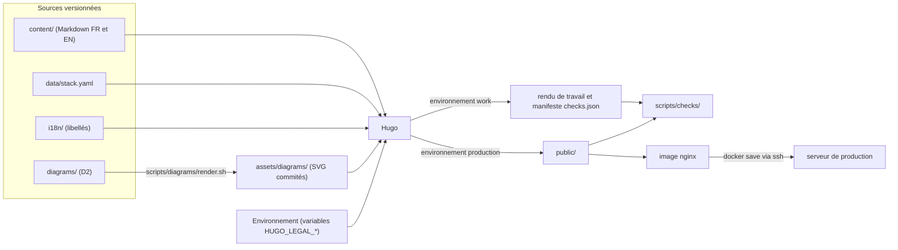
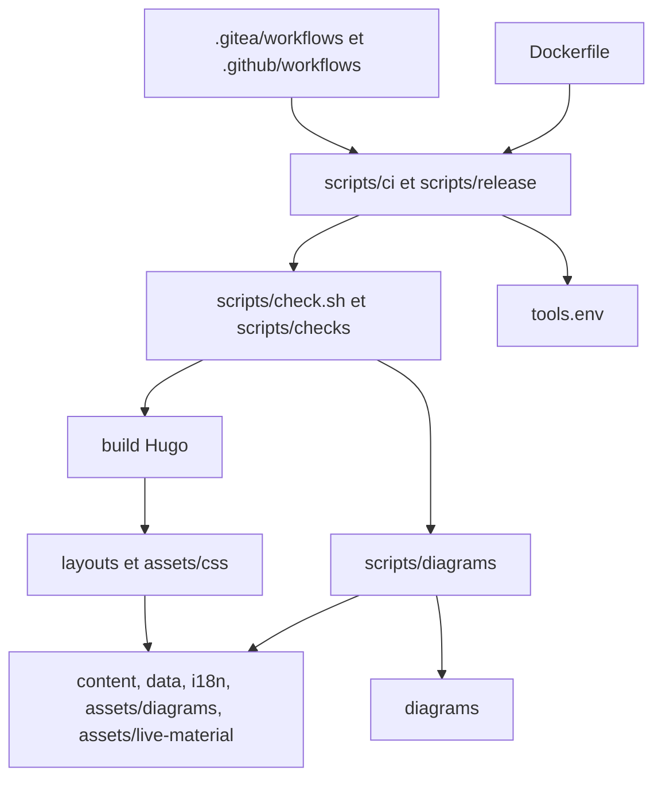
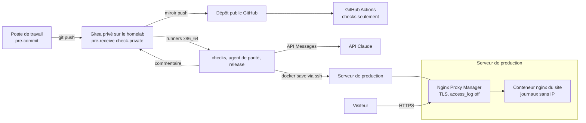

# Architecture : eleyone.fr

Document de référence pour les stories. Il fixe ce que deux stories construites séparément ne doivent pas décider chacune de leur côté. Les décisions portent un identifiant stable `AD-n` ; leur justification courte est en fin de document (« Décisions clés ») et, en détail, dans `.memlog.md`. Les propositions validées par Arnaud le 13/09/2026 sont consignées dans « Décisions d'Arnaud du 13/09/2026 ». À cette date, aucune proposition d'architecture ne reste à valider ; les questions ouvertes du PRD qui restent sont renvoyées sous « Reporté ».

Statut : brouillon rédigé sans interlocuteur (run headless), sur la base du PRD en brouillon, du brief et de son addendum validés, du format des cas (v0.2, passé en v0.3 le 13/09/2026), du cas pilote 02 et du test D2 bilingue. Les affirmations sur Hugo ont été vérifiées par un spike (Hugo v0.166.0, hors dépôt) ; celles sur Gitea, GitHub, nginx, D2 et Nginx Proxy Manager, par recherche web et lecture du code source (voir « Sources vérifiées »).

## Paradigme

**Pipes-and-filters de génération statique.** Des sources passent par des filtres (rendu D2, contrôles, Hugo) jusqu'à un artefact unique (`public/`), emballé dans une image nginx puis servi. Aucun filtre ne modifie une source, à une exception près : le rendu D2 écrit les SVG, qui sont commités et vérifiés. **Le contenu est une donnée** : un cas ne connaît pas la page qui l'affiche, et les gabarits l'assemblent.



| Couche du paradigme | Emplacement |
| --- | --- |
| Sources de contenu | `content/`, `data/`, `i18n/`, `assets/live-material/`, `diagrams/` |
| Présentation (assemblage) | `layouts/`, `assets/css/` |
| Filtres | `scripts/diagrams/`, `scripts/checks/`, Hugo |
| Orchestration | `scripts/check.sh`, `scripts/ci/`, `scripts/release/` ; workflows minces dans `.gitea/workflows/` et `.github/workflows/` |
| Emballage et service | `Dockerfile`, `deploy/` |

## Invariants et règles

Sens des dépendances : une flèche signifie « peut lire ou appeler ». Rien ne remonte.



### AD-1 — Chaîne statique Hugo, versions épinglées à un seul endroit [ADOPTED]

- **Binds:** NFR-1, NFR-7, NFR-8, FR-27 ; tout script, workflow et le `Dockerfile`.
- **Prevents:** qu'une CI, le poste de travail et l'image utilisent des versions différentes de Hugo ou de D2, ce qui casserait la comparaison octet par octet des SVG ou produirait un site différent de celui contrôlé.
- **Rule:** le site est généré par Hugo (binaire standard, sans module ni dépendance Node). Les versions et empreintes sha256 de Hugo et de D2 sont déclarées **uniquement** dans `tools.env`, avec l'image de contrôle `CHECK_IMAGE` (`alpine:3.24` épinglée par digest). `scripts/ci/install-tools.sh` télécharge et vérifie Hugo et D2 et installe par `apk` les outils de contrôle (`bash`, `git`, `jq`, `libxml2-utils`) ; il sert au conteneur de contrôle des deux CI et à l'étape `tools` du `Dockerfile`. Les runners n'apportent donc aucun outil de contrôle : l'image `ubuntu-24.04` de GitHub n'a pas `xmllint`, et libxml2 existe en 2.9.14 sur Ubuntu 24.04 contre 2.13.9 sur Alpine 3.24. Tout script qui appelle `hugo` ou `d2` compare d'abord la version présente à `tools.env` et échoue si elle diffère. La version de l'image nginx est épinglée dans le `Dockerfile` (tag et digest), seul endroit où elle sert. Une montée de version de D2 se fait dans un commit dédié qui régénère tous les SVG.

### AD-2 — Langues, URL et traductions

- **Binds:** FR-20, FR-21, FR-2, FR-15 ; `config/_default/hugo.yaml`, tous les fichiers de `content/`, `layouts/baseof.html`.
- **Prevents:** des URL ou des liens d'une langue qui pointent vers l'autre, un sélecteur de langue qui ne retrouve pas la page équivalente, une redirection implicite vers la racine.
- **Rule:**
  - `defaultContentLanguage: fr`, `defaultContentLanguageInSubdir: false`, `disableDefaultSiteRedirect: true` (le spike montre que, sans ce réglage, Hugo génère `/fr/index.html` avec une redirection `meta refresh`). Clés de langue `label`, `locale` et `weight` (les anciennes clés `languageName` et `languageCode` sont dépréciées depuis Hugo v0.158.0). `baseURL: https://eleyone.fr/` ; `disableKinds: [taxonomy, term, rss]` (sans usage en v1, et sources d'avertissements) ; le sitemap multilingue généré par Hugo est conservé.
  - Tout fichier de `content/` existe en `.fr.md` et `.en.md` et porte un `translationKey` identique dans les deux langues. L'URL vient du `slug` de chaque langue. Aucun lien interne n'est écrit en dur dans un gabarit : il vient de `.RelPermalink`, de `.Translations` ou du partial `case-url.html` (AD-4).
  - Permaliens par langue : FR `page.cases: /cas/:slug/`, `section.cases: /cas/:sections[1:]/` ; EN `page.cases: /cases/:slug/`, `section.cases: /cases/:sections[1:]/`, sous le préfixe `/en/` ajouté par Hugo (décidé le 13/09/2026).
  - Chaque page déclare `<html lang>` (valeur de `locale`), une balise `<link rel="alternate" hreflang>` par traduction (`.AllTranslations`), plus `hreflang="x-default"` vers la version française. Locales `fr` et `en` (décidé le 13/09/2026).
  - Sélecteur de langue sans JavaScript : un lien par traduction (`.Translations`), avec les attributs `hreflang` et `lang`. Sur une page de groupe, il mène à la page de groupe de l'autre langue.

### AD-3 — Le contenu est une donnée, les gabarits assemblent

- **Binds:** FR-1, FR-5 à FR-8, FR-16 à FR-19, FR-25, NFR-6 ; `content/`, `i18n/`, `layouts/`.
- **Prevents:** du texte de contenu écrit dans un gabarit (qui obligerait à toucher au code pour le modifier), des libellés d'interface éparpillés, un cas qui dépend de sa mise en page.
- **Rule:**
  - Les cas suivent `docs/format-cas.md` (front matter et rubriques). Aucun gabarit ne contient de texte de contenu : le titre du site et le pitch sont dans `content/_index.{fr,en}.md`, les autres pages dans leur fichier Markdown.
  - Les libellés d'interface (encarts, champs, cadres, sélecteur, pied de page) sont dans `i18n/fr.yaml` et `i18n/en.yaml`, en clés `snake_case` anglaises. Le libellé d'un cadre s'obtient par `T (printf "setup_%s" (replace .setup "-" "_"))`.
  - Un seul partial rend un cas (`_partials/case.html`) : titre, encart « Contexte mission », encart « En bref », cas complet, dans cet ordre (FR-5). Il reçoit le niveau de titre (1 sur une page de cas, 2 dans une section de groupe) et ne se duplique pas.
  - Libellés EN (décidés le 13/09/2026) : « Contexte mission » → *Engagement context* ; « En bref » → *At a glance* ; Société / Cadre / Rôle / Période / Stack → *Company / Engagement / Role / Period / Stack* ; cadres `employee` → *Employee*, `freelance` → *Freelance*, `agency` → *IT consultancy*, `ton-pote-le-geek` → *Ton Pote le Geek*.

### AD-4 — Emplacement des cas, pages de groupe et adressage des sections

- **Binds:** FR-2, FR-9, FR-15, FR-32 ; `content/cases/`, `layouts/cases/`, `_partials/case-url.html`.
- **Prevents:** une page séparée pour les cas 02, 03 ou 04, une page Chiliz à modifier à chaque cas ajouté, deux façons de construire un lien vers un cas, des ancres différentes entre FR et EN.
- **Rule:**
  - Un cas sans groupe : `content/cases/case-NN-<short>.{fr,en}.md`, rendu à son URL.
  - Un cas groupé : `content/cases/<group>/case-NN-<short>.{fr,en}.md`. Le dossier du groupe contient `_index.{fr,en}.md`, qui **est** la page de groupe (titre et introduction éventuelle : question 9 du PRD). Ce `_index` porte `cascade: [{build: {render: never, list: always}, target: {kind: page}}]`. Le `target` est obligatoire : le spike montre que, sans lui, la page de groupe elle-même n'est plus rendue.
  - La clé `group` du front matter reste obligatoire pour un cas groupé et doit être égale au nom du dossier (contrôle bloquant). C'est le dossier qui décide du rendu ; `group` n'est qu'une redondance vérifiée. Ces règles sont reprises par `docs/format-cas.md` v0.3 (décidé le 13/09/2026), où le `_index` du groupe ne relève pas de la rédaction des cas. Le cas pilote se trouve dans `content/cases/chiliz/case-02-chiliz.{fr,en}.md`.
  - Les titres du Markdown d'un cas passent par un seul hook, `layouts/_markup/render-heading.html`. Il préfixe chaque identifiant par le `translationKey` (`case-02-contexte`), pour qu'aucun identifiant ne se répète quand plusieurs cas partagent une page. Pour un cas groupé, il descend chaque titre d'un niveau (`##` rendu en `<h3>`) sous le `<h2>` du titre du cas. Aucun gabarit n'a donc à changer quand le cas 03 arrive. À valider dans WS-2.
  - La page de groupe rend ses cas par `sort .RegularPages "Params.order"`, chacun dans `<section id="<translationKey>">` (par exemple `id="case-02"`, identique en FR et en EN). Les brouillons sont exclus par Hugo en production, et une section absente ne laisse aucune trace.
  - Tout lien vers un cas passe par `_partials/case-url.html` : `.Parent.RelPermalink#<translationKey>` pour un cas groupé, `.RelPermalink` sinon (spike : `/cas/chiliz/#case-02` depuis l'accueil).
  - Cas mis en avant sur l'accueil : `where site.RegularPages "Params.featured" true`, triés par `number`.
  - `content/cases/_index.{fr,en}.md` porte `build: {render: never}` tant que la question 6 (accès aux cas non mis en avant) n'est pas tranchée.
  - Une page de groupe sans aucun cas publié est rendue vide par Hugo (constaté dans le spike). Le contrôle de mise en ligne l'interdit (AD-10).

### AD-5 — Deux environnements de rendu : production et travail

- **Binds:** FR-12, FR-26, FR-32 ; `layouts/`, `config/`, scripts de build.
- **Prevents:** qu'un gabarit invente son propre interrupteur (paramètre, variable), qu'un élément « prévu » ou un brouillon arrive en production, ou que le rendu de travail soit déployé.
- **Rule:**
  - `scripts/build.sh work|production` est le **seul** appel à `hugo` des scripts et du `Dockerfile`, avec des options et des dossiers de sortie fixes :
    - **production** : `hugo --environment production --minify --cleanDestinationDir --panicOnWarning --destination public`, sans `--buildDrafts` ;
    - **travail** : `hugo --environment work --buildDrafts --cleanDestinationDir --panicOnWarning --destination build/work`.
    Les deux sorties ne se mélangent jamais (Hugo ne vide pas le dossier de sortie sans `--cleanDestinationDir`). En local, `scripts/dev.sh` lance `hugo server --environment work --buildDrafts`. `.gitignore` et `.dockerignore` excluent `public/`, `build/`, `resources/_gen/` et `.hugo_build.lock`.
  - Les gabarits ne testent que `hugo.IsProduction`. Le rendu de travail ajoute `<meta name="robots" content="noindex">`.
  - `config/work/hugo.yaml` ajoute le format de sortie `checks` (manifeste JSON, AD-10) ; le spike confirme qu'il est absent du build de production.
  - L'image n'est construite qu'à partir d'un build de production. Le rendu de travail n'est jamais servi publiquement.
  - Aucun build n'émet d'avertissement (`--panicOnWarning`). Une dépréciation reste au niveau INFO pendant trois versions mineures avant de devenir un avertissement : une montée de version de Hugo relit donc les notes de version.
  - Le build de production de contrôle et celui de l'image sont la même commande. Les contrôles HTML portent donc sur un HTML identique à celui de l'image ; le minifieur de Hugo retire par défaut les guillemets des attributs.

### AD-6 — Matériel vivant : un seul shortcode, une résolution par type

- **Binds:** FR-12, FR-13, FR-14, NFR-4, NFR-10 ; `_shortcodes/live-material.html`, `assets/diagrams/`, `assets/live-material/`.
- **Prevents:** plusieurs façons d'afficher un élément, une trace d'élément « prévu » en production, un schéma sans alternative textuelle, des fichiers d'élément nommés différemment d'une story à l'autre.
- **Rule:**
  - Le seul point d'insertion est ``. Un `id` non déclaré dans `live_material` fait échouer le build (`errorf`).
  - En production, un élément `planned` ne produit **rien** : le spike confirme qu'il ne reste ni `<figure>`, ni `<p>` vide, ni commentaire. En rendu de travail, un élément `planned` n'est **jamais résolu** (sa source n'est pas cherchée) : il s'affiche en encart fixe avec son type et sa `description`. Seul un élément `ready` est résolu.
  - Les identifiants sont en kebab-case anglais, préfixés par leur type (`diagram-`, `video-`, `snippet-`, `callout-`). Un identifiant est le même dans les fichiers FR et EN d'un cas, et n'appartient qu'à un seul cas (`translationKey`) dans tout le site.
  - Résolution d'un élément `ready`, dans la langue de la page (`<lang>` = clé de langue Hugo, `fr` ou `en`, jamais la locale) :

    | Type | Source | Rendu |
    | --- | --- | --- |
    | `diagram` | `assets/diagrams/<id>.<lang>.svg` | `<figure></figure>` ; `alt` = `description` du fichier de la langue ; dimensions lues dans le SVG ; fichier empreinté |
    | `video` | `url` du front matter | lien `<a href>` vers YouTube, avec la `description` pour texte ; jamais d'iframe |
    | `snippet`, `callout` | `assets/live-material/<id>.<lang>.md` | Markdown rendu dans `<figure>` ou `<aside>` |

  - Un élément `ready` dont la source manque fait échouer le build.
  - La `description` sert d'alternative textuelle ; elle doit donc se lire comme telle *(relecture)*. Le SVG de D2 ne contient ni `<title>` ni `<desc>` (constaté avec D2 v0.9.0) : l'alternative est portée par ``.

### AD-7 — Pipeline D2

- **Binds:** FR-13, FR-27, NFR-8 ; `diagrams/`, `assets/diagrams/`, `scripts/diagrams/`.
- **Prevents:** des SVG désynchronisés de leurs sources, un libellé traduit d'un seul côté, des SVG illisibles par nginx, des variations de rendu entre machines.
- **Rule:**
  - Un schéma = un dossier `diagrams/<id>/` avec `structure.d2` (identifiants, formes et liens ; tous les libellés en `${variables}` ; **aucun** bloc `vars` de libellé), `fr.d2` et `en.d2` (bloc `vars`, puis `...@structure`). `<id>` est l'identifiant `live_material` du schéma. Le thème commun `diagrams/theme.d2` (base `theme-id: 1` Neutral Grey et `theme-overrides` du test D2 bilingue) est importé par chaque structure. L'option `--theme` n'est jamais passée, car elle écraserait `theme-id`.
  - D2 ne coupe pas les libellés : les retours à la ligne s'écrivent à la main (`\n`) dans `fr.d2` et `en.d2`, séparément pour chaque langue si besoin. La lisibilité à 320 px et l'absence de débordement d'un libellé se vérifient dans un navigateur, au titre de la check-list manuelle (AD-17).
  - `scripts/diagrams/render.sh` rend chaque langue avec `--omit-version --no-xml-tag --pad 24 --layout elk`, en neutralisant `D2_THEME`, `D2_LAYOUT`, `D2_PAD` et `D2_SKETCH`, vers `assets/diagrams/<id>.<lang>.svg`. Il applique ensuite `chmod 0644`, puisque D2 v0.9.0 écrit en `0600` même avec `umask 022` (constaté).
  - Les SVG sont commités. `scripts/diagrams/check.sh` régénère dans un dossier temporaire, compare avec `cmp` et échoue sur tout écart, tout SVG manquant, tout SVG orphelin, et toute différence entre les clés de `vars` de `fr.d2`, celles de `en.d2` et les variables `${…}` utilisées dans `structure.d2` (une variable en trop passe inaperçue pour D2).
  - Un dossier de `diagrams/` sans élément `diagram` déclaré dans un cas, ou un élément `ready` sans dossier, fait échouer le contrôle. Le schéma de démonstration de FR-27 vit dans `tests/fixtures/diagrams/`, rendu vers `tests/fixtures/svg/` par les mêmes scripts appelés avec d'autres dossiers ; il n'est jamais publié.
  - Les rendus comparés se font sur x86_64 : runners Gitea, et `ubuntu-24.04` sur GitHub, qui est x64.

### AD-8 — Qualité front : zéro JavaScript, aucune ressource tierce, budget de poids

- **Binds:** NFR-3, NFR-5, NFR-12, FR-14 ; `layouts/`, `assets/css/`, contrôles HTML.
- **Prevents:** un script ou une ressource tierce ajoutés « juste pour un détail », une police web ou une image sans dimensions qui dégrade LCP ou CLS, une page qui dépasse le budget sans que personne ne le voie.
- **Rule:**
  - Aucune balise `<script>`, aucun attribut `on*=`, aucune `<iframe>`, aucun `<form>`, aucune ressource (feuille de style, image, police) chargée depuis une autre origine. Une exception à NFR-12 demande une décision écrite ajoutée à ce document.
  - Une seule feuille de style `assets/css/main.css`, minifiée et empreintée par Hugo Pipes. Pas de police web ; pile de polices système (décidé le 13/09/2026). Toute `` porte `width` et `height`.
  - Budget par page (décidé le 13/09/2026), mesuré sur `public/` en octets non compressés : HTML ≤ 50 Ko ; CSS total ≤ 20 Ko ; chaque SVG ≤ 60 Ko (le schéma de test D2 fait 20 Ko pour 9 nœuds) ; page complète (HTML, CSS et images référencées) ≤ 200 Ko ; au plus 10 ressources ; 0 fichier JavaScript ; 0 fichier de police ; au plus 800 éléments HTML.
  - La politique CSP (AD-13) interdit aussi les scripts côté navigateur.

### AD-9 — Mentions légales : valeurs injectées par l'environnement, jamais commitées

- **Binds:** FR-18, FR-19, NFR-9 ; `_partials/legal-value.html`, `_shortcodes/legal.html`, `scripts/env.sh`, `.env.example`, `ci/legal-placeholder.env`, `.gitignore`, `.dockerignore`, `scripts/check-private.sh`, workflows.
- **Prevents:** des coordonnées de l'éditeur ou de l'hébergeur dans le dépôt ou son historique GitHub, une page légale publiée vide ou avec des valeurs factices, deux mécanismes de lecture différents.
- **Rule:**
  - Les valeurs (identité, adresse, contact et numéro d'immatriculation de l'éditeur ; nom, adresse et contact de l'hébergeur) sont lues **uniquement** dans `_partials/legal-value.html`, par `os.Getenv`, sous des noms `HUGO_LEGAL_*` : `HUGO_LEGAL_PUBLISHER_NAME`, `HUGO_LEGAL_PUBLISHER_ADDRESS`, `HUGO_LEGAL_PUBLISHER_CONTACT`, `HUGO_LEGAL_PUBLISHER_REGISTRATION`, `HUGO_LEGAL_HOST_NAME`, `HUGO_LEGAL_HOST_ADDRESS`, `HUGO_LEGAL_HOST_CONTACT`. Cette liste de sept variables est **définitive** (décidé le 13/09/2026 ; ex-question 12 du PRD, tranchée) :
    - le directeur de la publication est l'éditeur lui-même. Aucune variable dédiée : la page des mentions légales affiche `HUGO_LEGAL_PUBLISHER_NAME` sous le libellé i18n `legal_publication_director` (« Directeur de la publication » / *Publication director*) ;
    - pas de numéro de TVA intracommunautaire, donc ni variable ni champ.
    Toute variable ou tout champ légal ajouté plus tard passe par une modification de cet AD. Le préfixe `HUGO_` est imposé par la liste d'autorisation par défaut de `security.funcs.getenv` (`^HUGO_`, `^CI$`) ; le spike confirme qu'une variable hors de cette liste fait échouer le build. Les coordonnées de l'hébergeur sont reprises de sa page légale officielle.
  - `os.Getenv` a été préféré à la surcharge `HUGO_PARAMS_…` : le spike montre qu'une clé en `snake_case` y est découpée sur `_` (`HUGO_PARAMS_LEGAL_PUBLISHER_NAME` ne remplit pas `params.legal.publisher_name`), sauf à changer de délimiteur (`HUGOxPARAMSx…`).
  - Le partial fait échouer **tout** build si une valeur est vide. Il n'existe pas de valeur par défaut. Le Markdown des pages légales l'appelle par le shortcode ``, dont l'argument donne le suffixe en minuscules de la variable.
  - Un seul chargeur, `scripts/env.sh`, prépare l'environnement de tout appel à `scripts/build.sh` et `scripts/dev.sh` (Hugo ne lit pas `.env`). Priorité : variables déjà définies, puis `.env` s'il existe, puis `ci/legal-placeholder.env`, sauf avec `ENV_MODE=release`, où le fichier factice est interdit et toute variable manquante fait échouer le chargeur.
  - **Build de contrôle** (GitHub, job de contrôles Gitea, poste de travail sans `.env`) : charge `ci/legal-placeholder.env`, commité, dont chaque valeur contient le marqueur `VALEUR-FACTICE`. Le fichier n'est chargé que dans le processus du conteneur de contrôle, jamais dans l'environnement du job qui construit l'image.
  - **Build de production** (workflow `release` sur Gitea) : les valeurs viennent des secrets et variables de la CI Gitea et passent au `docker build` en secret BuildKit, jamais en `ARG` : `docker build --secret id=legal_env,src=<fichier temporaire>` et `RUN --mount=type=secret,id=legal_env,required=true`, dans la même instruction `RUN` que `scripts/build.sh production` et `scripts/check.sh` (le secret n'existe que pendant cette instruction). Le fichier secret est au format dotenv. Avec `--secret id=legal_env` seul, Buildx chercherait une variable ou un fichier nommés `legal_env`. Un secret ne change pas la clé de cache : l'étape `build` est donc reconstruite sans cache (`--no-cache-filter build`), pour qu'une valeur modifiée ne produise pas une page périmée. Le fichier factice n'y est jamais chargé. Le contrôle de mise en ligne échoue si `VALEUR-FACTICE` apparaît dans `public/`.
  - En local : `.env` (ignoré par git). `.env.example`, commité, liste exactement les sept variables ci-dessus, une par ligne, sous la forme `NOM=` sans valeur. `ci/legal-placeholder.env` contient les mêmes sept noms, avec des valeurs `VALEUR-FACTICE-…`. Un contrôle (C18) échoue si l'un de ces deux fichiers ne liste pas exactement ces sept noms. `.env` est exclu par `.dockerignore` et ajouté aux chemins interdits de `scripts/check-private.sh`.
  - Ces valeurs sont publiques une fois le site en ligne : le but est de les tenir hors du dépôt, pas de les cacher.

### AD-10 — Contrôles : scripts partagés, point d'entrée unique, manifeste Hugo

- **Binds:** FR-23, FR-26, FR-27, FR-15, NFR-4, NFR-5, NFR-12, FR-32 ; `scripts/check.sh`, `scripts/checks/`, `layouts/home.checks.json`.
- **Prevents:** des contrôles écrits dans le YAML d'une forge et absents de l'autre, deux lectures différentes du front matter (Hugo contre un autre parseur YAML), un contrôle local qui diffère de celui de la CI.
- **Rule:**
  - `scripts/check.sh` est le **seul** point d'entrée des contrôles bloquants. Il est lancé de la même façon en local, sur Gitea et sur GitHub. `scripts/check.sh --release` ajoute les contrôles de mise en ligne.
  - `scripts/check.sh` fonctionne sans `.git` (il tourne aussi dans l'étape `build` du `Dockerfile`) : les contrôles qui lisent l'historique restent dans `scripts/ci/checks-job.sh`.
  - Les métadonnées des pages sont lues **par Hugo** : le rendu de travail émet `build/work/checks.json` et `build/work/en/checks.json`, qui listent **tous** les fichiers de `content/` (pages et `_index`) avec leur `kind` (`home`, `section`, `page`) et leur rôle (`case`, `group`, `page`), le fichier, la langue, le `translationKey`, le brouillon, groupe, dossier, `order`, `featured`, `number`, `setup`, `stack`, `live_material`, identifiants placés, titres H2 extraits du Markdown brut par `findRE`, présence de `[TODO`), plus le vocabulaire de `hugo.Data.stack`. La forme du manifeste n'est définie qu'à un endroit, `layouts/home.checks.json`, et documentée en tête de `scripts/checks/lib.sh`, que tous les scripts de contrôle sourcent. Les scripts `bash` + `jq` comparent ces manifestes. Les titres H2 sont pris dans le Markdown brut, car Hugo transforme les apostrophes du titre rendu (`&rsquo;`, constaté).
  - Les contrôles HTML portent sur le build de production de contrôle (`public/`, AD-9, produit par `scripts/build.sh production`). Les attributs se vérifient par requêtes XPath avec `xmllint --html`, jamais par `grep` sur leur écriture ; `grep` ne sert qu'aux chaînes (`<script`, `[TODO`, `VALEUR-FACTICE`). Le parseur HTML de libxml2 antérieur à 2.14 signale les balises HTML5 comme invalides : ces avertissements sont ignorés, et WS-3 valide les requêtes XPath sur une page réelle. Aucun navigateur, ni Node, ni Chrome en CI.
  - Tout signalement nomme le fichier et l'écart, et tout écart rend un code de sortie non nul. La liste des contrôles est tenue dans la section « Liste des contrôles » ; un nouveau contrôle s'y ajoute avec son script.

### AD-11 — CI double sans duplication

- **Binds:** FR-23, FR-24, FR-27, FR-28, NFR-2, NFR-8, NFR-11 ; `.gitea/workflows/`, `.github/workflows/`, `scripts/ci/`.
- **Prevents:** des exécutions en double ou en échec, un build d'image ou un déploiement sur GitHub, une logique métier différente entre les deux forges.
- **Rule:**
  - **Gitea lit `.gitea/workflows/` et ignore `.github/workflows/` dès que le premier existe.** C'est vérifié dans le code : réglage `[actions] WORKFLOW_DIRS`, dont la valeur par défaut est `.gitea/workflows,.github/workflows`, et `listWorkflowsInDirs`, qui retient le premier dossier présent. `.gitea/workflows/` doit donc toujours contenir au moins un workflow, et `WORKFLOW_DIRS` garde sa valeur par défaut sur l'instance. GitHub ne lit que `.github/workflows/`.
  - `.gitea/workflows/` : `checks.yaml` (sur `push` de `main` et sur `pull_request`, pour ne pas contrôler deux fois une PR interne), `parity-agent.yaml` (AD-16), `release.yaml` (sur `push` de tags `v*`, AD-14).
  - `.github/workflows/` : `checks.yaml` seulement (sur `push` et `workflow_dispatch`), `runs-on: ubuntu-24.04`. Pas de secret, pas de `docker build`.
  - Les workflows Gitea utilisent un seul label `runs-on`, celui des runners x86_64 qui ont accès à Docker (`docker run` des contrôles, `docker build` de la mise en ligne). Le nom exact dépend des runners existants et est fixé dans WS-4.
  - Le workflow `release` vérifie d'abord que le tag pointe sur un commit de `main` (`git merge-base --is-ancestor`), et que son nom suit `vMAJEUR.MINEUR.CORRECTIF`.
  - Un workflow ne contient que le déclencheur, le checkout (`fetch-depth: 0`) et l'appel d'un script : `scripts/ci/checks-job.sh` pour les contrôles. Ce script lance `docker run --rm` sur `CHECK_IMAGE` avec le dépôt monté, puis y enchaîne l'installation des outils, le chargement de `ci/legal-placeholder.env`, le garde-fou en mode historique et `scripts/check.sh`. Lancer un conteneur existant n'est pas construire une image. Le même script tourne en local. Sur GitHub, les actions tierces sont épinglées par SHA de commit.
  - **Build Hugo de contrôle ≠ build d'image.** Les deux forges font un build Hugo (travail et production de contrôle) pour contrôler le HTML. Seul le workflow `release` de Gitea construit et livre une image.

### AD-12 — Garde-fou public/privé en trois couches

- **Binds:** FR-28, NFR-9, UJ-4 ; `scripts/check-private.sh`, `.githooks/pre-commit`, hook serveur Gitea, `scripts/ci/checks-job.sh`.
- **Prevents:** l'entrée d'un chemin ou d'un motif privé dans l'historique de Gitea, donc sur GitHub ; un contournement par un poste sans hook ; la divergence entre la version du script dans le dépôt et celle du serveur.
- **Rule:**
  - **Local** : `scripts/check-private.sh staged` en pre-commit (`git config core.hooksPath .githooks`).
  - **Serveur (autorité)** : hook pre-receive sur le dépôt Gitea, fermé en cas de doute (voir la procédure plus bas). Aucun push ne va directement sur GitHub : seul le miroir push de Gitea y écrit.
  - **CI** (Gitea et GitHub) : `scripts/check-private.sh history` sur tout l'historique, en mode chemins seulement, puisque la liste des motifs n'existe que sur le poste et sur le serveur Gitea.
  - Le mode `pre-receive` du script doit échouer si le fichier de motifs est absent (aujourd'hui, le script se replie sur les chemins seulement) : modification à faire dans une story. Les chemins interdits incluent `docs/private/`, `docs/context/` et `.env`.
  - **Ordre imposé** : le miroir push vers GitHub n'est activé qu'après l'installation et le test du hook pre-receive (procédure plus bas) et un audit `history` complet et propre, fait avec la liste des motifs. Un commit arrivé sur GitHub y reste accessible par son SHA, même après réécriture.

### AD-13 — Image multi-étapes et configuration nginx

- **Binds:** NFR-1, NFR-2, NFR-3, NFR-5, NFR-12, FR-21 ; `Dockerfile`, `.dockerignore`, `deploy/nginx/`.
- **Prevents:** une image qui embarque des fichiers du dépôt hors `public/` (notamment `.env` ou `docs/private/`), des fichiers illisibles par nginx, des en-têtes de sécurité perdus dans un bloc `location`, une 404 dans la mauvaise langue.
- **Rule:**
  - Étapes : `tools` (`CHECK_IMAGE`, `scripts/ci/install-tools.sh`) → `build` (sources, secret `legal_env`, `scripts/build.sh production`, `scripts/check.sh` au niveau donné par l'argument `CHECK_LEVEL` : `standard` par défaut, `release` seulement depuis `scripts/release/build-image.sh` ; puis `chmod -R a+rX public`) → `runtime` (`nginx:1.30.4-alpine` épinglé par digest, `COPY --from=build public /usr/share/nginx/html`, configuration de `deploy/nginx/`).
  - `.dockerignore` exclut au moins `.git/`, `.env`, `docs/private/`, `_bmad*/`, `.claude/`, `.agent*/`, `experiments/`.
  - Configuration nginx :
    - `server_tokens off; absolute_redirect off; log_not_found off;`
    - `gzip on;` pour HTML, CSS, SVG, JSON et XML, avec `gzip_vary on`.
    - `Cache-Control` : `no-cache` pour le HTML ; `public, max-age=31536000, immutable` pour les fichiers empreintés (motif `\.[0-9a-f]{64}\.(css|svg)$`).
    - En-têtes déclarés au niveau `server` avec le paramètre `always`, sans quoi ils ne sont pas envoyés sur les 404. `add_header_inherit merge;` (nginx 1.29.3 et plus, donc inclus dans 1.30.4) garde ces en-têtes dans les `location` qui ajoutent leur propre `Cache-Control`. En-têtes : `X-Content-Type-Options: nosniff`, `Referrer-Policy: strict-origin-when-cross-origin`, `Content-Security-Policy: default-src 'none'; style-src 'self'; img-src 'self'; base-uri 'none'; form-action 'none'; frame-ancestors 'none'`.
    - La CSP n'est envoyée **que** sur les réponses HTML, par `map $sent_http_content_type $csp { ~^text/html "<politique>"; default ""; }` : les SVG de D2 contiennent des `<style>` et des polices embarquées (constaté). Qu'une valeur vide supprime l'en-tête n'est affirmé que par des sources secondaires ; WS-5 le vérifie par `curl -I` sur un HTML, un SVG et une 404.
    - `error_page 404 /404.html;` et, dans `location /en/`, `error_page 404 /en/404.html;` (Hugo génère une 404 par langue, constaté).
  - TLS, HSTS et redirection HTTPS relèvent du reverse proxy existant, pas de l'image.

### AD-14 — Déploiement depuis Gitea, site indépendant du homelab

- **Binds:** NFR-2, FR-32, NFR-11 ; `.gitea/workflows/release.yaml`, `scripts/release/`, `deploy/remote/deploy-site.sh`, `deploy/compose.yaml`.
- **Prevents:** un site en ligne qui dépend du homelab (registre ou pull), une mise en ligne involontaire à chaque merge, un déploiement impossible à annuler.
- **Rule (décidé le 13/09/2026) :**
  - Une mise en ligne est un **tag Git `v*`** poussé sur Gitea (socle, puis un tag par cas publié). Le workflow `release` enchaîne `scripts/ci/checks-job.sh`, `scripts/release/build-image.sh` (image `eleyone-site:<tag>`) et `scripts/release/ship.sh`.
  - Livraison **sans registre** : `docker save | gzip | ssh` vers un compte de déploiement du serveur de production, dont la clé est restreinte dans `authorized_keys` (`restrict,command=`) à la commande forcée `deploy-site`. Secrets Gitea : `DEPLOY_SSH_KEY`, `DEPLOY_HOST`, `DEPLOY_KNOWN_HOSTS`.
  - Protocole de `deploy-site`, qui lit sa demande dans `SSH_ORIGINAL_COMMAND` :
    - `deploy <tag>` : lit l'archive de l'image sur l'entrée standard, la charge, vérifie qu'elle s'appelle `eleyone-site:<tag>`, relance le service `site` avec `SITE_TAG=<tag>`, puis supprime les images `eleyone-site` au-delà des trois plus récentes ;
    - `rollback <tag>` : relance le service sur une image déjà présente ;
    - `status` : affiche le tag en service.
    Tout autre argument, ou un tag qui ne suit pas `vMAJEUR.MINEUR.CORRECTIF`, est refusé.
  - `deploy/compose.yaml` est copié sur le serveur au premier déploiement, dans le dossier du compte de déploiement (voir « Procédure : premier déploiement ») ; ensuite, seul `SITE_TAG` change. Une modification de `compose.yaml` se recopie à la main, comme le hook pre-receive.
  - Hypothèse : le serveur de production est en x86_64 (amd64), comme les runners qui construisent l'image.
  - Le conteneur du site ne publie aucun port sur l'hôte : il rejoint le réseau Docker du reverse proxy, nommé par variable dans `deploy/compose.yaml`, et nginx y écoute sur le port 80. L'hôte proxy de NPM transmet à `site:80`.
  - **Homelab arrêté** : aucun déploiement n'est possible, et le site continue de tourner sur l'image déjà chargée. Plan de secours : les mêmes scripts lancés depuis le poste de travail, précédés de `scripts/check-private.sh history` avec la liste des motifs locale.

### AD-15 — Journalisation sans donnée personnelle, sur toute la chaîne

- **Binds:** NFR-3, NFR-9, FR-19 ; `deploy/nginx/`, `deploy/compose.yaml`, configuration de l'hôte dans Nginx Proxy Manager.
- **Prevents:** l'enregistrement d'une IP, d'un user-agent ou d'un referer par le conteneur du site ou par le proxy, et donc une politique de confidentialité fausse.
- **Rule:**
  - **Conteneur du site** :
    - `log_format site '$time_iso8601 $request_method $uri $status $body_bytes_sent';` et `access_log /dev/stdout site;` (`$uri` ne contient pas la chaîne de requête) ; `error_log /dev/stderr crit;` (décidé le 13/09/2026), avec `log_not_found off`. Les lignes d'erreur de niveau inférieur, qui peuvent contenir le `referrer` et la requête complète, ne sont pas écrites ; les 404 et 5xx restent visibles dans le journal d'accès.
    - **Pas de module `realip`** : le conteneur ne voit que l'adresse du proxy. NPM lui transmet pourtant `X-Real-IP` et `X-Forwarded-For` : aucun format de journal du site n'utilise ces en-têtes.
    - Rotation par Docker : `logging: {driver: json-file, options: {max-size: "10m", max-file: "3"}}` (Docker ne fait aucune rotation par défaut).
    - Objectif des journaux : repérer les 404 et les 5xx, rien d'autre.
  - **Nginx Proxy Manager** (code source vérifié de v2.12.6 à v2.15.1, branche `develop`). L'hôte proxy du site n'existe pas encore : la configuration sans IP est une étape de la procédure du premier déploiement et s'applique **dès la création de l'hôte** (décidé le 13/09/2026). Les points marqués « à tester » ci-dessous se vérifient lors de ce déploiement. Chaque point est classé « confirmé » (code ou documentation) ou « à tester ».
    - **Comportement par défaut**, *confirmé* :
      - journal d'accès sur disque seulement, sans visionneuse dans l'interface : `/data/logs/proxy-host-<id>_access.log`, au format `proxy` (`[Client $remote_addr]`, user-agent, referer). `$remote_addr` y est la vraie IP du visiteur (`set_real_ip_from`, `X-Real-IP`) ;
      - `error_log` en `warn` dans `proxy-host-<id>_error.log`, dont les lignes contiennent `client: <IP>` ;
      - rotation par logrotate au démarrage puis toutes les 48 h, avec environ 4 semaines de journaux d'accès et 10 semaines de journaux d'erreurs gardés. L'issue #4516 signale des échecs de rotation ;
      - aucune variable d'environnement ne règle les journaux ; la table `audit_log` de NPM ne contient aucune IP.
    - **Journal d'accès**, *confirmé* : `access_log off;` dans l'onglet *Advanced* de l'hôte proxy. D'après la documentation et le code de nginx, `off` annule tous les `access_log` du même niveau, sans conflit avec la ligne générée par NPM. Cela couvre aussi la redirection de HTTP vers HTTPS.
    - **Journal d'erreurs**, *confirmé* : un `error_log` placé au niveau `server` dans *Advanced* **s'ajoute** à celui de NPM au lieu de le remplacer.
    - **Journal d'erreurs**, *à tester* : créer une *Custom Location* `/` (même destination que l'hôte) et mettre dans son champ avancé `access_log off; error_log /dev/null crit;`. Au niveau `location`, ces directives remplacent celles héritées. Vérifier aussi les listes d'accès si l'hôte en utilise.
    - **Option « Cache Assets »**, *à tester* : si elle est active, NPM génère une `location` par expression régulière pour les fichiers statiques, qui ne passe pas par la *Custom Location* `/`. La désactiver pour cet hôte, puisque le cache est géré par le nginx du site.
    - **Traçabilité** : les directives saisies dans l'interface de NPM sont recopiées dans `deploy/proxy/npm-advanced.conf` (fichier de référence versionné, sans nom d'hôte ni adresse).
    - **Alternative**, *à tester* : anonymiser l'IP par un `map` qui la tronque, dans `/data/nginx/custom/http_top.conf`.
    - **À éviter**, *confirmé* :
      - écrire un bloc `location / {…}` dans *Advanced* : NPM ne génère alors plus son `proxy_pass` (`advancedConfigHasDefaultLocation`) ;
      - modifier à la main `/data/nginx/proxy_host/<id>.conf` : le fichier est réécrit à chaque sauvegarde.
    - **Point de vigilance**, *confirmé* : les journaux `fallback_*` et `default-host_*` de l'instance NPM contiennent des IP (scanners, accès direct par l'adresse du serveur). Ils existent indépendamment du site et ne relèvent pas de cette architecture.
    - **Vérification à la création de l'hôte** : `nginx -t`, puis `nginx -T | grep access_log`, puis contrôler que la taille du journal d'accès de l'hôte ne bouge pas après une requête.
  - Pas de limitation de débit en v1 (voir « Reporté »).
  - La politique de confidentialité peut dire que l'éditeur ne collecte aucune donnée personnelle et renvoyer à la politique de l'hébergeur pour ses propres traitements (ex-question 13 du PRD, tranchée).

### AD-16 — Agent de parité : script HTTP consultatif, sur Gitea seulement

- **Binds:** FR-24, NFR-11, UJ-4 ; `.gitea/workflows/parity-agent.yaml`, `scripts/parity-agent/`.
- **Prevents:** un agent qui bloque une PR, une clé d'API exposée à une PR de fork ou dans un journal, un agent qui tourne sans changement de contenu, un coût imprévisible.
- **Rule:**
  - Déclencheur : `pull_request` (`opened`, `synchronize`, `reopened`), filtré par `paths` sur `content/**`, `diagrams/**`, `assets/live-material/**` et `i18n/**`. **Jamais `pull_request_target`** : Gitea ne transmet aucun secret à une PR de fork, sauf avec `pull_request_target` (vérifié dans `models/secret/secret.go`).
  - Le job est en `continue-on-error: true` et le script sort toujours avec le code 0. Sans clé, il s'arrête proprement avec un message.
  - `scripts/parity-agent/run.sh` (`bash`, `curl`, `jq`) :
    1. identifie les `translationKey` modifiés et envoie les deux fichiers complets de chaque paire à `POST https://api.anthropic.com/v1/messages` (en-têtes `x-api-key`, `anthropic-version: 2023-06-01`) ;
    2. demande la liste des écarts de faits, de chiffres et de phrases entre FR et EN, sans réécriture ; les lignes de contexte propres à l'anglais (FR-22) ne comptent pas comme des écarts ;
    3. publie **un** commentaire par exécution avec `POST /api/v1/repos/{owner}/{repo}/issues/{index}/comments` et le jeton `GITEA_TOKEN` du job (`permissions:` limitées à la lecture du code et à l'écriture sur la PR, portée exacte à confirmer dans la story).
  - Secret : `ANTHROPIC_API_KEY`, secret du dépôt Gitea, jamais affiché (pas de `set -x`). Seuls des fichiers publics du dépôt sont envoyés.
  - Modèle en variable `PARITY_MODEL`, par défaut `claude-sonnet-5` (décidé le 13/09/2026 ; 2 $ / 10 $ par million de jetons en entrée / sortie). Estimation, non mesurée : environ 11 000 jetons en entrée et 1 000 en sortie par paire de cas, soit environ 0,03 $ par paire analysée.
  - **Pas d'agent sur GitHub** : le miroir n'a pas de PR, il faudrait y placer une clé, et les journaux y sont publics.

### AD-17 — Accessibilité et Core Web Vitals vérifiées sans navigateur en CI

- **Binds:** NFR-4, NFR-5, SM-8 ; `scripts/checks/html.sh`, `scripts/checks/budget.sh`, check-list manuelle par gabarit.
- **Prevents:** l'ajout d'une chaîne Chrome et Node pour mesurer, ou au contraire l'absence de toute vérification ; une régression d'accessibilité introduite par une story de gabarit.
- **Rule:**
  - **Automatique (bloquant)**, sur `public/` :
    - `<html lang>` présent ; `<title>` non vide ; un seul `<h1>` ; pas de saut de niveau de titre ; identifiants uniques ;
    - chaque `` a un `alt` non vide, `width` et `height` ; chaque lien a un nom accessible ;
    - liens `hreflang` présents ; aucun `tabindex` positif ;
    - zéro JS et aucune origine tierce (AD-8) ; budget (AD-8) ; liens internes et ancres résolus ; aucune page orpheline.
  - **Manuel (check-list par gabarit : accueil, page de cas, page de groupe, page simple, 404)**, à chaque story qui crée ou modifie un gabarit :
    - navigation au clavier et focus visible (2.4.7), focus non masqué (2.4.11) ;
    - reflow à 320 px CSS et zoom à 200 % ;
    - contraste mesuré sur les couleurs de la feuille de style (texte 4,5:1, grand texte et composants 3:1) ;
    - taille des cibles d'au moins 24 px (2.5.8), les liens dans le texte courant étant exemptés ;
    - ordre de lecture ; pertinence des alternatives des schémas.
  - **INP sans navigateur** : l'INP mesure le délai entre une interaction et l'affichage suivant, et ce délai vient surtout des gestionnaires d'événements JavaScript. Sans aucun script (garanti par le contrôle et par la CSP), une interaction se limite à l'action par défaut du navigateur : suivre un lien, sélectionner du texte. Le budget de 800 éléments borne le coût du rendu. **LCP** : texte, HTML léger, une CSS, pas de police web, gzip. **CLS** : dimensions sur toutes les images, pas de police web, pas de contenu injecté.
  - **Démonstration** : une mesure manuelle (PageSpeed Insights, mobile) de chaque gabarit sur le site en ligne à la mise en ligne du socle, notée dans la PR du tag. Aucune mesure en CI.

## Procédure : hook pre-receive sur Gitea

Vérifié dans le code de Gitea (branche `main`, documentation 1.27.3) :

- `DISABLE_GIT_HOOKS` (section `[security]`, `true` par défaut depuis 1.13) ne conditionne que **l'édition des hooks par l'interface web** (`User.CanEditGitHook`).
- Le script `hooks/pre-receive` généré par Gitea exécute chaque fichier exécutable de `hooks/pre-receive.d/`, lui transmet l'entrée standard et échoue si l'un d'eux échoue. Le hook propre de Gitea est `pre-receive.d/gitea`.
- La régénération des hooks réécrit `pre-receive` et `pre-receive.d/gitea` sans supprimer les autres fichiers du dossier. `SCRIPT_TYPE` vaut `bash` par défaut.

Procédure recommandée, qui laisse `DISABLE_GIT_HOOKS=true` et donc l'interface fermée à l'exécution de code :

1. Sur le serveur Gitea, hors de tout dépôt, avec l'utilisateur système de Gitea : copier `scripts/check-private.sh` et la liste des motifs (droits `0600`) dans un dossier dédié du répertoire `custom/` de Gitea.
2. Dans le dépôt nu du site (`<repositories>/<owner>/<repo>.git/hooks/pre-receive.d/`), créer `check-private` (droits `0755`). Il échoue si la liste des motifs est absente, puis lance `PRIVATE_PATTERNS_FILE=<liste> <script> pre-receive`.
3. Tester en poussant sur une branche jetable un commit qui ajoute un fichier sous `docs/private/`, puis un commit qui contient un motif factice ajouté temporairement à la liste : les deux pushs doivent être refusés.
4. Tester qu'un merge de PR fait depuis l'interface passe aussi par le hook (à constater, non vérifié dans le code).
5. À chaque modification de `scripts/check-private.sh` dans le dépôt, recopier le script sur le serveur ; à chaque mise à jour de Gitea ou régénération des hooks, relancer le test 3.
6. Le dépôt privé imbriqué (`docs/private/`) n'a pas ce hook et n'est jamais mirroré.

## Procédure : premier déploiement

Étapes manuelles, faites une fois au premier déploiement (le site n'est pas déployé et le domaine ne pointe pas encore vers le serveur de production) :

1. **Compte de déploiement** sur le serveur de production : un utilisateur dédié, membre du groupe `docker`, avec `deploy/remote/deploy-site.sh` installé et une clé publique restreinte (`restrict,command="…/deploy-site"`) dans `authorized_keys`. La clé privée et l'empreinte de l'hôte vont dans les secrets Gitea (AD-14).
2. **Service** : copier `deploy/compose.yaml` dans le dossier du compte, avec le nom du réseau Docker de NPM et `SITE_TAG` en variables.
3. **Premier tag** : pousser `v1.0.0` sur `main` une fois le socle prêt (C15). Le workflow `release` livre l'image, et `deploy-site status` confirme le tag en service.
4. **Hôte proxy dans NPM**, créé à ce moment, avec la configuration sans IP dès sa création (AD-15) :
   - destination `site:80` ;
   - `access_log off;` dans l'onglet *Advanced* ;
   - *Custom Location* `/` avec `access_log off; error_log /dev/null crit;` (à tester) ;
   - option « Cache Assets » désactivée ;
   - certificat TLS et HSTS.

   Recopier les directives dans `deploy/proxy/npm-advanced.conf`.
5. **Vérification** : `nginx -t` et `nginx -T | grep access_log` dans le conteneur NPM ; une requête sur le site ne fait pas grossir `proxy-host-<id>_access.log`. Puis `curl -I` sur une page HTML, un SVG et une 404 de chaque langue (en-têtes d'AD-13).
6. **DNS** : faire pointer le domaine vers le serveur de production seulement après l'étape 5.
7. **Retour arrière** : tester `rollback` sur le tag précédent au deuxième déploiement.

## Liste des contrôles

Portée : C3 porte sur tout fichier de `content/`. C4, C6 à C8 et C18 ne portent que sur les cas (rôle `case` dans le manifeste). C11 et C12 portent sur toutes les pages de `public/`, sauf les 404, exclues du contrôle des pages orphelines. La liste des pages attendues à chaque mise en ligne, par `translationKey`, est tenue dans `ci/release-pages.txt` et lue par C15. Un cas publié non mis en avant fait échouer C12 tant que la question 6 (navigation) n'a pas de réponse, et c'est voulu.

| # | Contrôle | Script | Gitea | GitHub | Exigence |
| --- | --- | --- | --- | --- | --- |
| C1 | Chemins interdits sur tout l'historique | `scripts/check-private.sh history` (chemins seulement) | oui | oui | FR-28 |
| C2 | Chemins et motifs privés à chaque push | hook `pre-receive.d/check-private` | serveur | non | FR-28, NFR-9 |
| C3 | Parité FR/EN : paire de fichiers par `translationKey` ; mêmes `number`, `group`, `order`, `featured`, `draft`, `setup`, `stack`, `live_material` (id, type, statut) ; mêmes rubriques à la même position | `scripts/checks/parity.sh` | oui | oui | FR-20, FR-23 |
| C4 | Rubriques H2 dans la liste de `docs/format-cas.md`, dans l'ordre | `scripts/checks/content.sh` | oui | oui | FR-8 |
| C5 | Marqueur `[TODO` dans un fichier ⇒ `draft: true` ; aucun `[TODO` dans `public/` | `scripts/checks/content.sh`, `scripts/checks/html.sh` | oui | oui | FR-26 |
| C6 | `stack` ⊂ `data/stack.yaml` | `scripts/checks/content.sh` | oui | oui | FR-6 |
| C7 | Matériel vivant : identifiants déclarés ⇔ placés, uniques, préfixés par le type ; source présente pour chaque élément `ready` | `scripts/checks/content.sh` | oui | oui | FR-12, FR-13 |
| C8 | Groupe : `group` = dossier ; `order` unique dans le groupe | `scripts/checks/content.sh` | oui | oui | FR-9 |
| C9 | SVG régénérés identiques, sans SVG manquant ou orphelin ; mêmes clés `vars` en FR et en EN, égales aux variables de `structure.d2` | `scripts/diagrams/check.sh` | oui | oui | FR-27, NFR-8 |
| C10 | Zéro JS, pas d'iframe, pas de formulaire, pas d'origine tierce | `scripts/checks/html.sh` | oui | oui | NFR-12, FR-14, FR-17, NFR-3 |
| C11 | Accessibilité automatisable (AD-17) | `scripts/checks/html.sh` | oui | oui | NFR-4 |
| C12 | Liens internes et ancres résolus ; aucune page orpheline par langue | `scripts/checks/links.sh` | oui | oui | FR-2, FR-15 |
| C13 | Budget de poids et d'éléments | `scripts/checks/budget.sh` | oui | oui | NFR-5 |
| C14 | Build Hugo sans avertissement (`--panicOnWarning`) | `scripts/check.sh` | oui | oui | NFR-7 |
| C15 | Mise en ligne : aucune page de groupe vide ; pages de `ci/release-pages.txt` présentes en FR et en EN ; cas mis en avant publiés ; aucun `VALEUR-FACTICE`, aucun `checks.json`, aucun `noindex` dans `public/` | `scripts/check.sh --release` | `release` | non | FR-9, FR-32, FR-18, FR-26 |
| C16 | « En bref », **bloquant** (décidé le 13/09/2026 ; question 11 du PRD, tranchée) : dans chaque langue, la valeur de `summary` (lue dans le manifeste, après repli YAML) compte au plus 3 phrases et au plus 400 caractères. Caractères = points de code Unicode, espaces compris (`length` de `jq`). Phrase = segment terminé par `.`, `!`, `?` ou `…` suivi d'une espace ou de la fin du texte. Le pilote 02 passe (FR 354 caractères, EN 346, 3 phrases chacun). | `scripts/checks/content.sh` | oui | oui | FR-7 |
| C17 | Agent de parité, non bloquant | `scripts/parity-agent/run.sh` | PR | non | FR-24 |
| C18 | Règles du format : `title` ≤ 70 caractères ; `setup`, `type` et `status` dans leurs valeurs autorisées ; numéro du nom de fichier = `number` = suffixe du `translationKey` ; `.env.example` et `ci/legal-placeholder.env` listent exactement les sept variables d'AD-9 | `scripts/checks/content.sh` | oui | oui | FR-6, FR-12, FR-18 |

## Conventions de cohérence

| Sujet | Convention |
| --- | --- |
| Noms de fichiers et de dossiers | Anglais, minuscules, kebab-case. Scripts `.sh` en `bash` avec `set -euo pipefail`, lançables depuis la racine du dépôt. Workflows en `.yaml`. |
| Clés | Front matter : clés de `docs/format-cas.md`. i18n : `snake_case` anglais. Paramètres de site : `snake_case` sous `params`. Classes CSS : kebab-case, préfixées par le composant (`case-context`, `live-material`). |
| Gabarits Hugo | Système de gabarits de Hugo v0.146+ : `layouts/baseof.html`, `home.html`, `page.html`, `section.html`, `404.html`, `layouts/cases/page.html`, `layouts/cases/section.html`, `layouts/_partials/`, `layouts/_shortcodes/`. `hugo.Data` et `hugo.Sites` plutôt que `.Site.Data` et `.Site.AllPages`, dépréciés depuis v0.156.0. |
| Identifiants de page | `translationKey` : `home` pour l'accueil, `cases` pour `content/cases/_index`, `case-NN` pour un cas, `group-<group>` pour une page de groupe, nom anglais kebab-case pour les autres pages (`about`, `contact`, `legal-notice`, `privacy`). Ancre de section = `translationKey`. |
| Shell | `bash` dans l'image de contrôle Alpine : utilitaires BusyBox, donc pas de `grep -P` ni d'option propre à GNU. Aucun script de `scripts/checks/` n'appelle `git`. |
| Signalements des contrôles | Une ligne par écart, `<fichier>: <écart>`, sur la sortie d'erreur ; code de sortie 1 s'il y a au moins un écart. |
| Environnement | Seules les variables `HUGO_LEGAL_*` sont lues par les gabarits. Les scripts lisent `tools.env` et les secrets CI par leur nom ; aucune valeur réelle n'est commitée. |
| Secrets et variables CI | Gitea uniquement. Secrets : `ANTHROPIC_API_KEY`, `DEPLOY_SSH_KEY`, `DEPLOY_HOST`, `DEPLOY_KNOWN_HOSTS`. Valeurs légales (secrets ou variables Gitea, lues seulement par le workflow `release`) : `HUGO_LEGAL_PUBLISHER_NAME`, `HUGO_LEGAL_PUBLISHER_ADDRESS`, `HUGO_LEGAL_PUBLISHER_CONTACT`, `HUGO_LEGAL_PUBLISHER_REGISTRATION`, `HUGO_LEGAL_HOST_NAME`, `HUGO_LEGAL_HOST_ADDRESS`, `HUGO_LEGAL_HOST_CONTACT`. GitHub : aucun. |
| Commits de schémas | La modification d'une source D2 et ses SVG régénérés vont dans le même commit. La montée de version de D2 a son propre commit. |
| Données personnelles | Aucun journal ne contient d'IP, de user-agent ni de referer ; aucun script n'affiche un secret (`set -x` interdit dans les scripts qui manipulent un secret). |

## Stack

| Name | Version |
| --- | --- |
| Hugo (binaire standard linux-amd64, lié statiquement) | v0.166.0 |
| D2 (linux-amd64) | v0.9.0 |
| Moteur de mise en page D2 | ELK (intégré à D2 v0.9.0) |
| Image nginx | nginx:1.30.4-alpine (Alpine 3.24), épinglée par digest |
| Gitea (forge principale) | 1.27.x (documentation 1.27.3) |
| Gitea Runner | 2.0.0 au minimum (requis pour `continue-on-error`) ; 2.2.0 publiée en juillet 2026 |
| Runner GitHub | ubuntu-24.04 (x64) |
| Image de contrôle (les deux CI) | alpine:3.24, épinglée par digest dans `tools.env` (jq, libxml2-utils 2.13.9, bash, git depuis les paquets Alpine 3.24) |
| API Claude (agent de parité) | Messages API, `anthropic-version: 2023-06-01`, modèle `claude-sonnet-5` |
| Nginx Proxy Manager (existant, non géré par le dépôt) | v2.12.6 à v2.15.1 vérifiées (v2.15.1 = dernière release publiée ; version de l'instance à confirmer) |

## Structure initiale

```text
.
├── .gitea/workflows/        # checks.yaml, parity-agent.yaml, release.yaml
├── .github/workflows/       # checks.yaml (contrôles seulement)
├── .githooks/pre-commit     # garde-fou local (existant)
├── .dockerignore  .gitignore
├── .env.example             # les sept noms HUGO_LEGAL_*, sans valeur
├── Dockerfile               # tools → build → runtime (nginx)
├── README.md                # README-cas
├── tools.env                # versions et sha256 de Hugo et D2
├── ci/legal-placeholder.env # valeurs factices marquées VALEUR-FACTICE
├── ci/release-pages.txt     # translationKey attendus à la mise en ligne
├── config/
│   ├── _default/hugo.yaml   # langues, permaliens, sécurité, formats de sortie
│   └── work/hugo.yaml       # sortie checks (manifeste) du rendu de travail
├── content/
│   ├── _index.{fr,en}.md    # accueil : titre du site, pitch
│   ├── about.{fr,en}.md  contact.{fr,en}.md  legal-notice.{fr,en}.md  privacy.{fr,en}.md
│   └── cases/
│       ├── _index.{fr,en}.md          # non rendu tant que la question 6 est ouverte
│       ├── case-01-<short>.{fr,en}.md # cas sans groupe
│       └── chiliz/
│           ├── _index.{fr,en}.md      # page Chiliz, cascade render never sur les cas
│           └── case-02-chiliz.{fr,en}.md
├── data/stack.yaml          # vocabulaire contrôlé (existant)
├── i18n/{fr,en}.yaml        # libellés d'interface
├── layouts/                 # baseof, home, page, section, 404, cases/, _partials/, _shortcodes/, _markup/render-heading.html, home.checks.json
├── assets/
│   ├── css/main.css
│   ├── diagrams/<id>.<lang>.svg      # générés et commités
│   └── live-material/<id>.<lang>.md  # extraits et encarts thématiques prêts
├── diagrams/
│   ├── theme.d2
│   └── <id>/{structure,fr,en}.d2
├── deploy/
│   ├── nginx/               # default.conf, headers.conf
│   ├── compose.yaml         # service site, réseau du proxy, rotation des journaux
│   ├── proxy/npm-advanced.conf  # directives saisies dans NPM, pour référence
│   └── remote/deploy-site.sh
├── scripts/
│   ├── build.sh  dev.sh  env.sh  check.sh  check-private.sh
│   ├── checks/lib.sh        # forme du manifeste, fonctions communes
│   ├── checks/              # parity.sh, content.sh, html.sh, links.sh, budget.sh
│   ├── diagrams/            # render.sh, check.sh
│   ├── ci/                  # install-tools.sh, checks-job.sh
│   ├── release/             # build-image.sh, ship.sh
│   └── parity-agent/run.sh
├── tests/fixtures/          # schéma de démonstration et cas de test des contrôles, jamais publiés
├── docs/format-cas.md
└── _bmad-output/            # artefacts de cadrage
```

URL publiques (préfixes et slugs des pages simples décidés le 13/09/2026) :

| Page | FR | EN |
| --- | --- | --- |
| Accueil | `/` | `/en/` |
| Page Chiliz, section du cas 02 | `/cas/chiliz/#case-02` | `/en/cases/chiliz/#case-02` |
| Cas sans groupe | `/cas/<slug>/` | `/en/cases/<slug>/` |
| À propos, Contact | `/a-propos/`, `/contact/` | `/en/about/`, `/en/contact/` |
| Mentions légales, confidentialité | `/mentions-legales/`, `/confidentialite/` | `/en/legal-notice/`, `/en/privacy/` |
| 404 | `/404.html` | `/en/404.html` |

Topologie des forges et du déploiement :



## README-cas

- **Emplacement** : `README.md` à la racine, page d'accueil du dépôt public GitHub.
- **Structure** : celle des cas (contexte, problème, la solution facile et pourquoi elle a été écartée, ce qui a été décidé, ce qui a résisté, résultat), sans nommer de fichier privé (FR-30).
- **Références** :
  - les workflows `.github/workflows/checks.yaml` et `.gitea/workflows/` (ces derniers sont lisibles dans le dépôt, même si leurs exécutions restent privées) ;
  - `scripts/check.sh` et la liste des contrôles ;
  - les exécutions publiques des contrôles sur GitHub ;
  - ce document, dont la section « Décisions clés » tient lieu d'ADR ;
  - le test D2 bilingue de la branche `experiment/d2-bilingue` (dossier `experiments/d2-bilingue/`), poussée sur GitHub par le miroir ;
  - les artefacts de `_bmad-output/planning-artifacts/` ;
  - `docs/format-cas.md`.
- **Langue** : anglais (décidé le 13/09/2026 ; ex-question 14 du PRD, tranchée) ; les artefacts de cadrage restent en français.

## Capacités → architecture

| Exigences | Où | Régies par |
| --- | --- | --- |
| FR-1, FR-3, FR-4 (accueil, contact, activité parallèle) | `content/_index.*`, `layouts/home.html`, `i18n/` | AD-3, AD-2 |
| FR-2 (cas mis en avant) | `layouts/home.html`, `_partials/case-url.html` | AD-4, C12 |
| FR-5 à FR-8, FR-10, FR-11 (cas) | `_partials/case.html`, `layouts/cases/page.html`, `i18n/` | AD-3, C3, C4, C6 |
| FR-9 (page Chiliz) | `content/cases/chiliz/`, `layouts/cases/section.html` | AD-4, C8, C15 |
| FR-12 à FR-14 (matériel vivant, schémas, vidéos) | `_shortcodes/live-material.html`, `assets/`, `diagrams/` | AD-6, AD-7, C7, C9, C10 |
| FR-15 (accès aux cas) | liens des gabarits | AD-4, C12 ; navigation reportée (question 6) |
| FR-16 à FR-19 (pages simples et légales) | `content/*.md`, `layouts/page.html`, `_partials/legal-value.html` | AD-3, AD-9, AD-15 |
| FR-20 à FR-22 (bilinguisme) | `config/_default/hugo.yaml`, `baseof.html`, contenu EN | AD-2, C3 |
| FR-23 (script de parité) | `scripts/checks/parity.sh`, manifeste | AD-10, C3 |
| FR-24 (agent de parité) | `.gitea/workflows/parity-agent.yaml`, `scripts/parity-agent/` | AD-16 |
| FR-25 (édition sans code) | séparation contenu / gabarits ; une PR de contenu touche `content/`, `data/stack.yaml`, `diagrams/`, `assets/diagrams/`, `assets/live-material/` | AD-3, AD-6, AD-7 |
| FR-26 (brouillons, rendu de travail) | environnements Hugo | AD-5, C5 |
| FR-27 (SVG vérifiés) | `scripts/diagrams/` | AD-7, C9 |
| FR-28 (garde-fou) | hooks, CI | AD-12, C1, C2 |
| FR-29 à FR-31 (dépôt public) | `README.md`, `_bmad-output/` | README-cas, AD-11 |
| FR-32 (mise en ligne progressive) | tags `v*`, `release.yaml` | AD-14, C15 |
| NFR-1, NFR-7 | Hugo, scripts | AD-1 |
| NFR-2 | image, SSH, service sur le serveur de production | AD-13, AD-14 |
| NFR-3, NFR-12 | gabarits, CSP | AD-8, AD-13, C10 |
| NFR-4, NFR-5 | contrôles HTML, check-list, budget | AD-8, AD-17, C11, C13 |
| NFR-6 | CSS sobre | reporté à l'étape de mise en page (question 12, étape UX) |
| NFR-8 | D2 épinglé, x86_64 | AD-1, AD-7 |
| NFR-9 | garde-fou, mentions légales, journaux | AD-9, AD-12, AD-15 |
| NFR-10 | relecture | hors architecture |
| NFR-11 | secrets Gitea, `pull_request` | AD-11, AD-16 |

## Walking skeleton

Première tranche démontrable avec le seul cas pilote, sur le rendu de travail (le pilote est encore `draft: true`). Chaque tranche est une story courte.

0. **WS-0. Garde-fou serveur avant tout miroir** : `scripts/check-private.sh` en échec sans fichier de motifs en mode `pre-receive`, `.env` ajouté aux chemins interdits, hook installé et testé sur Gitea (procédure), audit `history` complet avec la liste des motifs. *Démo* : les deux pushs de test sont refusés, et l'audit est propre. Le miroir GitHub ne se configure qu'ensuite.
1. **WS-1. Base Hugo bilingue** : `tools.env`, `scripts/ci/install-tools.sh`, `config/_default/hugo.yaml`, `baseof.html` (lang, hreflang, sélecteur), accueil minimal tiré de `content/_index.*`, 404 FR et EN. *Démo* : `/` et `/en/` se répondent par le sélecteur, sans `/fr/`.
2. **WS-2. Cas pilote sur la page Chiliz** : le pilote est déjà dans `content/cases/chiliz/` ; reste à créer le `_index` Chiliz (titre seul en attendant la question 9), avec sa cascade, puis `_partials/case.html` avec les deux encarts et les libellés i18n, shortcode `live-material`, `case-url.html`, cas mis en avant sur l'accueil. *Démo* : en rendu de travail, `/cas/chiliz/#case-02` montre la section et ses trois éléments « prévus » ; en build de production avec une copie locale non commitée du pilote en `draft: false`, les éléments disparaissent sans trace.
3. **WS-3. Contrôles v1** : manifeste `checks.json`, `parity.sh`, `content.sh` (C3 à C8), `html.sh` (C10, C11), `links.sh`, `scripts/check.sh`. *Démo* : supprimer une rubrique en EN fait échouer `scripts/check.sh` avec le nom du fichier.
4. **WS-4. CI des deux forges** : `scripts/ci/checks-job.sh`, `ci/legal-placeholder.env`, `.gitea/workflows/checks.yaml`, `.github/workflows/checks.yaml`, garde-fou C1. *Démo* : un push sur `main` de Gitea déclenche un seul run sur Gitea et un seul sur GitHub, par le miroir. *Prérequis* : WS-0 terminé **avant** d'activer le miroir (AD-12).
5. **WS-5. Image et nginx** : `Dockerfile`, `.dockerignore`, `deploy/nginx/` (en-têtes, cache, 404 par langue, journaux sans IP), lancement local. *Démo* : `curl -I` montre la CSP sur le HTML et non sur un SVG, et la 404 anglaise sous `/en/`.

Viennent ensuite, hors du squelette : le pipeline D2 avec un schéma de démonstration (FR-27), les pages simples et légales (AD-9), le workflow `release` et le premier déploiement, hôte NPM compris (AD-14, AD-15, procédure), puis l'agent de parité (AD-16).

## Décisions clés

Justifications courtes, en guise d'ADR. Le détail est dans `.memlog.md`.

| # | Décision | Pourquoi | Écarté |
| --- | --- | --- | --- |
| ADR-1 | Hugo, pas Symfony | Contenu statique, sans état ni formulaire : un générateur produit des fichiers servis tels quels, sans runtime PHP à maintenir ni surface d'attaque. Le multilinguisme est natif et c'est un seul binaire. Choisir l'outil adapté au besoin est justement ce que le site veut montrer. | Symfony (runtime, dépendances, maintenance), framework JS (JavaScript client contraire à NFR-12) |
| ADR-2 | D2 plutôt que Mermaid | Rendu SVG au build par un binaire Go statique, sans JavaScript côté client ni Chromium. Libellés bilingues par variables et imports, et rendu identique à l'octet près : tous deux testés sur la branche `experiment/d2-bilingue`. Mise en page ELK lisible pour des flux. | Mermaid : rendu dans le navigateur par JavaScript, ou export SVG par un navigateur sans interface ; non retenu dès l'addendum du brief |
| ADR-3 | Gitea privé pour le travail, GitHub pour des contrôles publics | Les PR, les commentaires de l'agent, les secrets et les clés de déploiement restent hors de la vue publique, sur un homelab jamais exposé. Le hook pre-receive exige une forge qu'on administre. GitHub montre publiquement que les contrôles passent, sans secret. | Tout sur GitHub (secrets et déploiement exposés à une forge publique, pas de hook serveur) ; Gitea exposé publiquement (disponibilité du homelab, surface) |
| ADR-4 | Un fichier par cas, page de groupe par dossier | La rédaction ne dépend pas de la mise en page. Un nouveau cas s'intègre sans modifier la page. La cascade `target: {kind: page}` est native à Hugo et vérifiée par le spike. | Page Chiliz écrite à la main (modifiée à chaque cas) ; filtrage par `group` seul (Hugo ne cible pas une cascade sur un paramètre) |
| ADR-5 | SVG commités et régénérés en CI | Schémas visibles sur GitHub, build sans D2 obligatoire, désynchronisation détectée par `cmp`. | SVG générés au build seulement (invisibles dans le dépôt, D2 requis partout) |
| ADR-6 | Contrôles via un manifeste émis par Hugo | Un seul parseur de front matter : les scripts voient ce que Hugo voit (brouillons, métadonnées). `bash` et `jq` suffisent. | Parseur YAML séparé (deux lectures du même fichier) ; `errorf` dans les gabarits pour tout (signalements moins lisibles, contrôles liés au rendu) |
| ADR-7 | Image livrée par SSH, sans registre | Le serveur de production ne dépend jamais du homelab, rien n'est exposé et il y a un service de moins à tenir. Le retour arrière se fait sur les images gardées. | Registre Gitea (le serveur tirerait l'image depuis le homelab) ; registre public (build d'image hors de Gitea) |
| ADR-8 | Agent de parité en script HTTP | Tâche bornée (comparer deux fichiers), coût prévisible, aucune dépendance Node, non bloquant par construction. | Claude Code CLI (Node, comportement agentique inutile ici) ; action GitHub dédiée (GitHub seulement, alors que les PR sont sur Gitea) |
| ADR-9 | Pas de navigateur en CI | Zéro JavaScript et gabarits contrôlés : les propriétés mesurables (poids, dimensions, structure HTML) se vérifient par script. Ce qui ne l'est pas passe par une check-list et une mesure à la mise en ligne. | Lighthouse ou axe en CI (Chrome et Node, contraires à NFR-7 et SM-C3) |
| ADR-10 | Mentions légales par l'environnement | Coordonnées hors du dépôt et de l'historique public. Échec explicite plutôt que page vide ; valeurs factices marquées pour les builds de contrôle. | Coordonnées commitées (historique public) ; surcharge `HUGO_PARAMS_…` (découpage des clés `snake_case`) |
| ADR-11 | Journaux sans IP sur toute la chaîne | Aucune donnée personnelle collectée, donc une politique de confidentialité simple. Les journaux ne servent qu'à repérer les 404 et les 5xx. | Journaux nginx par défaut (IP, user-agent, referer) |
| ADR-12 | Vidéos en simples liens [ADOPTED] | Pas de cookie tiers, pas de bandeau de consentement, pas de JavaScript. | Iframe YouTube, façade (reportée) |

## Reporté

- **Navigation vers les cas non mis en avant** (question 6) : attend la décision ; `content/cases/_index` reste non rendu d'ici là.
- **Mise en page, palette, typographie** (NFR-6, question 12) : relève d'une étape UX ou d'Arnaud. AD-8 et AD-17 en fixent les contraintes (police système proposée, contraste mesuré, pas de JavaScript).
- **Taxonomie par technologie** : hors v1 ; la `stack` en métadonnée la rend possible sans changer le format.
- **Hébergement du rendu de travail** : local (`hugo server`) ; une publication privée (artefact CI) pourra être ajoutée si les démonstrations de stories l'exigent.
- **Limitation de débit** : non requise pour un site statique en v1. Si elle devient nécessaire, la placer dans NPM avec `limit_req_log_level info`. Dans le conteneur du site, tous les visiteurs ont l'adresse du proxy, et `limit_req` journalise les rejets avec l'IP du client.
- **Informations affichées pour un cas mis en avant** (question 7) et **emplacement de la mention de l'activité parallèle** (question 8) : contenu de gabarits, sans effet sur la structure ; tranchés avant les stories de l'accueil et de la page « À propos ».
- **Durcissement du conteneur** (système de fichiers en lecture seule, utilisateur non root) : amélioration sans effet sur la cohérence entre stories.
- **Thème sombre des schémas D2**, **mise en page dagre par schéma** : non testés, sans besoin en v1.
- **Architecture arm64** : non testée pour D2 ; tous les runners retenus sont x86_64.
- **Commentaire unique mis à jour par l'agent** plutôt qu'un commentaire par exécution : confort, pas une question de cohérence.
- **Supervision de disponibilité et sauvegardes** : le dépôt est la source ; le serveur de production relève de l'infrastructure existante.
- **Contenu de la v1.1** (question 13) : aucune entrée.

## Décisions d'Arnaud du 13/09/2026

1. Budget de poids : HTML ≤ 50 Ko, CSS ≤ 20 Ko, SVG ≤ 60 Ko, page ≤ 200 Ko, 10 ressources et 800 éléments au plus (AD-8).
2. Libellés anglais des encarts et des cadres, tels que proposés (AD-3).
3. Police système, sans police web (AD-8).
4. URL `/cas/…` et `/en/cases/…`, locales `fr` et `en`, `x-default` vers le français (AD-2).
5. Format des cas v0.3 : cas groupés dans `content/cases/<group>/`, `group` égal au nom du dossier, `_index` du groupe hors rédaction des cas ; pilote déplacé dans `content/cases/chiliz/` (AD-4).
6. Mise en ligne par tag `vX.Y.Z`, livraison par SSH sans registre, trois images gardées (AD-14).
7. README-cas en anglais (ex-question 14, tranchée).
8. Agent de parité sur `claude-sonnet-5` (AD-16).
9. Journal d'erreurs du site au niveau `crit` (AD-15).
10. Variables légales définitives : les sept `HUGO_LEGAL_*` d'AD-9 ; directeur de la publication = éditeur (libellé i18n, pas de variable) ; pas de numéro de TVA intracommunautaire (AD-9 ; ex-question 12, tranchée).

11. Slugs des pages simples : FR `/a-propos/`, `/contact/`, `/mentions-legales/`, `/confidentialite/` ; EN `/en/about/`, `/en/contact/`, `/en/legal-notice/`, `/en/privacy/` (AD-2).
12. Encart « En bref » : 3 phrases et 400 caractères au plus par langue, sur la valeur de `summary` ; contrôle C16 bloquant (question 11, tranchée).
13. Configuration de Nginx Proxy Manager : étape de la procédure du premier déploiement, appliquée dès la création de l'hôte. `access_log off;` est confirmé ; la *Custom Location* `/` pour le journal d'erreurs et l'option « Cache Assets » restent à tester lors de ce déploiement, avec contrôle par `nginx -T` (AD-15).

## Recommandations encore à valider par Arnaud

Aucune à cette date.

## Écarts et tensions avec les entrées

- **Format des cas** : la v0.2 plaçait tous les cas dans `content/cases/`. L'écart est résolu par la v0.3 du 13/09/2026, qui reprend l'emplacement des cas groupés défini par AD-4.
- **NFR-9** interdit un lieu dans « aucun fichier public, qu'il s'agisse d'une page du site ou d'un fichier du dépôt ». La décision du 13/09/2026 sur les mentions légales met l'adresse de l'éditeur dans le HTML public, mais hors du dépôt. Écart résolu : le PRD a reformulé NFR-9 (le dépôt et son historique ne contiennent aucune information personnelle) et tranché le contenu des mentions légales (ex-question 12) et les journaux du serveur (ex-question 13), repris par AD-9 et AD-15.
- **NFR-4 et NFR-5** demandent un audit et une mesure de chaque gabarit : l'architecture en automatise une partie et renvoie le reste à une check-list manuelle et à une mesure unique à la mise en ligne du socle (AD-17), sans mesure en CI.
- **FR-9** : tant que le cas 02 est un brouillon, le build de production contient une page Chiliz vide. Seule la mise en ligne l'interdit (C15) ; la CI courante l'accepte pour ne pas bloquer le travail sur le pilote.
- **FR-23** : l'hypothèse du PRD d'un script de parité bloquant est retenue.
- **NFR-2** : TLS et HSTS restent au reverse proxy existant (Nginx Proxy Manager), qui n'est pas géré par le dépôt, alors que la règle « aucune IP journalisée » (AD-15) s'y applique aussi.
- **Script `check-private.sh`** : en mode `pre-receive`, il doit échouer sans fichier de motifs (AD-12) ; aujourd'hui, il se replie sur les chemins seulement.
- **Statut** : le document reste en brouillon, comme le PRD, en attente de la validation d'Arnaud.

## Sources vérifiées

- Hugo v0.166.0 (09/09/2026) : [releases gohugoio/hugo](https://github.com/gohugoio/hugo/releases) ; clés de langue et dépréciations v0.158.0 : [configuration/languages](https://gohugo.io/configuration/languages/) ; `disableDefaultLanguageRedirect` et `disableDefaultSiteRedirect` : [configuration/all](https://gohugo.io/configuration/all/) ; système de gabarits v0.146.0 : [new-templatesystem-overview](https://gohugo.io/templates/new-templatesystem-overview/) ; `.Site.Data` et `.Site.AllPages` dépréciés en v0.156.0 : [discourse 56732](https://discourse.gohugo.io/t/56732) ; variables d'environnement `HUGO_PARAMS_` et délimiteur : [configuration/introduction](https://gohugo.io/configuration/introduction/) ; `security.funcs.getenv` : [configuration/security](https://gohugo.io/configuration/security/).
- Spike Hugo v0.166.0 (hors dépôt, avec le cas pilote) : cascade `target: {kind: page}`, permaliens par langue, ancres, shortcode sans trace en production, 404 par langue, manifeste limité à l'environnement `work`, lecture des variables d'environnement.
- D2 v0.9.0 (07/09/2026) : [releases d2lang/d2](https://github.com/d2lang/d2/releases) ; rendu refait pour ce document : droits `0600`, `<style>` et polices embarquées, octets identiques au SVG du test bilingue.
- Gitea : `WORKFLOW_DIRS` dans `modules/setting/actions.go` et `listWorkflowsInDirs` dans `modules/actions/workflows.go` ([go-gitea/gitea](https://github.com/go-gitea/gitea), branche `main`) ; hooks : `modules/git/hooks.go`, `models/user/user.go` (`CanEditGitHook`) ; `DISABLE_GIT_HOOKS` : [config cheat sheet](https://docs.gitea.com/administration/config-cheat-sheet/) ; secrets et forks : `models/secret/secret.go` ; permissions du jeton : [token-permissions](https://docs.gitea.com/usage/actions/token-permissions/) ; 1.27.0 et Runner 2.0.0 : [blog Gitea](https://blog.gitea.com/release-of-1.27.0/) ; miroir push : [repo-mirror](https://docs.gitea.com/usage/repository/repo-mirror/).
- GitHub : `ubuntu-latest` en x64 pour les dépôts publics : [github-hosted-runners](https://docs.github.com/en/actions/reference/runners/github-hosted-runners).
- nginx : tags officiels `1.30.4-alpine` et `1.31.5-alpine` : [docker-library/official-images](https://github.com/docker-library/official-images/blob/master/library/nginx) ; `access_log off` : [ngx_http_log_module](https://nginx.org/en/docs/http/ngx_http_log_module.html).
- Docker : rotation `json-file` : [json-file driver](https://docs.docker.com/engine/logging/drivers/json-file/).
- Nginx Proxy Manager : `backend/templates/proxy_host.conf`, `docker/rootfs/etc/nginx/conf.d/include/log-proxy.conf`, `backend/internal/nginx.js` ([NginxProxyManager/nginx-proxy-manager](https://github.com/NginxProxyManager/nginx-proxy-manager), branche `develop`, versions v2.12.6 à v2.15.1), rotation logrotate et [issue #4516](https://github.com/NginxProxyManager/nginx-proxy-manager/issues/4516) ; absence de réglage natif : [discussion #2170](https://github.com/NginxProxyManager/nginx-proxy-manager/discussions/2170) ; [configuration avancée](https://nginxproxymanager.com/advanced-config/).
- API Claude : modèles et tarifs d'après la référence de l'API (juin 2026) ; en-têtes de la Messages API.
