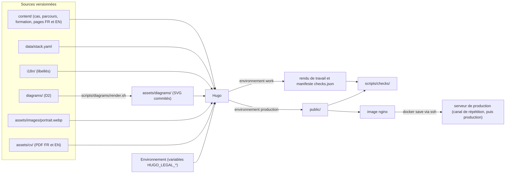
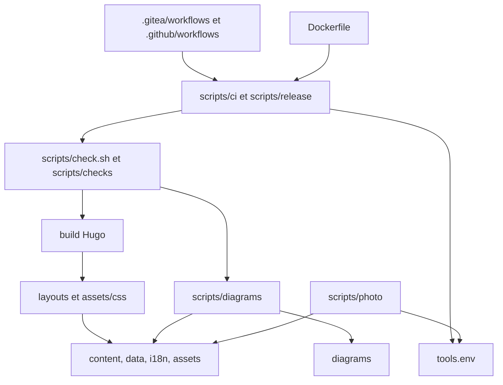
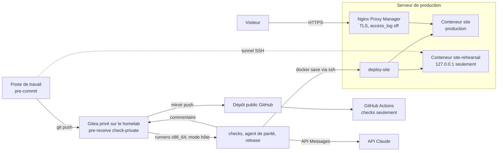

# Architecture : eleyone.fr

Document de référence pour les stories. Il fixe ce que deux stories construites séparément ne doivent pas décider chacune de leur côté. Les décisions portent un identifiant stable `AD-n` ; leur justification courte est en fin de document (« Décisions clés ») et, en détail, dans `.memlog.md`. Les décisions d'Arnaud du 13/09/2026 sont consignées dans la section du même nom. Une proposition ouverte serait marquée **[à valider par Arnaud]** et récapitulée à la fin ; il n'en reste aucune.

Statut : validé par Arnaud le 13/09/2026, puis mis à jour le même jour avec les décisions D-1 à D-17 du contrôle de préparation à l'implémentation (`implementation-readiness.md`, appliquées par `sprint-change-proposal-2026-09-13.md`). Première rédaction sans interlocuteur (run headless), sur la base du PRD, du brief et de son addendum, du format des cas, du cas pilote 02, du test D2 bilingue et des décisions d'Arnaud du 13/09/2026. Les affirmations sur Hugo ont été vérifiées par des spikes (Hugo v0.166.0, hors dépôt) ; les autres, par recherche web et lecture du code source (voir « Sources vérifiées »). Les renvois « question N » visent le §11.2 du PRD, dont la numérotation Q1 à Q17 est figée ; une question tranchée est citée par son intitulé au §11.1. La direction visuelle est tranchée et décrite par `DESIGN.md` et `EXPERIENCE.md` : ce document n'en fixe aucune valeur.

## Paradigme

**Pipes-and-filters de génération statique.** Des sources passent par des filtres (rendu D2, préparation de la photo, contrôles, Hugo) jusqu'à un artefact unique (`public/`), emballé dans une image nginx puis servi. Aucun filtre de build ne modifie une source ; deux outils de préparation écrivent des fichiers commités puis vérifiés : le rendu D2 (SVG) et la préparation de la photo. **Le contenu est une donnée** : un cas ne connaît pas la page qui l'affiche, un poste ne connaît pas ses cas, et les gabarits assemblent.



| Couche du paradigme | Emplacement |
| --- | --- |
| Sources de contenu | `content/`, `data/`, `i18n/`, `assets/live-material/`, `assets/images/`, `assets/cv/`, `diagrams/` |
| Présentation (assemblage) | `layouts/`, `assets/css/` |
| Filtres et préparation | `scripts/diagrams/`, `scripts/photo/`, `scripts/checks/`, Hugo |
| Orchestration | `scripts/check.sh`, `scripts/ci/`, `scripts/release/` ; workflows minces dans `.gitea/workflows/` et `.github/workflows/` |
| Emballage et service | `Dockerfile`, `deploy/` |

## Invariants et règles

Sens des dépendances : une flèche signifie « peut lire ou appeler ». Rien ne remonte.



### AD-1 — Chaîne statique Hugo, versions épinglées à un seul endroit [ADOPTED]

- **Binds:** NFR-1, NFR-7, NFR-8, FR-27 ; tout script, workflow et le `Dockerfile`.
- **Prevents:** qu'une CI, le poste de travail et l'image utilisent des versions différentes de Hugo, de D2 ou des outils de contrôle, ce qui casserait la comparaison octet par octet des SVG ou produirait un site différent de celui contrôlé.
- **Rule:** le site est généré par Hugo (binaire standard, sans module ni dépendance Node). Les versions et empreintes sha256 de Hugo et de D2 sont déclarées **uniquement** dans `tools.env`, avec l'image de contrôle `CHECK_IMAGE` (`alpine:3.24` épinglée par digest). `scripts/ci/install-tools.sh` télécharge et vérifie Hugo et D2 et installe par `apk` les outils de contrôle (`bash`, `git`, `grep` et `findutils` GNU, `jq`, `libxml2-utils`, `poppler-utils`) ; il sert au conteneur de contrôle des deux CI et à l'étape `tools` du `Dockerfile`, appelé par `scripts/ci/install-tools-bootstrap.sh`, en sh POSIX, qui pose d'abord `bash` : `alpine:3.24` ne l'a pas (constaté story 2.1). Les paquets sont donc déclarés en trois listes dans `tools.env` — amorçage, prérequis du job (`curl`, `ca-certificates`, absents eux aussi, et `su-exec`, qui rend la main au compte de l'appelant en fin d'installation, AD-11), outils de contrôle — dont la réunion est la liste ci-dessus. `findutils` et `grep` sont ceux de GNU pour la même raison : le `find` de BusyBox ignore `-printf`, dont `scripts/tests/run.sh` se sert, et le poste et l'image doivent se comporter pareil (constaté à la première exécution du job, story 3.12). La vérification de version commune vit dans `scripts/lib/tools.sh` (`require_tool_version`), et la procédure est `docs/procedures/tools.md`. Avec l'option `--local`, il installe seulement Hugo et D2, vérifiés par sha256, dans `.tools/` à la racine du dépôt (ignoré par git), que `scripts/build.sh` et `scripts/dev.sh` placent en tête du `PATH` : le poste de développement tire ses versions du même `tools.env` (décidé le 13/09/2026, D-15). Les runners n'apportent donc aucun outil de contrôle : l'image `ubuntu-24.04` de GitHub n'a pas `xmllint`, et libxml2 existe en 2.9.14 sur Ubuntu 24.04 contre 2.13.9 sur Alpine 3.24. Tout script qui appelle `hugo` ou `d2` compare d'abord la version présente à `tools.env` et échoue si elle diffère. La version de l'image nginx est épinglée dans le `Dockerfile` (tag et digest), seul endroit où elle sert. Une montée de version de D2 se fait dans un commit dédié qui régénère tous les SVG.

### AD-2 — Langues, URL, traductions et titre des pages

- **Binds:** FR-20, FR-21, FR-2, FR-15 ; `config/_default/hugo.yaml`, tous les fichiers de `content/`, `layouts/baseof.html`.
- **Prevents:** des URL ou des liens d'une langue qui pointent vers l'autre, un sélecteur de langue qui ne retrouve pas la page équivalente, une redirection implicite vers la racine, un `<title>` construit différemment d'un gabarit à l'autre.
- **Rule:**
  - `defaultContentLanguage: fr`, `defaultContentLanguageInSubdir: false`, `disableDefaultSiteRedirect: true` (le spike montre que, sans ce réglage, Hugo génère `/fr/index.html` avec une redirection `meta refresh`). Clés de langue `label`, `locale` et `weight` (les anciennes clés `languageName` et `languageCode` sont dépréciées depuis Hugo v0.158.0). `baseURL: https://eleyone.fr/` ; `disableKinds: [taxonomy, term, rss]` ; le sitemap multilingue généré par Hugo est conservé.
  - Tout fichier de `content/` existe en `.fr.md` et `.en.md` et porte un `translationKey` identique dans les deux langues. L'URL vient du `slug` de chaque langue. Aucun lien interne n'est écrit en dur dans un gabarit : il vient de `.RelPermalink`, de `.Translations` ou du partial `case-url.html` (AD-4).
  - Permaliens par langue : FR `page.cases: /cas/:slug/`, `section.cases: /cas/:sections[1:]/` ; EN `page.cases: /cases/:slug/`, `section.cases: /cases/:sections[1:]/`, sous le préfixe `/en/` ajouté par Hugo. Slugs des pages simples : FR `/a-propos/`, `/contact/`, `/mentions-legales/`, `/confidentialite/` ; EN `/en/about/`, `/en/contact/`, `/en/legal-notice/`, `/en/privacy/` (décidé le 13/09/2026).
  - Chaque page déclare `<html lang>` (valeur de `locale`, `fr` ou `en`), une balise `<link rel="alternate" hreflang>` par traduction (`.AllTranslations`), plus `hreflang="x-default"` vers la version française (décidé le 13/09/2026).
  - `<title>` est construit par `baseof.html` seul : titre de la page, puis la ligne d'identité lue dans `content/_index.<lang>.md` (AD-19). Aucun gabarit ne l'écrit autrement. **L'accueil fait exception** (décidé le 16/09/2026, story 2.2) : son titre est le titre du site (FR-1), qui porte déjà le nom, et lui ajouter la ligne d'identité donnerait le nom deux fois dans l'onglet comme dans un résultat de recherche. La règle vise à ce qu'aucune page ne sorte avec un titre nu ; l'accueil la tient par son titre même.
  - Sélecteur de langue sans JavaScript : un lien par traduction (`.Translations`), avec les attributs `hreflang` et `lang`, libellé par le nom de la langue cible dans cette langue (« English » sur une page FR, « Français » sur une page EN : `label` de la langue, décidé le 13/09/2026). Sur une page de groupe, il mène à la page de groupe de l'autre langue. Il ne transmet aucune ancre ; sans traduction (impossible en production, FR-20), il mène à l'accueil de l'autre langue.

### AD-3 — Le contenu est une donnée, les gabarits assemblent

- **Binds:** FR-1, FR-5 à FR-8, FR-16 à FR-19, FR-25, NFR-6 ; `content/`, `i18n/`, `layouts/`.
- **Prevents:** du texte de contenu écrit dans un gabarit (qui obligerait à toucher au code pour le modifier), des libellés d'interface éparpillés, un cas qui dépend de sa mise en page.
- **Rule:**
  - Les cas suivent `docs/format-cas.md` ; les postes et formations suivent AD-18. Aucun gabarit ne contient de texte de contenu : identité, titre du site et pitch sont dans `content/_index.{fr,en}.md` ; les autres pages, dans leur fichier Markdown.
  - **Contact** : l'adresse mail et l'URL LinkedIn sont du contenu commité, dans le front matter de `content/contact.{fr,en}.md` (`email`, `linkedin` et `github`, URL du profil GitHub d'Arnaud, identiques en FR et en EN ; `github` ajoutée le 13/09/2026, D-7), et non des variables d'environnement (décidé le 13/09/2026).
  - **Lien vers le dépôt public** : URL dans `params.source_url` de `config/_default/hugo.yaml` ; tant qu'elle est vide, aucun lien n'est rendu (pas de lien factice), et C12 ne l'attend pas.
  - Les libellés d'interface (encarts, champs, cadres, blocs de l'accueil, sélecteur, pied de page) sont dans `i18n/fr.yaml` et `i18n/en.yaml`, en clés `snake_case` anglaises. Le libellé d'un cadre s'obtient par `T (printf "setup_%s" (replace .setup "-" "_"))`.
  - Un seul partial rend un cas (`_partials/case.html`) : titre, encart « Contexte mission », encart « En bref », cas complet, dans cet ordre (FR-5). Il reçoit le niveau de titre (1 sur une page de cas, 2 dans une section de groupe) et ne se duplique pas.
  - Libellés EN (décidés le 13/09/2026) : « Contexte mission » → *Engagement context* ; « En bref » → *At a glance* ; Société / Cadre / Rôle / Période / Stack → *Company / Engagement / Role / Period / Stack* ; cadres `employee` → *Employee*, `freelance` → *Freelance*, `agency` → *IT consultancy*, `ton-pote-le-geek` → *Ton Pote le Geek*.

### AD-4 — Emplacement des cas, pages de groupe et adressage des sections

- **Binds:** FR-2, FR-9, FR-15, FR-32 ; `content/cases/`, `layouts/cases/`, `_partials/case-url.html`.
- **Prevents:** une page séparée pour les cas 02, 03 ou 04, une page Chiliz à modifier à chaque cas ajouté, deux façons de construire un lien vers un cas, des ancres différentes entre FR et EN.
- **Rule:**
  - Un cas sans groupe : `content/cases/case-NN-<short>.{fr,en}.md`, rendu à son URL.
  - Un cas groupé : `content/cases/<group>/case-NN-<short>.{fr,en}.md`. Le dossier du groupe contient `_index.{fr,en}.md`, qui **est** la page de groupe (titre « Chiliz », sans introduction en v1 : question 9, tranchée le 13/09/2026). Ce `_index` porte `cascade: [{build: {render: never, list: always}, target: {kind: page}}]`. Le `target` est obligatoire : le spike montre que, sans lui, la page de groupe elle-même n'est plus rendue.
  - La clé `group` est obligatoire pour un cas groupé et égale au nom du dossier (contrôle bloquant), comme le fixe `docs/format-cas.md` v0.4 ; le `_index` du groupe ne relève pas de la rédaction des cas. Le cas pilote se trouve dans `content/cases/chiliz/case-02-chiliz.{fr,en}.md`.
  - Les titres du Markdown d'un cas passent par un seul hook, `layouts/_markup/render-heading.html`. Il :
    - préfixe chaque identifiant par le `translationKey` (`case-02-contexte`) ; les identifiants sont en ASCII (`markup.goldmark.parser.autoHeadingIDType: github-ascii`, décidé le 17/09/2026, story 2.6), pour qu'un lien copié reste lisible (`case-02-le-probleme`) ;
    - pour un cas groupé, descend chaque titre d'un niveau (`##` rendu en `<h3>`) ;
    - écrit devant chaque rubrique (titre de niveau 2 du Markdown) son numéro `<span class="rubric-number" aria-hidden="true">NN.r</span>` : numéro du cas (`number`), point, rang de la rubrique **dans le cas**, calculé à partir de `.PageInner.Fragments.Headings`. Le spike (Hugo v0.166.0) donne 02.1 à 02.6 sur le pilote. Le numéro ne dépend pas de la page qui affiche le cas, donc ne change pas quand le cas 03 est publié ; les rubriques étant identiques en FR et en EN (C3), les numéros le sont aussi ;
    - pose la classe de rôle `rubric-heading` ; l'apparence relève de `DESIGN.md`.
    Les encarts « Contexte mission » et « En bref » sont rendus par `_partials/case.html`, pas par le hook : ils n'ont ni numéro ni entrée de sommaire. L'accueil ne rend aucun Markdown de cas, donc aucun numéro de rubrique.
  - **Sommaire** : `_partials/toc.html` construit le sommaire d'une page cas ou de groupe à partir des mêmes titres, dans un `<details>` natif (sans JavaScript ni exception CSP), avec le nombre de rubriques calculé par le gabarit ; il ne liste que les rubriques et sections publiées.
  - La page de groupe rend ses cas par `sort .RegularPages "Params.order"`, chacun dans `<section id="<translationKey>">` (par exemple `id="case-02"`, identique en FR et en EN). Les brouillons sont exclus par Hugo en production, et une section absente ne laisse aucune trace.
  - Tout lien vers un cas passe par `_partials/case-url.html` : `.Parent.RelPermalink#<translationKey>` pour un cas groupé, `.RelPermalink` sinon (spike : `/cas/chiliz/#case-02` depuis l'accueil).
  - L'accueil liste les cas publiés sous leur poste ou dans le bloc « En parallèle » (FR-2, FR-4, AD-18) : chaque cas publié est atteint en un clic depuis l'accueil de sa langue. L'accueil ne présente plus de cas mis en avant à part (PRD §11.1) : aucun gabarit ne lit `featured`, supprimée par le format v0.4.
  - `content/cases/_index.{fr,en}.md` porte `build: {render: never}` : l'accès aux cas passe par l'accueil (question 6, tranchée).
  - Une page de groupe sans aucun cas publié est rendue vide par Hugo (constaté dans le spike). **Page de groupe en brouillon** (décidé le 13/09/2026, D-3) : le `_index` d'un groupe reste en `draft: true` tant qu'aucun de ses cas n'est publié.
    - En production, la page de groupe n'est alors pas construite : ni C12 ni C15 ne la voient. En rendu de travail (`--buildDrafts`), elle s'affiche avec ses cas.
    - Le `_index` passe en `draft: false` dans la même PR que la publication du premier cas du groupe (pour Chiliz, stories 10.4 et 10.5 livrées ensemble), si bien qu'aucune page de groupe vide n'existe en production. La règle vaut pour tout groupe futur.
    - La story 2.5 constate qu'un `_index` en brouillon ne casse ni la cascade ni `case-url.html` en rendu de travail. Si le constat échoue, repli : C12 exclut les pages de groupe sans section, comme C15 les traite déjà.
    - C15 garde l'interdiction d'une page de groupe vide à la mise en ligne.

### AD-5 — Deux environnements de rendu : production et travail

- **Binds:** FR-12, FR-26, FR-32 ; `layouts/`, `config/`, scripts de build.
- **Prevents:** qu'un gabarit invente son propre interrupteur, qu'un élément « prévu » ou un brouillon arrive en production, ou que le rendu de travail soit déployé.
- **Rule:**
  - `scripts/build.sh work|production` est le **seul** appel à `hugo` des scripts et du `Dockerfile`, avec des options et des dossiers de sortie fixes :
    - **production** : `hugo --environment production --minify --cleanDestinationDir --panicOnWarning --destination public`, sans `--buildDrafts` ;
    - **travail** : `hugo --environment work --buildDrafts --cleanDestinationDir --panicOnWarning --destination build/work`.
    Les deux sorties ne se mélangent jamais. `build.sh` **vide lui-même son dossier de destination** avant d'appeler Hugo : `--cleanDestinationDir` ne supprime pas les fichiers d'un build précédent (constaté avec Hugo 0.166, story 2.2 — une page déposée dans `public/` survit au build suivant), et une page retirée du site resterait servie. En local, `scripts/dev.sh` lance `hugo server --environment work --buildDrafts`. `.gitignore` et `.dockerignore` excluent `public/`, `build/`, `resources/_gen/` et `.hugo_build.lock`.
  - Les gabarits ne testent que `hugo.IsProduction`. Le rendu de travail ajoute `<meta name="robots" content="noindex">`, et un marqueur « Brouillon » (libellé i18n `draft_marker`, classe `draft-marker`) devant le titre de chaque cas en brouillon (page cas, section de groupe et lien sous le poste) et devant la société de chaque poste en brouillon (décidé le 17/09/2026, story 2.7), et devant le titre de chaque entrée de `content/education/` en brouillon (étendu le 21/09/2026, story 5.3 : ces entrées n'existaient pas quand la liste a été fixée). Ce marqueur n'est jamais émis quand `hugo.IsProduction` est vrai ; C15 vérifie son absence de `public/`.
  - `config/work/hugo.yaml` ajoute le format de sortie `checks` (manifeste JSON, AD-10) ; le spike confirme qu'il est absent du build de production.
  - L'image n'est construite qu'à partir d'un build de production. Le rendu de travail n'est jamais servi publiquement.
  - Aucun build n'émet d'avertissement (`--panicOnWarning`). Une dépréciation reste au niveau INFO pendant trois versions mineures avant de devenir un avertissement : une montée de version de Hugo relit donc les notes de version.
  - Le build de production de contrôle et celui de l'image sont la même commande : les contrôles HTML portent sur un HTML identique à celui de l'image (le minifieur retire par défaut les guillemets des attributs).

### AD-6 — Matériel vivant : un seul shortcode, une résolution par type

- **Binds:** FR-12, FR-13, FR-14, NFR-4, NFR-10 ; `_shortcodes/live-material.html`, `assets/diagrams/`, `assets/live-material/`.
- **Prevents:** plusieurs façons d'afficher un élément, une trace d'élément « prévu » en production, un schéma sans alternative textuelle, des fichiers d'élément nommés différemment d'une story à l'autre.
- **Rule:**
  - Le seul point d'insertion est ``. Un `id` non déclaré dans `live_material` fait échouer le build (`errorf`).
  - En production, un élément `planned` ne produit **rien** : le spike confirme qu'il ne reste ni `<figure>`, ni `<p>` vide, ni commentaire. En rendu de travail, un élément `planned` n'est **jamais résolu** : il s'affiche en encart fixe avec son type et sa `description`. Seul un élément `ready` est résolu.
  - Les identifiants sont en kebab-case anglais, préfixés par leur type (`diagram-`, `video-`, `snippet-`, `callout-`). Un identifiant est le même dans les fichiers FR et EN d'un cas, et n'appartient qu'à un seul cas dans tout le site.
  - Résolution d'un élément `ready`, dans la langue de la page (`<lang>` = clé de langue Hugo, `fr` ou `en`) :

    | Type | Source | Rendu |
    | --- | --- | --- |
    | `diagram` | `assets/diagrams/<id>.<lang>.svg` | `<figure></figure>` ; `alt` = `description` du fichier de la langue ; dimensions lues dans le SVG ; fichier empreinté |
    | `video` | `url` du front matter | lien `<a href>` vers YouTube, avec la `description` pour texte ; jamais d'iframe |
    | `snippet`, `callout` | `assets/live-material/<id>.<lang>.md` | Markdown rendu dans `<figure>` ou `<aside>` |

  - Un élément `ready` dont la source manque fait échouer le build. La `description` sert d'alternative textuelle *(relecture)* ; le SVG de D2 ne contient ni `<title>` ni `<desc>` (constaté avec D2 v0.9.0).
  - **Schéma large** (impact I-4 d'`EXPERIENCE.md`) : au-delà du seuil de largeur intrinsèque fixé par `DESIGN.md`, le shortcode pose une classe et un attribut `width` calculé selon la proportion fixée par `DESIGN.md`, enveloppe l'image dans un conteneur focalisable (`tabindex="0"`) doté d'un nom accessible, et ajoute un lien « taille réelle » (libellé i18n `diagram_full_size`) vers le SVG empreinté. Aucun attribut `style` n'est émis : la CSP d'AD-13 (`style-src 'self'`) le bloquerait.

### AD-7 — Pipeline D2

- **Binds:** FR-13, FR-27, NFR-8 ; `diagrams/`, `assets/diagrams/`, `scripts/diagrams/`.
- **Prevents:** des SVG désynchronisés de leurs sources, un libellé traduit d'un seul côté, des SVG illisibles par nginx, des variations de rendu entre machines.
- **Rule:**
  - Un schéma = un dossier `diagrams/<id>/` avec `structure.d2` (identifiants, formes et liens ; tous les libellés en `${variables}` ; **aucun** bloc `vars` de libellé), `fr.d2` et `en.d2` (bloc `vars`, puis `...@structure`). `<id>` est l'identifiant `live_material` du schéma. Le thème commun `diagrams/theme.d2` est importé par chaque structure ; ses valeurs (thème clair, et thème sombre par `dark-theme-id` et `dark-theme-overrides`) viennent de `DESIGN.md` (« Accord avec les schémas D2 »). Les options `--theme` et `--dark-theme` ne sont jamais passées.
  - **Spike « D2 à double thème »**, avant toute story du pipeline D2 (impact I-3). Il vérifie, sur le schéma de test :
    1. qu'un SVG qui embarque les deux thèmes suit `prefers-color-scheme` quand il est chargé par `` (Firefox, Chrome, Safari) ;
    2. que deux rendus restent identiques à l'octet près (C9) ;
    3. que le SVG reste ≤ 60 Ko (C13).
    Si l'un des trois échoue : repli sur le thème clair seul, présenté en planche claire encadrée selon `DESIGN.md` ; les autres règles d'AD-7 ne changent pas.
  - D2 ne coupe pas les libellés : les retours à la ligne s'écrivent à la main (`\n`) dans `fr.d2` et `en.d2`. La lisibilité à 320 px se vérifie dans un navigateur, au titre de la check-list manuelle (AD-17).
  - `scripts/diagrams/render.sh` rend chaque langue avec `--omit-version --no-xml-tag --pad 24 --layout elk`, en neutralisant `D2_THEME`, `D2_LAYOUT`, `D2_PAD` et `D2_SKETCH`, vers `assets/diagrams/<id>.<lang>.svg`, puis applique `chmod 0644` (D2 v0.9.0 écrit en `0600` même avec `umask 022`, constaté).
  - Les SVG sont commités. `scripts/diagrams/check.sh` régénère dans un dossier temporaire, compare avec `cmp` et échoue sur tout écart, tout SVG manquant ou orphelin, et toute différence entre les clés de `vars` de `fr.d2`, de `en.d2` et les variables de `structure.d2`.
  - Un dossier de `diagrams/` sans élément `diagram` déclaré dans un cas, ou un élément `ready` sans dossier, fait échouer le contrôle. Le schéma de démonstration de FR-27 vit dans `tests/fixtures/diagrams/` et n'est jamais publié.
  - Les rendus comparés se font sur x86_64 : runners Gitea, et `ubuntu-24.04` sur GitHub, qui est x64.

### AD-8 — Qualité front : zéro JavaScript, aucune ressource tierce, budget de poids

- **Binds:** NFR-3, NFR-5, NFR-6, NFR-12, NFR-13, FR-14, FR-35 ; `layouts/`, `assets/css/`, contrôles HTML.
- **Prevents:** un script ou une ressource tierce ajoutés « juste pour un détail », une police web ou une image sans dimensions qui dégrade LCP ou CLS, une page qui dépasse le budget sans que personne ne le voie, un mode sombre qui ajoute du JavaScript.
- **Rule:**
  - Aucune balise `<script>` exécutable, aucun attribut `on*=`, aucune `<iframe>`, aucun `<form>`, aucune ressource chargée depuis une autre origine. **Seule exception** : un bloc de données JSON-LD, dans les conditions d'AD-20. Toute autre exception demande une décision écrite ajoutée à ce document.
  - Une seule feuille de style `assets/css/main.css`, minifiée et empreintée par Hugo Pipes. Pas de police web ; pile de polices système (décidé le 13/09/2026). Toute `` porte `width` et `height`.
  - **Mode sombre en CSS pur** (NFR-13) : `@media (prefers-color-scheme: dark)` dans `main.css`, sans bouton ni JavaScript ; les couleurs passent par des propriétés personnalisées CSS, et le contraste se mesure dans les deux modes (AD-17).
  - Budget par page (décidé le 13/09/2026), mesuré sur `public/` en octets non compressés, **1 Ko = 1 000 octets** et une image déclinée comptée par sa variante la plus lourde (story 3.11, 19/09/2026) : HTML ≤ 50 Ko ; CSS total ≤ 20 Ko ; chaque SVG ≤ 60 Ko ; page complète (HTML, CSS et images référencées, photo comprise) ≤ 200 Ko ; au plus 10 ressources ; 0 fichier JavaScript ; 0 fichier de police ; au plus 800 éléments HTML. Les PDF du CV (AD-21) sont des liens, hors budget de page.
  - La politique CSP (AD-13) interdit aussi les scripts côté navigateur.

### AD-9 — Mentions légales : valeurs injectées par l'environnement, jamais commitées

- **Binds:** FR-18, FR-19, FR-33, NFR-9 ; `_partials/legal-value.html`, `_shortcodes/legal.html`, `scripts/env.sh`, `.env.example`, `ci/legal-placeholder.env`, `.gitignore`, `.dockerignore`, `scripts/check-private.sh`, workflows.
- **Prevents:** des coordonnées de l'éditeur ou de l'hébergeur dans le dépôt ou son historique GitHub, une page légale publiée vide ou avec des valeurs factices, deux mécanismes de lecture différents.
- **Rule:**
  - Les valeurs sont lues **uniquement** dans `_partials/legal-value.html`, par `os.Getenv`, sous sept noms définitifs (décidé le 13/09/2026 ; PRD §11.1, « Contenu des mentions légales ») : `HUGO_LEGAL_PUBLISHER_NAME`, `HUGO_LEGAL_PUBLISHER_ADDRESS`, `HUGO_LEGAL_PUBLISHER_CONTACT`, `HUGO_LEGAL_PUBLISHER_REGISTRATION`, `HUGO_LEGAL_HOST_NAME`, `HUGO_LEGAL_HOST_ADDRESS`, `HUGO_LEGAL_HOST_CONTACT`.
    - Le directeur de la publication est l'éditeur : la page affiche `HUGO_LEGAL_PUBLISHER_NAME` sous le libellé i18n `legal_publication_director`, sans variable dédiée.
    - Pas de numéro de TVA intracommunautaire, donc ni variable ni champ.
    - L'adresse de l'éditeur est celle de l'activité déclarée (question 17, option a, décidé le 13/09/2026) : sa commune n'apparaît que sur les deux pages des mentions légales (`/mentions-legales/`, `/en/legal-notice/`), injectée par `HUGO_LEGAL_PUBLISHER_ADDRESS`. `legal-value.html` refuse (`errorf`) toute lecture d'une variable `HUGO_LEGAL_*` hors d'une page de `translationKey` `legal-notice` : ni `<title>`, ni meta `description`, ni JSON-LD, ni sitemap, ni pied de page. C23 le vérifie sur la sortie. Aucune exclusion des moteurs de recherche n'est posée sur ces pages (C15 interdit `noindex` en production).
    - Le lien vers la politique de confidentialité de l'hébergeur fait partie du texte des pages légales (contenu commité), pas d'une variable.
    - Toute variable légale ajoutée plus tard passe par une modification de cet AD. Le préfixe `HUGO_` est imposé par la liste d'autorisation par défaut de `security.funcs.getenv` (`^HUGO_`, `^CI$`) ; le spike confirme qu'une variable hors de cette liste fait échouer le build.
  - `os.Getenv` a été préféré à la surcharge `HUGO_PARAMS_…`, qui découpe les clés `snake_case` sur `_` (spike).
  - Le partial fait échouer **tout** build si une valeur est vide. Le Markdown des pages légales l'appelle par ``, dont l'argument donne le suffixe en minuscules de la variable.
  - **Un seul chargeur**, `scripts/env.sh`, prépare l'environnement de tout appel à `scripts/build.sh` et `scripts/dev.sh` (Hugo ne lit pas `.env`) :
    - hors mise en ligne : variables déjà définies, puis `.env` s'il existe, puis `ci/legal-placeholder.env` ;
    - avec `ENV_MODE=release` : variables déjà définies, puis le fichier désigné par `LEGAL_ENV_FILE`, obligatoire ; `.env` et le fichier factice sont refusés, et toute variable manquante fait échouer le chargeur.
  - **Build de contrôle** (GitHub, job de contrôles Gitea, poste sans `.env`) : charge `ci/legal-placeholder.env`, commité, dont chaque valeur contient `VALEUR-FACTICE`, uniquement dans le processus du conteneur de contrôle.
  - **Build de mise en ligne** (workflow `release`, production ou répétition) : le workflow écrit les secrets Gitea dans un fichier temporaire au format dotenv et le passe en secret BuildKit (`docker build --secret id=legal_env,src=<fichier>`). Dans le `Dockerfile`, une seule instruction `RUN --mount=type=secret,id=legal_env,required=true` exécute `ENV_MODE=release LEGAL_ENV_FILE=/run/secrets/legal_env scripts/build.sh production` puis `scripts/check.sh`. L'étape `build` est reconstruite sans cache (`--no-cache-filter build`), puisqu'un secret ne change pas la clé de cache. Le contrôle de mise en ligne échoue si `VALEUR-FACTICE` apparaît dans `public/`.
  - `.env`, à la racine du dépôt et jamais commité, contient **tous** les jetons, identifiants et secrets utilisés en local : les sept `HUGO_LEGAL_*`, et `GITEA_URL`, `GITEA_USER`, `GITEA_TOKEN` d'AD-24 (décidé le 13/09/2026). `scripts/env.sh` ne transmet à Hugo que les variables `HUGO_LEGAL_*` : il ne lit dans `.env` que les lignes `^HUGO_LEGAL_`, sans `source` du fichier entier ni `set -a`, si bien qu'un `GITEA_TOKEN` défini dans `.env` n'est jamais visible du processus `hugo` (critère de la story 2.4). Les autres variables ne servent qu'aux scripts du poste de développement. `.env.example`, commité, liste exactement ces dix noms (les sept `HUGO_LEGAL_*`, `GITEA_URL`, `GITEA_USER`, `GITEA_TOKEN`) sous la forme `NOM=` sans valeur ; `ci/legal-placeholder.env` contient les sept noms légaux avec des valeurs `VALEUR-FACTICE-…` (C18). `.env` est ignoré par git, exclu par `.dockerignore`, et figure déjà dans les chemins interdits de `scripts/check-private.sh`.
  - Ces valeurs sont publiques une fois le site en ligne : le but est de les tenir hors du dépôt, pas de les cacher.
  - **Motifs interdits et sortie du build** : la liste des motifs, qui contient la commune de résidence, s'applique aux sources versionnées (garde-fou, AD-12) et aux PDF (C21). Sur la sortie de production `public/`, le contrôle C22 du job `release` confronte chaque page à la liste : toute occurrence fait échouer la mise en ligne, sauf sur les deux pages des mentions légales, où une occurrence n'est admise que si elle est contenue dans l'une des valeurs `HUGO_LEGAL_*` injectées. Le build de contrôle de GitHub, avec ses valeurs factices et sans liste de motifs, n'est pas concerné.

### AD-10 — Contrôles : scripts partagés, point d'entrée unique, manifeste Hugo

- **Binds:** FR-23, FR-26, FR-27, FR-15, FR-32, NFR-4, NFR-5, NFR-12 ; `scripts/check.sh`, `scripts/checks/`, `layouts/home.checks.json`.
- **Prevents:** des contrôles écrits dans le YAML d'une forge et absents de l'autre, deux lectures différentes du front matter, un contrôle local qui diffère de celui de la CI, un contrôle qui rejette un brouillon légitime.
- **Rule:**
  - `scripts/check.sh` est le **seul** point d'entrée des contrôles bloquants, lancé de la même façon en local, sur Gitea et sur GitHub ; `scripts/check.sh --release` ajoute les contrôles de mise en ligne. Il fonctionne sans `.git` ; les contrôles qui lisent l'historique restent dans `scripts/ci/checks-job.sh`.
  - Les métadonnées sont lues **par Hugo** : le rendu de travail émet `build/work/checks.json` et `build/work/en/checks.json`, qui listent **tous** les fichiers de `content/` avec leur `kind` (`home`, `section`, `page`) et leur rôle (`home`, `case`, `group`, `position`, `education`, `section` pour un `_index` technique, `page`), le fichier (chemin relatif à `content/`), la langue, le `translationKey`, le brouillon et le front matter **tel qu'écrit dans le fichier** (relu par `os.ReadFile` et `transform.Unmarshal`, casse des clés gardée, sans ce que la cascade ou Hugo ajoutent), les identifiants placés, les titres extraits du Markdown brut par `findRE` avec leur niveau (`headings`, story 3.4), le matériel vivant déclaré avec la source qu'AD-6 lui donne dans la langue du fichier et son existence (`material`, story 3.5) et la présence de `[TODO`, plus le vocabulaire de `hugo.Data.stack` et les rubriques de `hugo.Data.rubrics`, avec leurs deux écritures (story 3.3). Le manifeste liste **tous** les fichiers Markdown de `content/`, y compris ceux qu'aucune collection ne contient (`list: never`) : le gabarit parcourt `content/` puis résout chaque fichier par `site.GetPage`. Un fichier sans suffixe de langue figure dans les deux manifestes avec une clé `error` (story 3.1, 18/09/2026). La forme du manifeste n'est définie que dans `layouts/home.checks.json`, et documentée en tête de `scripts/checks/lib.sh`, que tous les scripts de contrôle sourcent. Ces scripts (`bash`, `jq`, `xmllint`) tournent dans `CHECK_IMAGE`, qui embarque `jq` (AD-1) : lancés en local par `scripts/ci/checks-job.sh`, ils ne demandent pas `jq` sur le poste ; seul un appel direct de `scripts/check.sh` hors conteneur le demande.
  - **Brouillons** : pour un fichier en `draft: true`, une valeur qui commence par `[TODO` est acceptée par toutes les règles de forme (valeurs autorisées, longueur, comptage de l'encart, vocabulaire, rattachement à un poste). Seuls la parité (C3), la liste des rubriques (C4) et le garde-fou s'appliquent aux brouillons. Un `[TODO` dans un fichier publié fait échouer C5.
  - Les contrôles HTML portent sur le build de production de contrôle (`public/`). Les attributs se vérifient par requêtes XPath avec `xmllint --html` ; `grep` ne sert qu'aux chaînes. Le parseur HTML de libxml2 antérieur à 2.14 signale les balises HTML5 comme invalides : ces avertissements sont ignorés. Aucun navigateur, ni Node, ni Chrome en CI.
  - Tout signalement nomme le fichier et l'écart, et tout écart rend un code de sortie non nul. La liste des contrôles est tenue dans la section « Liste des contrôles ».

### AD-11 — CI double sans duplication

- **Binds:** FR-23, FR-24, FR-27, FR-28, NFR-2, NFR-8, NFR-11 ; `.gitea/workflows/`, `.github/workflows/`, `scripts/ci/`.
- **Prevents:** des exécutions en double ou en échec, un build d'image ou un déploiement sur GitHub, une logique métier différente entre les deux forges, un job Gitea incapable de lancer Docker.
- **Rule:**
  - **Gitea lit `.gitea/workflows/` et ignore `.github/workflows/` dès que le premier existe** (vérifié dans le code : `[actions] WORKFLOW_DIRS`, défaut `.gitea/workflows,.github/workflows`, premier dossier présent retenu). `.gitea/workflows/` contient toujours au moins un workflow, et `WORKFLOW_DIRS` garde sa valeur par défaut. GitHub ne lit que `.github/workflows/`.
  - `.gitea/workflows/` : `checks.yaml` (sur `push` de `dev` et de `main`, et sur `pull_request` ; ses statuts servent aux protections de branche et au verrou « CI verte » d'AD-24), `parity-agent.yaml` (AD-16), `release.yaml` (sur `push` de tags `v*`, AD-14 et AD-22).
  - `.github/workflows/` : `checks.yaml` seulement (sur `push` des seules branches `dev` et `main`, et `workflow_dispatch`), `runs-on: ubuntu-24.04`. Pas de secret, pas de `docker build`, et `permissions: contents: read` déclaré dans le workflow. Le filtre de branches est décidé le 20/09/2026 (story 3.14) : le miroir pousse **toutes** les branches, et sans lui chaque branche de travail lancerait un run public, alors qu'elle est déjà contrôlée sur Gitea par `pull_request` ; le dépôt public montre l'état du tronc.
  - **Accès des runners Gitea à Docker** : les jobs qui lancent Docker (`checks.yaml`, `release.yaml`) tournent sur un label en mode hôte, nommé distinctement comme le recommande la documentation de Gitea (par exemple `linux_amd64:host`), sur un runner x86_64 dont l'utilisateur a accès au démon Docker. En mode conteneur, le runner monte l'espace de travail dans un volume Docker (commentaire de `config.example.yaml`) : un `docker run -v "$PWD"` lancé depuis le job monterait alors un chemin absent de l'hôte. Mode hôte décidé le 13/09/2026 ; le nom exact du label se fixe dans WS-4.
  - Sur GitHub, `scripts/ci/checks-job.sh` lance aussi `docker run` depuis la machine virtuelle du runner, plutôt qu'un conteneur de job : les actions JavaScript comme `actions/checkout` sont fragiles dans un conteneur Alpine (binaire Node lié à glibc). Le job tire `CHECK_IMAGE` à part, et seulement si elle manque, avec trois tentatives espacées : les runners publics partagent leurs adresses IP et le registre limite les tirages anonymes (story 3.14). La reprise vit dans le script, jamais dans un YAML.
  - Le workflow `release` vérifie d'abord le nom et la branche du tag : `vMAJEUR.MINEUR.CORRECTIF` sur un commit de `main` (production), `vMAJEUR.MINEUR.CORRECTIF-rc.N` sur un commit de `dev` (répétition, AD-22 et AD-24).
  - Un workflow ne contient que le déclencheur, le checkout (`fetch-depth: 0`) et l'appel d'un script. `scripts/ci/checks-job.sh` lance `docker run --rm` sur `CHECK_IMAGE` avec le dépôt monté sur `/repo`, qui est aussi le répertoire de travail, et lui passe l'UID et le GID de l'appelant. Dans le conteneur, `scripts/ci/checks-job-container.sh` pose les outils en `root`, puisque `apk` l'exige, puis **redescend au compte de l'appelant** par `su-exec` avant d'enchaîner le garde-fou en mode historique, `scripts/tests/run.sh` et `scripts/check.sh` : sans cette bascule, `public/` et `build/`, écrits dans le dépôt monté, appartiendraient à `root` et le `scripts/check.sh` suivant échouerait à les vider (décidé le 19/09/2026, story 3.12). Les valeurs légales sont celles de `ci/legal-placeholder.env`, chargées par `scripts/env.sh` dans le seul processus du conteneur ; `ENV_FILE` y désigne un chemin inexistant, pour qu'un `.env` présent dans le dépôt monté ne soit pas lu. Le même script tourne en local (`docs/procedures/checks-job.md`). Sur GitHub, les actions tierces sont épinglées par SHA de commit.
  - **Build Hugo de contrôle ≠ build d'image.** Les deux forges font un build Hugo pour contrôler le HTML ; seul le workflow `release` de Gitea construit et livre une image.

### AD-12 — Garde-fou public/privé en trois couches

- **Binds:** FR-28, NFR-9, UJ-4 ; `scripts/check-private.sh`, `.githooks/pre-commit`, hook serveur Gitea, `scripts/ci/checks-job.sh`.
- **Prevents:** l'entrée d'un chemin ou d'un motif privé dans l'historique de Gitea, donc sur GitHub ; un contournement par un poste sans hook ; la divergence entre la version du script dans le dépôt et celle du serveur.
- **Rule:**
  - **Local** : `scripts/check-private.sh staged` en pre-commit (`git config core.hooksPath .githooks`).
  - **Serveur (autorité)** : hook pre-receive sur le dépôt Gitea, fermé en cas de doute (procédure plus bas).
  - **Dépôt public GitHub** (décidé le 13/09/2026, D-9) : aucun push ne va directement sur GitHub, seul le miroir push de Gitea y écrit, et GitHub l'impose :
    - un ruleset couvre toutes les branches et tous les tags : création, mise à jour et suppression restreintes, avec un seul acteur autorisé à contourner, l'identité du miroir. Trois constats de la story 1.4 (16/09/2026) fixent cette identité : le miroir push de Gitea ne sait pas pousser en SSH, donc pas de clé de déploiement ; un jeton à grain fin ne cible que les dépôts de son propriétaire, or le compte machine n'est que collaborateur, donc un **jeton classique** limité aux portées `public_repo` et `workflow` ; et l'acteur de contournement est le **compte machine désigné nommément**, jamais un rôle : un contournement par rôle Write couvre aussi le propriétaire du dépôt, dont le push direct passe alors (vérifié, puis corrigé) ;
    - `main` porte en plus « Block force pushes », puisqu'elle n'est jamais réécrite. `dev` ne le porte pas, pour que la réécriture qui suit un hotfix passe par le miroir (AD-24). Un acteur de contournement échappe à toutes les règles du ruleset qui l'autorise : ce blocage vit donc dans un second ruleset, limité à `main` et sans acteur de contournement ;
    - test (story 1.4) : un push direct depuis le compte personnel d'Arnaud est refusé par GitHub.
  - **CI** (Gitea et GitHub) : `scripts/check-private.sh history` sur tout l'historique, en mode chemins seulement.
  - Chemins interdits (déjà en place), comparés sans tenir compte de la casse : `docs/private/`, `docs/context/`, `.env` seul ou suffixé (`.env.production`, `.env.local` ; `.environment.md` et `env.example` restent admis), et, à titre temporaire, `assets/cv/*.pdf` et les extensions d'images, chacune levée quand son contrôle (C21, C20) vivra dans le hook. Deux exceptions nommées : `.env.example` et `design/<branche>/screenshots/` (captures déjà publiées des branches de design, hors du périmètre de C20). **Nommer** `docs/private/` dans un fichier public est autorisé (NFR-9, décidé le 13/09/2026) : le garde-fou refuse les fichiers sous ce chemin, pas la mention du chemin.
  - La recherche de motifs de `check-private.sh` utilise `git grep -I`, qui ignore les fichiers binaires : le texte des PDF et les métadonnées des images échappent donc à ce garde-fou, et sont couverts par C20 et C21 (AD-19, AD-21). **Depuis l'activation du miroir (story 1.4), un contrôle qui ne vit qu'en CI arrive après la publication** : le miroir pousse à chaque push, et un commit publié reste accessible par son SHA. C20 comme C21 vivent donc dans le hook `pre-receive` ; d'ici là, leurs chemins (`assets/cv/*.pdf`, extensions d'images) y sont refusés (décidé le 16/09/2026, story 1.5, après la rétrospective de l'epic 1).
  - **Quatre surfaces** (décidé le 16/09/2026, story 1.5) : le contenu des fichiers, leur chemin, le chemin confronté aux motifs (un dossier nommé d'après un client fuit autant qu'un fichier ; le chemin fautif n'est pas affiché, il contient le motif), et le **message des commits**, en `history` et en `pre-receive`. En `staged`, le message n'existe pas encore : il est refusé au push.
  - Une alerte n'affiche que l'emplacement du contenu trouvé (commit, fichier, ligne) et le numéro de ligne du motif, jamais le contenu ni le motif, pour qu'aucune donnée privée ne passe dans un terminal, une conversation d'agent, un journal de CI ou la réponse du hook serveur (décidé le 14/09/2026, story 0.3). Chaque arbre est cherché en un seul passage avec tous les motifs ; la recherche motif par motif, qui situe les résultats, n'a lieu qu'en cas de résultat, et une erreur de recherche fait échouer le garde-fou. Dans une copie sans `docs/private/`, `PRIVATE_PATTERNS_FILE` désigne le fichier de motifs : un passage « chemins seulement » ne vaut pas audit.
  - Le mode `pre-receive` du script échoue si `PRIVATE_PATTERNS_FILE` n'est pas définie, si la liste des motifs est absente ou si elle ne contient aucun motif ; il ne se replie jamais sur les chemins seulement (décidé le 15/09/2026, story 1.1). Les modes `staged` et `history` gardent ce repli, avec l'avertissement.
  - **Ordre imposé** : le miroir push vers GitHub n'est activé qu'après l'installation et le test du hook pre-receive et un audit `history` complet et propre, fait avec la liste des motifs.

### AD-13 — Image multi-étapes et configuration nginx

- **Binds:** NFR-1, NFR-2, NFR-3, NFR-5, NFR-12, FR-21 ; `Dockerfile`, `.dockerignore`, `deploy/nginx/`.
- **Prevents:** une image qui embarque des fichiers du dépôt hors `public/`, des fichiers illisibles par nginx, des en-têtes de sécurité perdus dans un bloc `location`, une 404 dans la mauvaise langue.
- **Rule:**
  - Étapes : `tools` (`CHECK_IMAGE`, `scripts/ci/install-tools.sh`) → `build` (sources, instruction `RUN` unique décrite en AD-9, `scripts/check.sh` au niveau donné par l'argument `CHECK_LEVEL` : `standard` par défaut, `release` seulement depuis `scripts/build-image.sh --release` ; puis `chmod -R a+rX public`) → `runtime` (`nginx:1.30.4-alpine` épinglé par digest, `COPY --from=build public /usr/share/nginx/html`, configuration de `deploy/nginx/`).
  - `.dockerignore` exclut au moins `.git/`, `.env`, `docs/private/`, `_bmad*/`, `.claude/`, `.agent*/`, `experiments/`, et les sorties de build du poste (`public/`, `build/`, `.tools/`) : l'image reconstruit les siennes.
  - **Une seule commande de build dans le dépôt**, `scripts/build-image.sh` (décidé le 21/09/2026, story 4.1) : elle porte le secret BuildKit et les arguments, et l'epic 11 l'appelle avec `--release` au lieu d'écrire un second script. L'étape `runtime` vide `/usr/share/nginx/html` avant la copie : `COPY` n'efface pas le `50x.html` de l'image nginx, une page qui n'a passé aucun contrôle.
  - Configuration nginx :
    - `server_tokens off; absolute_redirect off; log_not_found off;`
    - `gzip on;` pour HTML, CSS, SVG, JSON et XML, avec `gzip_vary on`. La liste des types nomme **`text/xml` autant qu'`application/xml`** : nginx sert un `.xml` en `text/xml`, et le sitemap partait non compressé (constaté story 4.2).
    - `Cache-Control` : `no-cache` pour le HTML et les PDF ; `public, max-age=31536000, immutable` pour les fichiers empreintés (motif `\.[0-9a-f]{64}\.(css|svg|webp)$`).
    - En-têtes déclarés au niveau `server` avec `always`, et `add_header_inherit merge;` (nginx 1.29.3 et plus) : `X-Content-Type-Options: nosniff`, `Referrer-Policy: strict-origin-when-cross-origin`, `Content-Security-Policy: default-src 'none'; style-src 'self'; img-src 'self'; base-uri 'none'; form-action 'none'; frame-ancestors 'none'`.
    - La CSP n'est envoyée **que** sur les réponses HTML, par `map $sent_http_content_type $csp { ~^text/html "<politique>"; default ""; }` (les SVG de D2 contiennent des `<style>` et des polices embarquées). WS-5 vérifie par `curl -I` qu'une valeur vide supprime l'en-tête. Le bloc JSON-LD n'est pas exécuté et n'est pas concerné par la CSP (AD-20).
    - `error_page 404 /404.html;` et, dans `location /en/`, `error_page 404 /en/404.html;`.
  - TLS, HSTS et redirection HTTPS relèvent du reverse proxy existant, pas de l'image.

### AD-14 — Déploiement depuis Gitea, site indépendant du homelab

- **Binds:** NFR-2, FR-32, NFR-11 ; `.gitea/workflows/release.yaml`, `scripts/release/`, `deploy/remote/deploy-site.sh`, `deploy/compose.yaml`.
- **Prevents:** un site en ligne qui dépend du homelab, une mise en ligne involontaire à chaque merge, un déploiement impossible à annuler, une répétition qui touche la production.
- **Rule (décidé le 13/09/2026) :**
  - Une mise en ligne est un **tag Git `vX.Y.Z`** posé sur `main` après la publication de `dev` en fast-forward ou après un hotfix (AD-24), puis poussé sur Gitea (socle, puis un tag par cas publié). Le workflow `release` enchaîne `scripts/ci/checks-job.sh`, `scripts/build-image.sh --release` (image `eleyone-site:<tag>`, décidé le 21/09/2026, story 4.1) et `scripts/release/ship.sh`. Un tag `vX.Y.Z-rc.N` suit le même chemin vers le canal de répétition (AD-22).
  - Livraison **sans registre** : `docker save | gzip | ssh` vers un compte de déploiement du serveur de production, dont la clé est restreinte dans `authorized_keys` (`restrict,command=`) à la commande forcée `deploy-site`. Secrets Gitea : `DEPLOY_SSH_KEY`, `DEPLOY_HOST`, `DEPLOY_KNOWN_HOSTS`.
  - Protocole de `deploy-site`, lu dans `SSH_ORIGINAL_COMMAND` :
    - `deploy <tag>` (tag `vX.Y.Z` seulement) : lit l'archive sur l'entrée standard, la charge, vérifie qu'elle s'appelle `eleyone-site:<tag>`, relance le service `site` avec `SITE_TAG=<tag>`, puis garde les trois images de production les plus récentes ;
    - `rollback <tag>` : relance le service de production sur une image déjà présente ;
    - `status` : affiche les tags en service (production et répétition) ;
    - `rehearse deploy|rollback|stop` : canal de répétition (AD-22).
    Tout autre argument, ou un tag qui ne correspond pas au canal, est refusé.
  - `deploy/compose.yaml` (production) et `deploy/compose.rehearsal.yaml` (répétition) sont copiés sur le serveur au premier déploiement ; ensuite, seul le tag change. Une modification de ces fichiers se recopie à la main, comme le hook pre-receive.
  - Hypothèse : le serveur de production est en x86_64 (amd64), comme les runners qui construisent l'image.
  - Le conteneur de production ne publie aucun port sur l'hôte : il rejoint le réseau Docker du reverse proxy, et nginx y écoute sur le port 80. L'hôte proxy de NPM transmet à `site:80`.
  - **Homelab arrêté** : aucun déploiement n'est possible, et le site continue de tourner sur l'image déjà chargée. Plan de secours : les mêmes scripts lancés depuis le poste de travail, précédés de `scripts/check-private.sh history` avec la liste des motifs locale.

### AD-15 — Journalisation sans donnée personnelle, sur toute la chaîne

- **Binds:** NFR-3, NFR-9, FR-19 ; `deploy/nginx/`, `deploy/compose.yaml`, configuration de l'hôte dans Nginx Proxy Manager.
- **Prevents:** l'enregistrement d'une IP, d'un user-agent ou d'un referer par le conteneur du site ou par le proxy, et donc une politique de confidentialité fausse.
- **Rule:**
  - **Conteneur du site** :
    - `log_format site '$time_iso8601 $request_method $uri $status $body_bytes_sent';` et `access_log /dev/stdout site;` ; `error_log /dev/stderr crit;` (décidé le 13/09/2026), avec `log_not_found off`.
    - **Pas de module `realip`** : le conteneur ne voit que l'adresse du proxy ; aucun format de journal n'utilise `X-Real-IP` ni `X-Forwarded-For`.
    - Rotation par Docker : `logging: {driver: json-file, options: {max-size: "10m", max-file: "3"}}`.
    - Objectif des journaux : repérer les 404 et les 5xx, rien d'autre.
  - **Nginx Proxy Manager** (code source vérifié de v2.12.6 à v2.15.1, branche `develop`). L'hôte proxy du site n'existe pas encore : la configuration sans IP est une étape de la procédure du premier déploiement et s'applique **dès la création de l'hôte** (décidé le 13/09/2026). Les points « à tester » se vérifient lors de ce déploiement.
    - **Comportement par défaut**, *confirmé* : journal d'accès `/data/logs/proxy-host-<id>_access.log` au format `proxy` (`[Client $remote_addr]`, user-agent, referer ; `$remote_addr` est la vraie IP du visiteur) ; `error_log` en `warn` avec `client: <IP>` ; rotation logrotate au démarrage puis toutes les 48 h (environ 4 semaines d'accès, 10 semaines d'erreurs ; l'issue #4516 signale des échecs) ; aucune variable d'environnement ne règle les journaux ; la table `audit_log` ne contient aucune IP.
    - **Journal d'accès**, *confirmé* : `access_log off;` dans l'onglet *Advanced* de l'hôte (nginx : `off` annule tous les `access_log` du même niveau). Couvre aussi la redirection HTTP vers HTTPS.
    - **Journal d'erreurs**, *confirmé* : un `error_log` placé au niveau `server` dans *Advanced* **s'ajoute** à celui de NPM.
    - **Journal d'erreurs**, *à tester* : *Custom Location* `/` (même destination) avec `access_log off; error_log /dev/null crit;` dans son champ avancé ; vérifier les listes d'accès si l'hôte en utilise.
    - **Option « Cache Assets »**, *à tester* : la désactiver pour cet hôte, sa `location` par expression régulière ne passant pas par la *Custom Location* `/`.
    - **Alternative**, *à tester* : anonymiser l'IP par un `map` qui la tronque, dans `/data/nginx/custom/http_top.conf`.
    - **À éviter**, *confirmé* : un bloc `location / {…}` dans *Advanced* (NPM ne génère plus son `proxy_pass`) ; l'édition de `/data/nginx/proxy_host/<id>.conf` (réécrit à chaque sauvegarde).
    - **Traçabilité** : directives recopiées dans `deploy/proxy/npm-advanced.conf`, sans nom d'hôte ni adresse.
    - **Point de vigilance** : les journaux `fallback_*` et `default-host_*` de l'instance NPM contiennent des IP ; ils existent indépendamment du site.
    - **Vérification à la création de l'hôte** : `nginx -t`, `nginx -T | grep access_log`, puis taille du journal d'accès de l'hôte stable après une requête.
  - Pas de limitation de débit en v1 (voir « Reporté »).
  - La politique de confidentialité dit que l'éditeur ne collecte aucune donnée personnelle et renvoie, par un lien écrit dans le texte de la page, à la politique de l'hébergeur (PRD §11.1, « Journaux du serveur dans la politique de confidentialité »).

### AD-16 — Agent de parité : script HTTP consultatif, sur Gitea seulement

- **Binds:** FR-24, NFR-11, UJ-4 ; `.gitea/workflows/parity-agent.yaml`, `scripts/parity-agent/`.
- **Prevents:** un agent qui bloque une PR, une clé d'API exposée à une PR de fork ou dans un journal, un agent qui tourne sans changement de contenu, un coût imprévisible.
- **Rule:**
  - Déclencheur : `pull_request` (`opened`, `synchronize`, `reopened`), filtré par `paths` sur `content/**`, `diagrams/**`, `assets/live-material/**` et `i18n/**`. **Jamais `pull_request_target`** : Gitea ne transmet aucun secret à une PR de fork, sauf avec `pull_request_target` (vérifié dans `models/secret/secret.go`).
  - Le job est en `continue-on-error: true` et le script sort toujours avec le code 0. Sans clé, il s'arrête proprement.
  - `scripts/parity-agent/run.sh` (`bash`, `curl`, `jq`) :
    1. identifie les paires modifiées et envoie les deux fichiers complets de chaque paire à `POST https://api.anthropic.com/v1/messages` (en-têtes `x-api-key`, `anthropic-version: 2023-06-01`). Un fichier de `content/` s'apparie par son `translationKey` (cas, postes, formations, pages) ; un fichier sans `translationKey` s'apparie par son nom : `diagrams/<id>/fr.d2` avec `diagrams/<id>/en.d2`, `assets/live-material/<id>.fr.md` avec `<id>.en.md`, `i18n/fr.yaml` avec `i18n/en.yaml` ;
    2. demande la liste des écarts de faits, de chiffres et de phrases entre FR et EN, sans réécriture ; les lignes de contexte propres à l'anglais (FR-22) ne comptent pas comme des écarts ;
    3. publie **un** commentaire par exécution avec `POST /api/v1/repos/{owner}/{repo}/issues/{index}/comments` et le jeton `GITEA_TOKEN` du job (`permissions:` limitées, portée exacte à confirmer dans la story).
  - Secret : `ANTHROPIC_API_KEY`, jamais affiché (pas de `set -x`). Seuls des fichiers publics du dépôt sont envoyés.
  - Modèle en variable `PARITY_MODEL`, par défaut `claude-sonnet-5` (décidé le 13/09/2026 ; 2 $ / 10 $ par million de jetons en entrée / sortie). Estimation, non mesurée : environ 11 000 jetons en entrée et 1 000 en sortie par paire, soit environ 0,03 $ par paire analysée.
  - **Pas d'agent sur GitHub** : le miroir n'a pas de PR, il faudrait y placer une clé, et les journaux y sont publics.

### AD-17 — Accessibilité et Core Web Vitals vérifiées sans navigateur en CI

- **Binds:** NFR-4, NFR-5, NFR-13, FR-37, SM-8 ; `scripts/checks/html.sh`, `scripts/checks/budget.sh`, check-list manuelle par gabarit, `docs/measures/`.
- **Prevents:** l'ajout d'une chaîne Chrome et Node pour mesurer, ou au contraire l'absence de toute vérification ; une régression d'accessibilité introduite par une story de gabarit ; une mesure consignée nulle part.
- **Rule:**
  - **Automatique (bloquant)**, sur `public/` : `<html lang>` présent ; `<title>` non vide et contenant la ligne d'identité ; un seul `<h1>` ; pas de saut de niveau de titre ; identifiants uniques ; chaque `` a un `alt` non vide, `width` et `height` ; chaque lien a un nom accessible ; liens `hreflang` présents ; aucun `tabindex` positif ; zéro JS hors exception d'AD-20 ; aucune origine tierce ; budget ; liens internes et ancres résolus ; aucune page orpheline.
  - **Manuel (check-list par gabarit : accueil CV, page de cas, page de groupe, page simple, 404)**, à chaque story qui crée ou modifie un gabarit :
    - navigation au clavier et focus visible (2.4.7), focus non masqué (2.4.11) ;
    - reflow à 320 px CSS et zoom à 200 % ;
    - contraste mesuré dans le mode clair **et** le mode sombre (texte 4,5:1, grand texte et composants 3:1) ;
    - taille des cibles d'au moins 24 px (2.5.8), les liens dans le texte courant étant exemptés ;
    - ordre de lecture ; pertinence des alternatives des schémas et de la photo ;
    - **accueil, critère mobile 390×844** (FR-37), vérifié sur le socle puis à chaque modification du haut de l'accueil ou du premier poste : sans défilement, l'écran montre la ligne d'identité, le titre, le pitch et le début du premier poste avec son premier cas.
  - **INP sans navigateur** : sans script exécutable (garanti par le contrôle et par la CSP), une interaction se limite à l'action par défaut du navigateur ; le budget de 800 éléments borne le coût du rendu. **LCP** : texte, HTML léger, une CSS, pas de police web, photo dimensionnée et empreintée. **CLS** : dimensions sur toutes les images, pas de police web, pas de contenu injecté.
  - **Démonstration** : à la mise en ligne du socle, une mesure manuelle (PageSpeed Insights, mobile) de chaque gabarit. Un tag n'a pas de PR : la mesure est consignée dans `docs/measures/<tag>.md`, commité par une PR ordinaire après la mise en ligne. Aucune mesure en CI.

### AD-18 — Parcours, formation, certifications et langues : l'accueil est un CV

- **Binds:** FR-1, FR-2, FR-3, FR-4, FR-11, FR-15, FR-20, FR-32, FR-36, FR-37, FR-38, NFR-10 ; `content/career/`, `content/education/`, `layouts/home.html`, `_partials/position.html`, format des cas v0.4.
- **Prevents:** deux sources du parcours (données et contenu), un poste qui liste ses cas à la main et doit être modifié à chaque cas publié, une période calculée ou inventée par un gabarit, un cas publié rattaché à un poste absent ou différent entre FR et EN.
- **Rule:**
  - **Emplacement** : le parcours est du contenu Markdown bilingue, pas un fichier de `data/` :
    - un poste = `content/career/position-<id>.{fr,en}.md` ;
    - une formation, une certification ou une langue = `content/education/education-<id>.{fr,en}.md` (FR-36) ;
    - `content/career/_index.{fr,en}.md` et `content/education/_index.{fr,en}.md` portent `build: {render: never, list: never}` et `cascade: [{build: {render: never, list: always}, target: {kind: page}}]` : ces fichiers ne produisent aucune page et ne servent qu'à l'accueil.
  - **Identifiant stable** : `translationKey: position-<id>` (ou `education-<id>`), kebab-case anglais, identique au nom de fichier, jamais renommé une fois publié (un cas y fait référence).
  - **Identifiants de poste** (décidé le 13/09/2026, D-8) : `position-<société en kebab-case>` quand la société n'apparaît qu'une fois dans le parcours ; `position-<société>-<année de début>` quand elle apparaît plusieurs fois. Exception : `position-earlier-career` désigne un regroupement (« Parcours antérieur », 2008–2014), pas une société. La liste est figée ici, avant la rédaction des cas 01, 05 et 06 et avant la story 10.2 ; `docs/format-cas.md` y renvoie. Liste exacte décidée par Arnaud le 13/09/2026 (compléments de la proposition de changement) :

    | Identifiant | Poste | Cas rattachés |
    | --- | --- | --- |
    | `position-chiliz` | Chiliz | 02, 03, 04 |
    | `position-synolia` | Synolia | — |
    | `position-mister-auto` | Mister Auto | — |
    | `position-april-technologies-2017` | April Technologies, 2017, en prestation Modis | 06 |
    | `position-orange` | Orange | 05 |
    | `position-earlier-career` | « Parcours antérieur », 2008–2014 : regroupement, pas une société | — |
    | `position-ton-pote-le-geek` | Ton Pote le Geek (`track: parallel`) | 01 |

    La liste est complète : aucun autre poste n'est créé sans modifier cet AD, et aucun identifiant du tableau n'est renommé. La mission de 2013–2014 chez April pour le compte de CGI n'est pas un poste : c'est une ligne de détail de `position-earlier-career`.
  - **Front matter d'un poste** (clés en anglais) :
    - `company` (non traduit) ; `role` (dans la langue du fichier) ;
    - `period` : texte donné par l'auteur, dans la langue du fichier, jamais calculé ; `[TODO: période]` impose `draft: true` ;
    - `location` (facultatif, dans la langue du fichier) : ville de travail ou mode de travail, par exemple « full remote » ;
    - `setup` (facultatif, valeurs du format des cas : `employee`, `freelance`, `agency`, `ton-pote-le-geek`) ;
    - `via` (facultatif, non traduit) : société de prestation par laquelle passait la mission ;
    - `company_url` (facultatif, non traduit) : adresse du site de la société ; le nom de la société devient alors un lien. Ajoutée le 21/09/2026 (story 5.2, décision d'Arnaud) : `DESIGN.md` § cv-position veut que le nom de Ton Pote le Geek renvoie à son site, et aucune clé ne le permettait. La règle est générale, elle ne nomme aucune société. **Pas `url`** : Hugo réserve cette clé pour forcer l'adresse d'une page, et refuse une valeur à protocole (« URLs with protocol (http*) not supported »), ce qui fait échouer le build ;
    - au moins `location` ou `setup` est présent (FR-2) ;
    - `track` : `main` (parcours) ou `parallel` (bloc « En parallèle ») ;
    - `order` : entier, 1 pour le plus récent, unique dans son `track` ; l'ordre d'affichage vient de `order`, jamais d'une date ;
    - `draft`.
    Le corps Markdown, facultatif, décrit le poste ; il n'est rendu que si le poste n'a aucun cas publié dans la langue de la page. Un poste sans cas publié affiche ses champs puis son corps éventuel, sans zone de cas ni mention d'absence (décidé le 13/09/2026).
  - **Front matter d'une entrée de `content/education/`** : `kind` (`education`, `certification` ou `language`), `title`, `institution` (facultatif), `period` (facultatif, même règle que pour un poste), `level` (facultatif, pour une langue), `order` (unique par `kind`), `draft`. Ces données, comme celles des postes, viennent du CV d'Arnaud (NFR-10).
  - **Lien cas → poste** : la clé `position: "position-<id>"` est dans le **cas** (format v0.4), identique en FR et en EN, obligatoire pour un cas publié. Le poste ne liste pas ses cas : `_partials/position.html` les retrouve par `where site.RegularPages "Params.position" $translationKey`, triés par `number`, et Hugo exclut les brouillons en production. Un cas se publie ainsi sans modifier aucun autre fichier (FR-25, FR-32), et un brouillon ne peut pas apparaître par erreur sous un poste.
  - **Ancres et retour au parcours** : `_partials/position.html` pose `id="<translationKey>"` sur chaque poste (par exemple `#position-chiliz`). La page d'un cas seul et la page de groupe rendent **une fois, en haut de page**, avant le `h1`, un lien « Retour au parcours » (i18n `back_to_career`) vers l'accueil de leur langue suivi de `#<position>`, construit par `_partials/career-url.html` à partir de la clé `position` du cas (celle des cas de la page pour un groupe, tous rattachés au même poste ; décidé le 17/09/2026, story 2.7). C12 vérifie ces ancres.
  - **Bloc « En parallèle »** : poste `position-ton-pote-le-geek` avec `track: parallel` ; le cas 01 porte `position: "position-ton-pote-le-geek"` (FR-4, FR-11).
  - **Cas 06** : rattaché au poste `position-april-technologies-2017` (April Technologies, 2017, en prestation Modis ; PRD §11.1, question 15) ; le lien avec la mission de 2013–2014 (ligne de détail de `position-earlier-career`) peut figurer dans le corps du poste, sans clé dédiée.
  - **Accueil** (`layouts/home.html`) : ligne d'identité, titre du site et pitch (AD-19, AD-3), puis postes `track: main` par `order`, chacun avec ses cas publiés, affichés par numéro (i18n `case_number`) et titre seulement, sans encart « En bref » (lien par `case-url.html`), puis le bloc « En parallèle », puis le bloc formation, certification et langues (entrées de `content/education/` par `kind` puis `order`), l'appel à contact (FR-3) ; les liens vers les CV PDF passent par le pied de page commun (AD-21). Libellés des blocs dans `i18n/`. La mise en page et les valeurs visuelles relèvent de `DESIGN.md` et `EXPERIENCE.md` : aucune n'est fixée ici.
  - Les villes de travail peuvent apparaître ; la ville de résidence reste privée (liste des motifs du garde-fou).
  - Contrôles : C19 (AD-10).

### AD-19 — Identité et photo

- **Binds:** FR-1, FR-33, FR-34, FR-37, NFR-4, NFR-5, NFR-9 ; `content/_index.{fr,en}.md`, `assets/images/portrait.webp`, `scripts/photo/prepare.sh`, `_partials/portrait.html`, `scripts/checks/images.sh`.
- **Prevents:** une photo publiée avec ses métadonnées (appareil, date, coordonnées GPS), l'original commité dans l'historique public, deux outils de traitement d'image, une photo sans alternative textuelle ou hors budget.
- **Rule:**
  - **Identité** : `content/_index.{fr,en}.md` porte `identity` (nom et pseudonyme, identique en FR et en EN), `based_in` (« Basé en France » / *Based in France*), `job_title` (intitulé repris par le JSON-LD, dans la langue du fichier ; ajoutée le 13/09/2026, D-7, AD-20) et `portrait_alt` (texte alternatif de la photo, dans la langue du fichier). `baseof.html` reprend `identity` dans le `<title>` de chaque page (AD-2). Aucune ville de résidence n'est publiée.
  - **Original hors dépôt** : l'original de la photo n'est jamais commité ni placé sous le dossier du dépôt.
  - **Copie commitée** : `scripts/photo/prepare.sh <original> <ancrage>` lance le Hugo épinglé de `tools.env` sur un mini-projet temporaire hors dépôt, qui recadre l'original au ratio 4:5 et le ramène à 640 × 800 par `.Process "crop 640x800 <ancrage> webp q80"`, puis écrit `assets/images/portrait.webp` (impact I-11). L'ancrage (`Top`, `Center`…) est obligatoire, choisi à la main et vérifié à l'œil ; le script refuse `Smart`. Le spike (Hugo v0.166.0), rejoué le 21/09/2026 à la story 5.4, montre qu'un JPEG portant des données EXIF et GPS ressort en WebP sans aucune trace d'`Exif`, de XMP ni de `VP8X`, et que le WebP produit est un VP8 simple, donc sans emplacement de métadonnées. **`GPS` n'est pas un marqueur** : une image d'essai portant de vraies coordonnées ne contient pas une seule fois cette chaîne, les coordonnées vivant en binaire dans l'IFD EXIF (constaté à la story 5.4). La règle du contrôle est donc « aucun EXIF, aucun XMP, aucun conteneur étendu » — sans eux, pas de GPS possible. La documentation de Hugo indique que les métadonnées ne sont pas conservées à la transformation. WebP est encodé par l'édition standard depuis Hugo v0.153.0. Aucun autre outil d'image n'est ajouté.
  - **Copies publiées** : `_partials/portrait.html` reçoit un emplacement (`home` ou `about`) et produit, depuis la copie commitée, les variantes WebP de cet emplacement par `.Process "resize"`, empreintées, en `srcset` 1x/2x, avec `width` et `height` (taille 1x) et `alt` = `portrait_alt` : accueil 120 × 150 et 240 × 300 ; « À propos » 160 × 200 et 320 × 400 (décidé le 13/09/2026, `DESIGN.md`). Quatre variantes au plus, toutes au ratio 4:5 et ≤ 640 px de large ; aucune page ne recadre autrement.
  - **Budget** (décidé le 13/09/2026) : copie commitée ≤ 800 px de côté et ≤ 150 Ko ; chaque variante publiée ≤ 40 Ko ; la photo compte dans le budget de page d'AD-8. Une variante au-dessus de 40 Ko voit sa qualité baisser (règle de `DESIGN.md`), jamais sa taille.
  - Contrôle : C20, bloquant sur les deux forges **et dans le hook `pre-receive`** (décidé le 16/09/2026, story 1.5) : la CI seule arriverait après la publication par le miroir. **Aucun outil n'est à installer là où tourne Gitea** (contrairement à `poppler-utils` pour C21) : la lecture se fait par `grep` et `od`, dans `scripts/lib/image.sh`, que la procédure du hook copie à côté de `check-private.sh` (story 5.4). L'interdiction temporaire des extensions d'images est **levée sous `assets/`** depuis cette story, et tient ailleurs : C20 sait dire qu'une image ne porte pas de données de prise de vue, pas ce qu'elle montre (périmètre arbitré par Arnaud le 21/09/2026).

### AD-20 — JSON-LD `Person` : seule exception au zéro JavaScript

- **Binds:** FR-35, NFR-12 ; `_partials/jsonld-person.html`, `scripts/checks/html.sh`.
- **Prevents:** qu'une exception de données serve de porte d'entrée à du code, plusieurs blocs contradictoires, des données personnelles non publiques dans le bloc.
- **Rule:**
  - Un seul bloc `<script type="application/ld+json">`, rendu par `_partials/jsonld-person.html` sur l'accueil de chaque langue, construit par `jsonify` à partir du contenu, avec exactement les champs de FR-35 : nom (`name`), pseudonyme (`alternateName`), intitulé (`jobTitle`), pays (`address.addressCountry: FR`), URL du site (`url`), liens LinkedIn et GitHub (`sameAs`). Aucun autre champ : ni ville, ni téléphone, ni photo.
  - **Sources des champs** (décidé le 13/09/2026, D-7) :
    - `name` et `alternateName` ← `identity` de `content/_index` (AD-19) ;
    - `jobTitle` ← `job_title` de `content/_index.{fr,en}.md`, dans la langue du fichier (par exemple le premier segment du titre du site) ;
    - `address.addressCountry` ← constante `FR` ; `url` ← `baseURL` ;
    - `sameAs` ← `linkedin` et `github` du front matter de `content/contact` (AD-3). `github` est l'URL du **profil** GitHub, pas du dépôt : `params.source_url` n'entre pas dans le bloc ;
    - un lien vide est omis de `sameAs`, jamais remplacé par une valeur factice.
  - C10 : toute balise `<script>` dont le `type` n'est pas exactement `application/ld+json`, ou qui porte `src`, fait échouer le contrôle ; au plus un bloc JSON-LD, sur l'accueil seulement, jusqu'à la story qui crée le bloc (9.6), puis exactement un sur l'accueil de chaque langue ; aucun sur les autres pages ; son contenu est un JSON valide (`jq`) de `@type` `Person`, aux seules clés de FR-35.
  - La CSP d'AD-13 reste inchangée : un bloc de données n'est pas exécuté par le navigateur et n'est pas soumis à `script-src`.

### AD-21 — CV PDF

- **Binds:** FR-38, FR-28, FR-32, NFR-9 ; `assets/cv/`, `scripts/checks/pdf.sh`, garde-fou.
- **Prevents:** un PDF publié qui contient un téléphone, une ville de résidence ou d'autres données privées, dans son texte ou ses métadonnées ; un PDF manquant dans une langue ; un générateur ajouté avant d'en avoir besoin.
- **Rule:**
  - **v1** : fichiers fournis par Arnaud, commités dans `assets/cv/cv-fr.pdf` et `assets/cv/cv-en.pdf`, publiés à `/cv/cv-fr.pdf` et `/cv/cv-en.pdf` (décidé le 13/09/2026).
  - **Liens conditionnels** (décidé le 13/09/2026) : `_partials/cv-links.html` fait `resources.Get` des deux fichiers et n'émet **rien** si l'un des deux manque (« ensemble ou rien », impact I-1) ; sinon, deux liens, le CV de la langue de la page en premier, avec `type="application/pdf"`, la taille lue au build (`len .Content`) et les libellés i18n `cv_pdf`. Il est appelé par le pied de page commun (donc aussi sur l'accueil, FR-38) et, en évidence, par la page « À propos » ; jamais par l'en-tête. Le spike (Hugo v0.166.0) confirme que `resources.Get` renvoie nil pour un fichier absent, et qu'un fichier de `assets/` n'est publié que s'il est référencé. Un PDF présent dans un build dont les contrôles passent a passé C21 : le socle peut sortir sans CV PDF (question 16, tranchée), et `ci/release-pages.txt` ne les exige pas.
  - **Contrôle C21 (bloquant)**, `scripts/checks/pdf.sh`, avec `pdftotext` et `pdfinfo` (paquet Alpine 3.24 `poppler-utils` 25.12.0, dans `CHECK_IMAGE`) :
    - partout : aucun des deux fichiers, ou les deux ; un seul fichier présent fait échouer le contrôle ; chaque fichier présent commence par l'en-tête PDF, a au moins une page et pèse au plus 500 Ko ;
    - quand la liste des motifs est disponible (poste de travail, job `release` de Gitea) : le texte (`pdftotext`), les métadonnées (`pdfinfo`) et le XMP (`pdfinfo -meta`) sont confrontés à la liste, qui contient notamment le téléphone et la ville de résidence ; toute occurrence fait échouer le contrôle ;
    - sur GitHub, sans liste de motifs : seules les vérifications de présence, d'en-tête, de pages et de taille s'appliquent.
  - **Avant l'historique** (FR-38) : le garde-fou `check-private.sh` ignore les binaires (`git grep -I`), donc le contrôle d'extraction tourne à trois endroits :
    - **pre-commit** : `.githooks/pre-commit` lance `scripts/checks/pdf.sh` avec la liste des motifs dès qu'un fichier de `assets/cv/` est indexé ;
    - **pre-receive Gitea** : le hook extrait chaque PDF ajouté ou modifié par les commits poussés (`git cat-file` vers un fichier temporaire) et lance le même script ; cela demande `poppler-utils` sur la machine Gitea, installé avant tout commit de PDF (décidé le 13/09/2026 ; procédure du hook pre-receive, étape 7) ;
    - **job `release`** : même script, avec la liste des motifs en secret Gitea (`PRIVATE_PATTERNS`), écrite dans un fichier temporaire.
    Règle d'ordre : aucun PDF n'est commité avant que le hook pre-receive sache extraire le texte, puisque le miroir publie chaque push sur GitHub. Tant que ce prérequis manque, `assets/cv/*.pdf` figure dans les chemins interdits du garde-fou.
  - **v1.1 (décision de principe)** : génération des deux PDF depuis `content/career/` et `content/education/`, exportés par un format de sortie JSON de Hugo et mis en page par **Typst** (binaire unique, version 0.15.0 du 15/06/2026 à épingler dans `tools.env`). La date de création est fixée par `SOURCE_DATE_EPOCH` ou `--creation-timestamp` (horodatage du commit) ; Typst 0.15.0 corrige la prise en compte du fuseau local qui rendait ces PDF non reproductibles. Les PDF générés seraient commités et régénérés en CI comme les SVG (comparaison `cmp`), sous réserve d'un spike de déterminisme au début de la v1.1.

### AD-22 — Répétition à blanc de la mise en ligne

- **Binds:** FR-39, FR-32, NFR-2, AD-14 ; `deploy/compose.rehearsal.yaml`, `deploy/remote/deploy-site.sh`, `.gitea/workflows/release.yaml`.
- **Prevents:** une première mise en ligne qui découvre en production une erreur de chaîne (secrets, image, envoi, commande forcée, retour arrière), et une répétition qui modifie le service de production, l'hôte proxy ou le DNS.
- **Rule:**
  - **Canal de répétition** sur le serveur de production, séparé de la production : projet compose `site-rehearsal` (`deploy/compose.rehearsal.yaml`), conteneur **hors** du réseau de NPM, publié seulement sur la boucle locale (`127.0.0.1:18080:80`, décidé le 13/09/2026). Aucun DNS, aucun hôte proxy, aucun port public.
  - **Accès** : tunnel SSH depuis le poste (`ssh -L 18080:127.0.0.1:18080 <compte>`), puis `curl -I` et navigateur sur `http://127.0.0.1:18080/`.
  - **Déclencheur** : tag `vX.Y.Z-rc.N` sur un commit de `dev` (AD-24), avant la PR `dev` → `main`. `dev` plutôt qu'une branche `release/*` : `dev` est déjà ce que la PR de publication porte vers `main`, et une branche `release/*` ajouterait une branche à tenir sans rien contrôler de plus. Avec la publication en fast-forward, le commit tagué `vX.Y.Z` sur `main` est un commit de `dev` : pour `v1.0.0`, le workflow `release` refuse le tag si aucun tag `v1.0.0-rc.N` ne pointe sur un commit de même arbre (`git diff --quiet`, FR-39 ; décidé le 13/09/2026). Ce refus bloquant ne vaut que pour `v1.0.0` : pour les tags de production suivants, le script `release` avertit seulement si aucun tag `-rc` de même arbre n'existe (décidé le 13/09/2026, D-6). Le workflow `release` fait exactement la chaîne de production (contrôles de mise en ligne, vraies valeurs légales, image `eleyone-site:<tag>`, envoi), mais `ship.sh` envoie `rehearse deploy <tag>`. `deploy-site` refuse un tag `-rc` en production et un tag sans `-rc` en répétition.
  - **Commandes** : `rehearse deploy <tag>` ; `rehearse rollback <tag>` (image `-rc` déjà présente) ; `rehearse stop` (arrête le conteneur et supprime les images `-rc`).
  - **Première répétition, tôt** (décidé le 13/09/2026, D-5) : dès que la chaîne existe (stories 11.1 à 11.9, placées avant le contenu du socle), une répétition sur un tag `v0.1.0-rc.N` exerce toute la chaîne, avec les pages déjà publiées et les vraies valeurs légales. C15 ne la bloque pas, puisque `ci/release-pages.txt` ne liste que les pages publiées attendues à ce commit. Le jalon ci-dessous reste la répétition générale sur l'arbre du socle.
  - **Jalon « répétition générale »**, avant `v1.0.0` : tag `v1.0.0-rc.1`, vérifications, tag `v1.0.0-rc.2`, `rehearse rollback v1.0.0-rc.1`, vérifications, `rehearse stop`. Vérifications : en-têtes d'AD-13 sur un HTML, un SVG, une 404 FR et EN ; pages légales avec les vraies valeurs ; journaux du conteneur sans IP (`docker logs`). Les tags `-rc` sont poussés sur GitHub par le miroir, sans effet sur les contrôles publics.

### AD-23 — Typographie française appliquée au build

- **Binds:** FR-20, NFR-4, NFR-10 ; `_partials/typo-fr.html`, `layouts/`, `assets/css/main.css`, `scripts/checks/typo.sh`.
- **Prevents:** des espaces insécables tapées à la main de façon inégale, une règle appliquée aux blocs de code, aux URL ou aux attributs, des pages EN modifiées, une règle de rédaction impossible à tenir.
- **Rule:**
  - Le Markdown s'écrit avec des espaces ordinaires. La typographie française est appliquée **au build** (impact I-8), par un seul partial, `_partials/typo-fr.html`, sur le HTML rendu des pages de langue `fr` : contenu (`.Content`), titres, encarts et libellés. Les pages EN ne passent jamais par ce partial.
  - Le partial isole les segments `<pre>…</pre>`, `<code>…</code>` et les balises (donc les attributs et les URL) avant `replaceRE`, puis les réassemble. Il remplace l'espace ordinaire placée devant `;`, `!`, `?` et `:`, et à l'intérieur des guillemets « », par l'espace insécable que prescrit `DESIGN.md` (« Typographie française et anglaise ») ; il n'insère pas d'espace là où l'auteur n'en a pas mis. Aucune dépendance n'est ajoutée. Validé sur le pilote dans la story.
  - Pas de césure automatique : aucune règle `hyphens: auto` dans la CSS.
  - Contrôle C24, bloquant sur les deux forges.

### AD-24 — Flux de développement : branches, revue par un LLM tiers, verrous de merge

- **Binds:** FR-28, FR-30, FR-31, FR-32, FR-39, NFR-9, NFR-11 ; branches `dev` et `main`, protections Gitea, `.claude/skills/`, `docs/procedures/`, `scripts/`, `README.md`.
- **Prevents:** un merge sans revue ni CI, un merge commit ou un historique réécrit en silence, un hotfix absent de `dev`, une revue externe qui lit `docs/private/`, un skill, une procédure et un script qui divergent, un contournement par `--force`.
- **Rule (décidé le 13/09/2026, sur le modèle du projet calculatrice-rentabilité) :**
  - **Branches** :
    - `feat/*` (fonctionnalité), `fix/*` (correctif), `chore/*` (outillage, configuration, suivi de sprint) et `docs/*` (documentation seule) partent de `dev` et y reviennent par PR, fusionnées en **squash**, ce qui garde `dev` linéaire. Le préfixe ne change aucun verrou : l'exception documentaire dépend des fichiers touchés, pas du nom de la branche (`chore/*` et `docs/*` décidés le 14/09/2026, story 0.2) ;
    - **aucun merge commit** : la publication `dev` → `main` garde un historique linéaire. Les tags `vX.Y.Z` se posent sur `main` (AD-14), les tags `vX.Y.Z-rc.N` sur `dev` (AD-22) ;
    - **hotfix de production** : une branche `hotfix/*` part de `main`, revient dans `main`, puis est réintégrée dans `dev`. Le préfixe `hotfix/*` est réservé aux branches issues de `main` ; `fix/*` ne sert qu'aux correctifs vers `dev` (décidé le 13/09/2026, D-14) ;
    - `dev` et `main` sont protégées sur Gitea : merge bloqué si la branche est en retard, contrôles d'état requis dès que la CI existe. `main` est à créer à la main. Réglages (décidés le 13/09/2026, D-10), notés dans `docs/procedures/gitea-branches.md` (story 0.2) :
      - `main` : aucun push ni force-push, pour aucun compte ; les fusions passent par l'API ;
      - `dev` : push direct refusé aux autres comptes. Gitea n'accepte un force-push de la liste d'autorisation que d'un compte qui a déjà le droit de push : le compte d'Arnaud figure donc dans la liste de push de `dev` et, seul, dans celle du force-push, pour le seul rebase qui suit un hotfix. Pour son compte, le push direct sur `dev` reste techniquement possible et n'est interdit que par la procédure ;
    - sur le miroir GitHub, la branche par défaut est `main`. `main` n'est jamais réécrite ; `dev` peut l'être après un hotfix, et le miroir la remplace alors sur GitHub, où seul le miroir écrit (ruleset d'AD-12).
  - **Publication en fast-forward** (décidé le 13/09/2026) : invariant, `main` est toujours un ancêtre de `dev`. La PR `dev` → `main` est fusionnée avec le style Gitea `fast-forward-only` (disponible depuis Gitea 1.22.0, valeur du champ `do` de l'API), plutôt que `rebase` : si `main` a divergé, la fusion échoue bruyamment au lieu de réécrire les commits en silence. Les SHA publiés sont ceux de `dev`, donc ceux des tags `-rc.N` répétés, et les tags restent stables. Styles autorisés dans les réglages du dépôt : `squash` et `fast-forward-only`, `squash` par défaut. Une PR se met à jour par rebase seulement (`allow_merge_update: false`, `default_update_style: rebase`) : sinon, le bouton de mise à jour d'une PR `dev` → `main` pousserait un merge commit sur `dev`. L'interface de Gitea 1.27.3 ne conserve pas `allow_merge_update: false` ; ce réglage se fait et se vérifie par l'API (constat du 14/09/2026, story 0.2). Réponses constatées de l'API de fusion : 405 pour un style interdit ; 500 `DivergingFastForwardOnly` pour un `fast-forward-only` après divergence, parfois précédé, juste après le déplacement de la base, d'un 405 transitoire « Please try again later » que `release` et `hotfix` ne prennent pas pour un refus.
  - **Hotfix** (décidé le 13/09/2026) :
    1. `hotfix/*` part de `main` ; PR vers `main`, fusionnée en fast-forward après les verrous ; tag `vX.Y.(Z+1)` sur `main` ;
    2. `dev` est rebasée sur `main` (`git rebase main`) puis poussée par `git push --force-with-lease`. C'est l'exception tracée au force-push de `dev`. Le skill `hotfix` peut la faire lui-même, mais seulement après l'approbation explicite d'Arnaud, demandée au moment de l'opération ; dans Gitea, le force-push sur `dev` est limité au compte d'Arnaud, seul sur le projet. Le skill vérifie ensuite que `main` est un ancêtre de `dev` ;
    3. chaque branche ouverte vers `dev` (`feat/*`, `fix/*`, `chore/*`, `docs/*`) est rebasée sur la nouvelle `dev`, puis sa PR est relue de nouveau par `llm-review` : le rapport précédent porte sur un SHA qui n'existe plus, et le verrou 1 ne le reconnaît donc pas (décidé le 13/09/2026, D-14).
    Pas de cherry-pick : la copie aurait un autre SHA et casserait le fast-forward de la publication suivante.
  - **Style de fusion** : Gitea ne fixe pas le style de fusion par branche (documentation 1.27 des branches protégées). Les scripts l'imposent par l'API (`POST /repos/{owner}/{repo}/pulls/{index}/merge`, avec `head_commit_id` égal au SHA relu, pour que la fusion échoue si la tête a bougé) :
    - `verify-and-merge-pr` ne fusionne que vers `dev`, en `do: squash`, et **refuse toute base `main`**, en renvoyant vers `release` ou `hotfix` ;
    - `release` et `hotfix` fusionnent vers `main` en `do: fast-forward-only`.
  - **Authentification auprès de l'API Gitea** (décidé le 13/09/2026) :
    - constat du 13/09/2026 sur le poste de développement : les remotes sont en SSH, et une clé SSH n'authentifie pas l'API REST ; git continue d'utiliser SSH pour les push ;
    - **tout jeton, identifiant ou secret du projet est défini dans `.env`**, à la racine du dépôt, jamais commité (AD-9). Pour l'API Gitea : `GITEA_URL`, `GITEA_USER`, `GITEA_TOKEN`. Le jeton est un jeton d'accès personnel, jamais le mot de passe, avec une date d'expiration et les portées minimales ; d'après la documentation 1.27, `write:repository` pour créer et fusionner les PR et `write:issue` pour les commenter, portées exactes à vérifier à la création ;
    - les scripts chargent `.env` sans jamais afficher une valeur (pas de `set -x`, pas d'`echo` d'une variable secrète). Si une variable manque, ils échouent avec un message qui renvoie à `docs/procedures/<nom>.md` ;
    - protections déjà en place : `.env` est ignoré par git et refusé par `scripts/check-private.sh` (chemin interdit) ; il est absent de la copie temporaire de `llm-review`, un export qui ne contient que les fichiers suivis. `.env.example`, commité, en donne les noms sans valeur ;
    - ces variables ne servent qu'au poste de développement : les skills qui les lisent ne tournent jamais en CI. Gitea interdit les secrets dont le nom commence par `GITEA_` ou `GITHUB_` (documentation 1.27), et les jobs de CI utilisent le jeton automatique du job, `GITEA_TOKEN` (AD-16) ;
    - **création du jeton : opération manuelle d'Arnaud**, dans son propre terminal, jamais dans une conversation d'agent ; il l'écrit lui-même dans `.env`. C'est un prérequis de `create-pull-request`, `verify-and-merge-pr`, `release` et `hotfix` ;
    - **aucun agent ne lit ni n'affiche `.env`** (décidé le 13/09/2026) :
      - Claude : `.claude/settings.json`, versionné, avec `permissions.deny` sur `Read` et `Edit` de `.env` et sur les commandes shell qui l'affichent (`cat`, `less`, `head`, `tail`, `grep` visant `.env`, `env`, `printenv`) ;
      - Antigravity : `~/.gemini/antigravity-cli/settings.json`, réglage du poste non versionné, avec `deny` sur `read_file` et `write_file` de `.env`, sur `read_file` de `docs/private`, et sur les commandes équivalentes (`command(...)`) ;
      - `.antigravityignore`, versionné, en défense en profondeur seulement : la CLI ne l'a pas toujours respecté (issue #309) ;
      - consigne dans `AGENTS.md`.
      **Limites** : un refus sur un fichier n'arrête pas toutes les commandes shell. Essai du 15/09/2026 (story 0.8, faux `.env` à valeur témoin) : avec `--dangerously-skip-permissions`, le refus de `read_file` sur `.env` tient, mais `grep` lit la valeur, y compris avec `--sandbox` ; sans ce drapeau, toute commande shell est refusée en mode non interactif. `llm-review` lance donc le relecteur sans ce drapeau. La garantie pour la revue externe reste la copie isolée de `llm-review`, un export sans `.git` qui ne contient ni `.env`, ni `docs/private/`, ni le chemin du dépôt de travail (story 0.8).
  - **Outillage en trois niveaux**, sous le même nom : `.claude/skills/<nom>/SKILL.md` (déclenchement et consignes pour l'agent) → `docs/procedures/<nom>.md` (étapes lisibles par une personne, qui font foi) → `scripts/<nom>.sh` (exécution). Un skill ne décrit aucune étape absente de sa procédure ; une procédure ne cite aucune commande absente de son script. **Disponibles quel que soit l'outil** (décidé le 14/09/2026, story 0.3) : le dossier du skill vit dans `.claude/skills/<nom>/`, et `.agents/skills/<nom>` et `.agent/skills/<nom>` sont des liens symboliques relatifs vers lui, lus par Antigravity, Gemini CLI et les outils qui suivent la convention `.agents/skills/`. Un seul exemplaire, donc aucune copie qui diverge ; l'installateur BMAD ne supprime pas les skills qu'il n'a pas posés. Limite : un clone sous Windows sans prise en charge des liens symboliques les réduit à de simples fichiers ; le poste de développement travaille sous WSL. Les neuf outils :
    - `llm-review` : revue par un LLM tiers (ci-dessous) ;
    - `create-pull-request` : PR Gitea par l'API, base déduite de la branche (`feat/*`, `fix/*`, `chore/*` et `docs/*` → `dev`, tout autre préfixe refusé) ; une PR vers `main` n'est créée que par `release` (depuis `dev`) ou `hotfix` (depuis `hotfix/*`), et `create-pull-request` refuse une branche `hotfix/*`. Avant tout appel d'écriture, il vérifie le dépôt distant (`Eleyone/eleyone.fr`, constante du script), un arbre sans modification en attente, une branche poussée au même commit, `check-private.sh history` sur la branche avec la liste des motifs, l'absence de motif privé dans le titre et le corps, le compte du jeton et l'absence de PR déjà ouverte pour la branche. Le corps est lu dans `.pr-body.md` (ignoré par git, réutilisé d'une PR à l'autre) ou dans `--body-file`, puis relu sur la forge et comparé au fichier ; la sortie donne le numéro de la PR, jamais son adresse (décidé le 14/09/2026, story 0.4) ;
    - `verify-and-merge-pr` : verrous de merge (ci-dessous) ;
    - `sprint-consistency` : cohérence entre `sprint-status.yaml` (dans `_bmad-output/implementation-artifacts/`) et l'en-tête `Status:` des fichiers de story. En v1, les statuts seulement, sans vérification des branches, qui pourra s'ajouter si un écart se produit (décidé le 13/09/2026, D-17). Interface (décidé le 14/09/2026, story 0.6) : sans option, contrôle global ; `--merge <n.m>` exige la story à `done` dans le suivi et dans son fichier ; `--rev <commit>` lit un commit ; statuts d'epic vérifiés d'après leurs stories ; seule la première ligne `Status:` d'un fichier de story compte ;
    - `check-private` : garde-fou public/privé (AD-12 ; le script existe déjà) ;
    - `rehearse-release` : tag `vX.Y.Z-rc.N` sur `dev` et vérifications par tunnel (AD-22) ;
    - `release` : vérifie d'abord que `main` est un ancêtre de `dev`, crée la PR `dev` → `main`, applique les verrous de la publication (ci-dessous), fusionne en fast-forward seulement avec `--merge` lancé par Arnaud, puis pose le tag `vX.Y.Z` sur `main` (AD-14). Pour `v1.0.0`, il refuse la publication si `ci/release-pages.txt` ne contient pas toutes les pages du socle (FR-32 ; D-5) ; pour les tags suivants, l'absence de tag `-rc` de même arbre n'est qu'un avertissement (AD-22, D-6) ;
    - `hotfix` : crée `hotfix/*` depuis `main`, la PR vers `main`, applique les verrous, fusionne en fast-forward et pose le tag `vX.Y.(Z+1)` ; puis, après approbation explicite d'Arnaud demandée au moment de l'opération, rebase `dev` sur `main`, pousse par `--force-with-lease`, vérifie que `main` est un ancêtre de `dev` et liste les PR ouvertes vers `dev` à rebaser puis à relire ;
    - `publish-case` : passage d'un cas en `draft: false` en FR et en EN et ajout à `ci/release-pages.txt` du cas et, pour un cas groupé, de `group-<group>` s'il n'y figure pas (D-5), dans une PR `feat/*`.
  - **Revue par un LLM tiers** (`llm-review`), sur le poste de développement :
    - CLI `agy` (Antigravity) en `--mode plan`, avec un modèle d'un autre fournisseur que l'auteur : auteur Claude → Gemini 3.1 Pro High ; auteur Gemini → un modèle Claude, par la même CLI (sens inverse, gardé pour le cas où Gemini écrirait du code ; auteur donné par `AUTHOR_LLM`, `claude` par défaut ; décidé le 13/09/2026, D-11). L'identifiant exact se relève par `agy models`. `--mode plan` n'est pas en lecture seule : lors de la revue manuelle de la story 0.3, il a créé un fichier de rapport dans le worktree (constat du 14/09/2026) ; la sécurité n'en dépend pas, puisque seule la copie isolée est exposée. Critères d'acceptation de la story `llm-review` : signaler tout fichier créé, modifié ou supprimé par le reviewer, passer la copie par `--add-dir` (sans quoi le reviewer n'a trouvé aucun fichier, story 0.2), refuser de publier un rapport qui n'a rien trouvé, et relever l'identifiant exact du modèle ;
    - **isolement** : `docs/private/` est présent dans l'arborescence de travail et le reviewer lit son répertoire courant. La revue tourne donc dans une copie temporaire créée **hors du dépôt** : un export du SHA relu (`git archive <SHA>`), qui ne contient que les fichiers suivis et aucun `.git`. Un worktree git ne convient pas : son fichier `.git` donne le chemin absolu du dépôt de travail à un relecteur qui exécute des commandes shell (décidé le 15/09/2026, story 0.8, constat S11 de la rétrospective de l'epic 0). `scripts/check-private.sh` passe sur ce périmètre (arbre du SHA et plage de commits relue) avant tout envoi ; une empreinte de la copie est prise avant et après la revue pour signaler tout fichier ajouté, modifié ou supprimé ; la copie est supprimée à la fin ;
    - **deux temps** (décidé le 14/09/2026, story 0.5) : chaque story commence par une revue de spec, `scripts/llm-review.sh --story <n.m>`, sur le texte de la story (angles adverse, structure et prose), triée par l'auteur avant la reformulation et les questions à Arnaud ; chaque PR reçoit une revue du code, `scripts/llm-review.sh <PR>`, sur le diff (angles edge-case-hunter et verification-gap, plus la couche propre au projet ; une PR sans code prend les angles structure et prose). Dans les deux cas, c'est le relecteur qui applique `bmad-review`, lu comme fichier dans la copie isolée ; `bmad-code-review`, qui attend des réponses, est écarté. Relecteurs en constantes (`gemini-3.1-pro-high`, `claude-opus-4-6-thinking`), consignes versionnées dans `scripts/`, jeton de lecture aléatoire que le rapport doit citer, dernière ligne `VERDICT:` en revue du code. Est bloquant ce qui casse un critère d'acceptation, fait fuiter une donnée privée ou un secret, ou laisse passer une erreur en silence ;
    - **fichier de story** : `_bmad-output/implementation-artifacts/<clé>.md`, avec l'en-tête `Status:` tenu égal au suivi de sprint, une section « Revue de spec » et une section « Revue du code » où chaque constat reçoit sa décision ; les constats reportés vont dans `deferred-work.md` (modèle de `bmad-build`) ;
    - **accès à l'API** : lecture de `.env`, appels authentifiés et masquage de l'adresse de la forge dans `scripts/lib/gitea.sh`, seul exemplaire de ce code pour tous les scripts du poste ;
    - **bibliothèques et tests** (décidé le 15/09/2026, story 0.9) : lecture du suivi de sprint dans `scripts/lib/sprint.sh` (sans `jq`), décisions des verrous de fusion dans `scripts/lib/merge-gates.sh`, séparées des appels à la forge ; `scripts/tests/run.sh` rejoue hors ligne les tests des scripts, sur le poste et en CI par `scripts/ci/checks-job.sh` (story 3.12) ; règles et pièges connus dans `docs/procedures/shell-scripts.md` ;
    - périmètre : la branche entière par rapport à sa base (`git diff <base>...<SHA>`), au SHA de tête ;
    - le diff part vers un service externe : c'est acceptable seulement parce que tout le contenu versionné est déjà public ;
    - rapport : un commentaire de la PR Gitea, par l'API, dont la première ligne est `llm-review sha=<SHA> base=<base> model=<modèle> verdict=<pass|block>`. Aucun rapport n'est commité, puisqu'il changerait le SHA relu (décidé le 13/09/2026). Cette ligne est le seul format de rapport : `llm-review` l'écrit, suivie du texte de la revue, et `verify-and-merge-pr` ne lit qu'elle. Sans verdict `pass` ou `block` lisible dans la réponse du reviewer, `llm-review` échoue et ne publie rien.
  - **Verrous de `verify-and-merge-pr`** (poste de développement, `bash`, `curl` et `jq`, jamais en CI) :
    1. un commentaire `llm-review` dont la première ligne porte `sha=` égal au SHA de tête, ou à son parent si le commit de tête est le commit de statut admis après la revue (ci-dessous), `base=` égal à la base de la PR (donc la branche entière) et `verdict=pass` ;
    2. `scripts/check-private.sh` passe sur l'arbre de tête ;
    3. la CI est verte sur le SHA de tête (statuts Gitea), avec trois états : `pass` passe, `fail` bloque, `absent` n'est admis que selon la règle d'amorçage ci-dessous, jamais comme une réussite silencieuse ;
    4. `sprint-consistency` passe.
    **Suivi de sprint dans la PR de la story** (décidé le 14/09/2026) : la ligne de la story dans `sprint-status.yaml` et l'en-tête `Status:` de son fichier de story passent à `in-progress` au premier commit de sa branche, à `review` dans un commit fait avant la revue LLM, et à `done` dans un commit fait après une revue `pass`, juste avant la fusion. Le verrou 1 admet donc un rapport sur le parent du SHA de tête quand le commit de tête ne modifie que `sprint-status.yaml` (la ligne de la story `review` → `done`, `last_updated` et, si la story clôt son epic, la ligne de l'epic → `done`) et l'en-tête `Status:` du fichier de story (`review` → `done`), et n'ajoute par ailleurs que des lignes au fichier de story et à `deferred-work.md` (rapports de revue, décision de l'auteur sur chaque constat, constats reportés), vérifié ligne par ligne. Tout autre changement après la revue, ou plus d'un commit, exige une nouvelle revue.
    Par défaut, le script audite et affiche l'état de chaque verrou ; il ne fusionne qu'avec `--merge` explicite. Il n'a pas d'option `--force` et n'utilise jamais `force_merge`. `release` et `hotfix` appliquent les mêmes verrous avant leur fusion vers `main` ; le `--force-with-lease` de `hotfix` ne concerne que la réécriture de `dev`, jamais une fusion.
  - **Verrous de la PR de publication `dev` → `main`** (décidé le 13/09/2026, D-13) : le verrou 1 est tenu si chaque commit de `main..dev` est le squash d'une PR fusionnée par `verify-and-merge-pr`, repérée par le numéro de PR dans le message de commit, sans nouvelle revue de tout l'écart ; les verrous 2, 3 et 4 s'appliquent tels quels ; `release` ne fusionne qu'avec `--merge` explicite, lancé par Arnaud.
  - **Règle d'amorçage** (décidé le 13/09/2026, D-1), pour les premières PR, avant que la CI et les skills de l'Epic 0 existent :
    1. `absent` n'est admis au verrou 3 que tant que `.gitea/workflows/checks.yaml` n'existe pas sur la branche de base, ce que le script détecte lui-même, sans interrupteur manuel. Dès que le fichier existe, `absent` bloque ;
    2. tant que la CI est absente, son substitut est `scripts/check-private.sh history` (C1), puis aussi `scripts/check.sh` dès qu'il existe (story 3.2), lancés sur le SHA de tête par `verify-and-merge-pr`, qui affiche le verrou CI « absent » avec leur résultat (décidé le 15/09/2026, story 0.7). Pour une PR documentaire, seule la revue LLM n'est pas exigée : garde-fou, CI et suivi le restent ;
    3. la planification de sprint est faite avant la story 0.1 ; la PR qui ajoute `sprint-status.yaml` est la seule fusionnée sans le verrou 4 ;
    4. tant que les skills de l'Epic 0 n'existent pas, la revue se fait par `agy --mode plan`, lancé à la main dans un worktree temporaire hors du dépôt, avec le rapport collé en commentaire de PR au format ci-dessus ; Arnaud fusionne à la main.
  - **Prérequis du poste de développement** (constats du 13/09/2026 ; décidés le 13/09/2026, D-15), listés dans chaque procédure concernée :
    - `jq`, installé : `create-pull-request`, `verify-and-merge-pr`, `release`, `hotfix` et `sprint-consistency` en dépendent ; chaque script vérifie `command -v jq` au démarrage et échoue en renvoyant à sa procédure. Les scripts du poste ne sont pas portés en python3, pour garder un seul outil de lecture JSON avec la CI ;
    - `agy`, installé et authentifié : `agy models` répond (prérequis de `llm-review`), avec le réglage `deny` d'Antigravity du poste ;
    - Docker disponible dans le shell WSL : `scripts/ci/checks-job.sh`, le build d'image et les démonstrations sur `CHECK_IMAGE` en dépendent ;
    - Hugo et D2 installés en local par `scripts/ci/install-tools.sh --local`, vérifiés par sha256, dans `.tools/` (ignoré par git), que `scripts/dev.sh` et `scripts/build.sh` placent en tête du `PATH` ; les versions ne viennent que de `tools.env` (AD-1).
  - **Exception documentaire** (périmètre décidé le 13/09/2026, D-2) : une PR dont tous les fichiers modifiés sont sous `_bmad-output/` (artefacts de cadrage et suivi de sprint, `sprint-status.yaml` compris) n'exige que la CI verte, qui inclut le garde-fou C1, ou son substitut tant que la CI est absente (règle d'amorçage). L'exception ne s'applique jamais si la PR touche un autre fichier, dont `content/**`, `AGENTS.md`, `CLAUDE.md`, `docs/procedures/**`, `.claude/**` ou `docs/format-cas.md`.
  - **README-cas** : il documente ce flux et renvoie aux branches `design/dossier-architecture`, `design/suisse` et `experiment/d2-bilingue`.

## Procédure : hook pre-receive sur Gitea

Vérifié dans le code de Gitea (branche `main`, documentation 1.27.3) :

- `DISABLE_GIT_HOOKS` (section `[security]`, `true` par défaut depuis 1.13) ne conditionne que **l'édition des hooks par l'interface web** (`User.CanEditGitHook`).
- Le script `hooks/pre-receive` généré par Gitea exécute chaque fichier exécutable de `hooks/pre-receive.d/`, lui transmet l'entrée standard et échoue si l'un d'eux échoue. Le hook propre de Gitea est `pre-receive.d/gitea`.
- La régénération des hooks réécrit `pre-receive` et `pre-receive.d/gitea` sans supprimer les autres fichiers du dossier. `SCRIPT_TYPE` vaut `bash` par défaut.

Procédure recommandée, qui laisse `DISABLE_GIT_HOOKS=true` :

1. Sur le serveur Gitea, hors de tout dépôt, avec l'utilisateur système de Gitea : copier `scripts/check-private.sh` et la liste des motifs dans `$GITEA_CUSTOM/eleyone-check-private/`, propriétaire `git`, droits `0600` (décidé le 15/09/2026, story 1.2 ; détail dans `docs/procedures/gitea-pre-receive-hook.md`).
2. Dans le dépôt nu du site (`<repositories>/<owner>/<repo>.git/hooks/pre-receive.d/`), créer `check-private` (propriétaire `git`, droits `0755`), copie de `scripts/gitea/pre-receive-check-private` : il refuse le push si `GITEA_CUSTOM`, le script du garde-fou ou la liste des motifs manque, puis lance `PRIVATE_PATTERNS_FILE=<liste> bash <script> pre-receive`.
3. Tester en poussant sur une branche jetable un commit qui ajoute un fichier sous `docs/private/`, puis un commit qui contient un motif factice ajouté temporairement à la liste : les deux pushs doivent être refusés.
4. Tester qu'un merge de PR fait depuis l'interface passe aussi par le hook (à constater).
5. À chaque modification de `scripts/check-private.sh`, recopier le script sur le serveur ; à chaque mise à jour de Gitea ou régénération des hooks, relancer le test 3.
6. Le dépôt privé imbriqué (`docs/private/`) n'a pas ce hook et n'est jamais mirroré.
7. **PDF** (AD-21), avant tout commit de PDF. Le hook s'exécute là où tourne Gitea : `poppler-utils` doit donc être présent dans cet environnement.
   - **Gitea installé sur la machine** : installer `poppler-utils` par le gestionnaire de paquets de la machine, avec l'utilisateur système de Gitea capable d'exécuter `pdftotext` et `pdfinfo`.
   - **Gitea dans un conteneur Docker** : l'image officielle, normale ou rootless, est construite sur `alpine:3.24` (Dockerfile de `go-gitea/gitea`). Construire une image dérivée (`FROM` l'image Gitea au tag en service, puis `RUN apk add --no-cache poppler-utils`) et la faire tourner à la place de l'image officielle. À chaque montée de version de Gitea, reconstruire l'image dérivée sur le nouveau tag. Un paquet installé à la main dans un conteneur en marche disparaît à sa recréation. Le script du hook et la liste des motifs doivent être visibles depuis le conteneur, dans le volume de données de Gitea (étape 1).
   - Ajouter ensuite à `check-private` l'extraction des PDF poussés (`git cat-file` vers un fichier temporaire) et l'appel de `scripts/checks/pdf.sh`.
   - Tester avec un PDF factice contenant un motif de test ajouté temporairement à la liste : le push doit être refusé.
   - Retirer alors `assets/cv/*.pdf` des chemins interdits. Avant cette étape, ce chemin reste interdit.

## Procédure : premier déploiement

Étapes manuelles, faites une fois (le site n'est pas déployé et le domaine ne pointe pas encore vers le serveur de production) :

1. **Compte de déploiement** sur le serveur de production : un utilisateur dédié, membre du groupe `docker`, avec `deploy/remote/deploy-site.sh` installé et une clé publique restreinte (`restrict,command="…/deploy-site"`) dans `authorized_keys`. La clé privée et l'empreinte de l'hôte vont dans les secrets Gitea (AD-14).
2. **Services** : copier `deploy/compose.yaml` et `deploy/compose.rehearsal.yaml` dans le dossier du compte, avec le nom du réseau Docker de NPM et le tag en variables.
3. **Répétition générale** (AD-22) : chaîne complète sur le canal de répétition, retour arrière compris, sans toucher à NPM ni au DNS.
4. **Premier tag de production** : pousser `v1.0.0` sur `main` une fois le socle prêt (C15). Le workflow `release` livre l'image, et `deploy-site status` confirme le tag en service.
5. **Hôte proxy dans NPM**, créé à ce moment, avec la configuration sans IP dès sa création (AD-15) : destination `site:80` ; `access_log off;` dans *Advanced* ; *Custom Location* `/` avec `access_log off; error_log /dev/null crit;` (à tester) ; option « Cache Assets » désactivée (à tester) ; certificat TLS et HSTS. Recopier les directives dans `deploy/proxy/npm-advanced.conf`.
6. **Vérification** : `nginx -t` et `nginx -T | grep access_log` dans le conteneur NPM ; une requête sur le site ne fait pas grossir `proxy-host-<id>_access.log` ; `curl -I` sur une page HTML, un SVG et une 404 de chaque langue.
7. **DNS** : faire pointer le domaine vers le serveur de production seulement après l'étape 6.
8. **Mesure** : PageSpeed Insights mobile de chaque gabarit, consignée dans `docs/measures/v1.0.0.md` (AD-17).
9. **Retour arrière** : tester `rollback` sur le tag précédent au deuxième déploiement de production.

## Liste des contrôles

Portée : C3 porte sur tout fichier de `content/`. C4, C6 à C8, C16 et C18 ne portent que sur les cas ; C19 sur les cas, postes et formations. Pour un brouillon, les règles de forme acceptent les valeurs `[TODO…]` (AD-10). C11 et C12 portent sur toutes les pages de `public/`, sauf les 404, exclues du contrôle des pages orphelines. `ci/release-pages.txt`, lu par C15, est la liste **cumulative** des pages publiées attendues à ce commit, par `translationKey` (décidé le 13/09/2026, D-5) : créée à la story 2.2 avec `home`, elle gagne une entrée à chaque story qui publie une page et, par `publish-case`, chaque cas publié (attendu comme section de sa page de groupe s'il est groupé) avec `group-<group>`. Aucune page attendue ne disparaît ; la complétude du socle n'est vérifiée qu'une fois, par `release` pour `v1.0.0` (AD-24). Pour C12 : l'en-tête commun lie l'accueil, « À propos » et Contact ; le pied de page lie les mentions légales, la politique de confidentialité, le dépôt public si son URL est renseignée (lien externe, non suivi) et les CV PDF si les deux sont publiés ; chaque cas publié est lié depuis son poste sur l'accueil (AD-18).

| # | Contrôle | Script | Gitea | GitHub | Exigence |
| --- | --- | --- | --- | --- | --- |
| C1 | Chemins interdits sur tout l'historique | `scripts/check-private.sh history` (chemins seulement) | oui | oui | FR-28 |
| C2 | Chemins et motifs privés à chaque push | hook `pre-receive.d/check-private` | serveur | non | FR-28, NFR-9 |
| C3 | Parité FR/EN : paire de fichiers par `translationKey` ; mêmes clés non traduites (cas : `number`, `group`, `order`, `draft`, `setup`, `stack`, `position`, `live_material` id/type/statut ; postes : `company`, `via`, `company_url`, `setup`, `track`, `order`, `draft` ; entrées de formation : `kind`, `order`, `draft` ; accueil : `identity` ; contact : `email`, `linkedin`, `github`) ; mêmes rubriques à la même position | `scripts/checks/parity.sh` | oui | oui | FR-20, FR-23 |
| C4 | Rubriques H2 dans la liste de `data/rubrics.yaml`, dans l'ordre, sans doublon (story 3.3, 18/09/2026 : la liste passe du document aux données ; `docs/format-cas.md` y renvoie) ; aucun titre plus profond que `###` dans un cas, sans quoi un cas groupé produirait un `<h7>` (story 3.4, 18/09/2026) | `scripts/checks/content.sh` | oui | oui | FR-8 |
| C5 | Marqueur `[TODO` dans un fichier ⇒ `draft: true` ; aucun `[TODO` dans `public/` | `scripts/checks/content.sh`, `scripts/checks/html.sh` | oui | oui | FR-26 |
| C6 | `stack` ⊂ `data/stack.yaml` | `scripts/checks/content.sh` | oui | oui | FR-6 |
| C7 | Matériel vivant : identifiants déclarés ⇔ placés, uniques, préfixés par le type ; source présente pour chaque élément `ready` | `scripts/checks/content.sh` | oui | oui | FR-12, FR-13 |
| C8 | Groupe : `group` = dossier ; `order` unique dans le groupe | `scripts/checks/content.sh` | oui | oui | FR-9 |
| C9 | SVG régénérés identiques, sans SVG manquant ou orphelin ; mêmes clés `vars` en FR et en EN, égales aux variables de `structure.d2` ; chaque SVG ≤ 60 Ko, les deux thèmes compris si le spike D2 est concluant | `scripts/diagrams/check.sh` | oui | oui | FR-27, NFR-8 |
| C10 | Zéro JS : aucune balise `<script>` autre qu'un bloc `application/ld+json` sans `src` (au plus un sur l'accueil jusqu'à la story 9.6, puis exactement un sur l'accueil de chaque langue ; aucun ailleurs ; JSON valide de `@type` `Person` aux seules clés de FR-35, sans lien vide dans `sameAs`) ; pas d'attribut `on*=`, d'iframe, de formulaire ni d'origine tierce | `scripts/checks/html.sh` | oui | oui | NFR-12, FR-14, FR-17, NFR-3 |
| C11 | Accessibilité automatisable (AD-17) | `scripts/checks/html.sh` | oui | oui | NFR-4 |
| C12 | Liens internes et ancres résolus (dont `#case-NN`, `#<translationKey>-<rubrique>` et `#position-<id>` des liens « Retour au parcours ») ; aucune page orpheline par langue ; liens de CV présents si et seulement si les deux PDF sont publiés ; lien du dépôt présent si et seulement si son URL est renseignée | `scripts/checks/links.sh` | oui | oui | FR-2, FR-15 |
| C13 | Budget de poids et d'éléments | `scripts/checks/budget.sh` | oui | oui | NFR-5 |
| C14 | Build Hugo sans avertissement (`--panicOnWarning`) | `scripts/check.sh` | oui | oui | NFR-7 |
| C15 | Mise en ligne : aucune page de groupe vide ; pages et sections de `ci/release-pages.txt` (liste cumulative) présentes en FR et en EN ; aucun `VALEUR-FACTICE`, aucun `checks.json`, aucun `noindex`, aucun marqueur `draft-marker` dans `public/` | `scripts/check.sh --release` | `release` | non | FR-9, FR-32, FR-18, FR-26 |
| C16 | « En bref », **bloquant** (PRD §11.1, « Mesure des trois lignes ») : au plus 3 phrases et 400 caractères par langue sur `summary` (points de code Unicode ; phrase = segment terminé par `.`, `!`, `?` ou `…` suivi d'une espace ou de la fin). Pilote 02 : FR 354 caractères, EN 346, 3 phrases chacun | `scripts/checks/content.sh` | oui | oui | FR-7 |
| C17 | Agent de parité, non bloquant | `scripts/parity-agent/run.sh` | PR | non | FR-24 |
| C18 | Règles du format : `title` ≤ 70 caractères ; encart d'un cas publié complet (`context.company`, `role`, `period`, `stack` non vides — story 3.6, 18/09/2026, FR-6) ; `setup`, `type` et `status` dans leurs valeurs autorisées ; numéro du nom de fichier = `number` = suffixe du `translationKey` ; `.env.example` liste exactement les noms d'AD-9 et d'AD-24 (sept `HUGO_LEGAL_*`, `GITEA_URL`, `GITEA_USER`, `GITEA_TOKEN`) ; `ci/legal-placeholder.env` exactement les sept variables légales | `scripts/checks/content.sh` | oui | oui | FR-6, FR-12, FR-18 |
| C19 | Parcours : tout cas publié porte `position`, qui désigne un poste publié de même langue ; `translationKey` d'un poste = nom de fichier ; `order` unique par `track` ; `track`, `setup` et `kind` dans leurs valeurs ; `company_url` d'un poste, si elle existe, absolue en `https://` ; `location` ou `setup` présent pour un poste ; `order` unique par `kind` dans `content/education/` ; `period`, `company` et `role` non vides pour un poste, `title` pour une entrée de formation (story 3.7, 18/09/2026, AD-18) ; `translationKey` préfixé par `position-` ou `education-` ; unicité des `order` brouillons compris ; le `[TODO` d'un fichier publié relève de C5, qui couvre tout `content/` | `scripts/checks/content.sh` | oui | oui | FR-2, FR-4, FR-11, FR-15, FR-36 |
| C20 | Images : aucun `Exif`, XMP ni `GPS` dans `assets/images/` et dans les images de `public/` ; WebP sans bloc `VP8X` ; copie commitée en 640 × 800 et ≤ 150 Ko ; variantes publiées au ratio 4:5, aux seules dimensions d'AD-19 (lues dans l'en-tête WebP), ≤ 40 Ko chacune ; toute photo publiée a un `alt` | `scripts/checks/images.sh` | oui | oui | FR-34, NFR-9, NFR-4, NFR-5 |
| C21 | CV PDF : aucun ou les deux (FR et EN), un seul présent fait échouer ; pour chaque fichier présent, en-tête, pages, ≤ 500 Ko ; texte, métadonnées et XMP confrontés à la liste des motifs quand elle est disponible (pre-commit, hook pre-receive une fois `poppler-utils` installé, job `release`) | `scripts/checks/pdf.sh` | pre-commit, hook et `release` (motifs), `checks` (sans motifs) | oui (sans motifs) | FR-38, NFR-9 |
| C22 | Motifs interdits sur la sortie de production : aucune occurrence dans `public/`, sauf sur les deux pages des mentions légales, où une occurrence doit être contenue dans une valeur `HUGO_LEGAL_*` injectée | `scripts/checks/output-patterns.sh` | `release` | non | FR-18, FR-33, NFR-9 |
| C23 | Adresse légale confinée : la valeur chargée de `HUGO_LEGAL_PUBLISHER_ADDRESS`, réelle ou factice, n'apparaît que dans le corps des deux pages des mentions légales ; jamais dans un `<title>`, une meta `description`, le JSON-LD, `sitemap.xml` ni une autre page | `scripts/checks/legal-address.sh` | oui | oui | FR-18, FR-33, NFR-9 |
| C24 | Typographie : dans les pages FR, aucun nœud texte hors `pre`, `code`, `script` et URL ne contient d'espace ordinaire devant `;`, `!`, `?`, `:` ni à l'intérieur des « » ; dans les pages EN, aucune espace insécable devant ces signes ; aucune règle `hyphens: auto` dans la CSS | `scripts/checks/typo.sh` | oui | oui | FR-20, NFR-10 |

## Conventions de cohérence

| Sujet | Convention |
| --- | --- |
| Noms de fichiers et de dossiers | Anglais, minuscules, kebab-case. Scripts `.sh` en `bash` avec `set -euo pipefail`, lançables depuis la racine du dépôt. Workflows en `.yaml`. |
| Clés | Front matter : clés de `docs/format-cas.md` et d'AD-18. i18n : `snake_case` anglais. Classes CSS : kebab-case, préfixées par le composant (`case-context`, `live-material`, `position`). |
| Gabarits Hugo | Système de gabarits de Hugo v0.146+ : `layouts/baseof.html`, `home.html`, `page.html`, `section.html`, `404.html`, `layouts/cases/page.html`, `layouts/cases/section.html`, `layouts/_partials/`, `layouts/_shortcodes/`. `hugo.Data` et `hugo.Sites` plutôt que `.Site.Data` et `.Site.AllPages`, dépréciés depuis v0.156.0. |
| Identifiants de page | `translationKey` : `home`, `cases`, `career`, `education`, `case-NN`, `group-<group>`, `position-<id>`, `education-<id>`, et nom anglais kebab-case pour les autres pages (`about`, `contact`, `legal-notice`, `privacy`). Ancre de section = `translationKey`. |
| Shell | `bash` dans l'image de contrôle Alpine, avec `grep` GNU installé ; aucune option propre à un autre système. Aucun script de `scripts/checks/` n'appelle `git`. |
| Signalements des contrôles | Une ligne par écart, `<fichier>: <écart>`, sur la sortie d'erreur ; code de sortie 1 s'il y a au moins un écart. |
| Environnement | Seules les variables `HUGO_LEGAL_*` sont lues par les gabarits. Les scripts lisent `tools.env` et les secrets CI par leur nom ; en local, tous les secrets sont dans `.env`, jamais commité ni affiché ; aucune valeur réelle n'est commitée. |
| Secrets et variables CI | Gitea uniquement. Secrets : `ANTHROPIC_API_KEY`, `DEPLOY_SSH_KEY`, `DEPLOY_HOST`, `DEPLOY_KNOWN_HOSTS`, `PRIVATE_PATTERNS`. Valeurs légales (lues seulement par le workflow `release`) : les sept `HUGO_LEGAL_*` d'AD-9. GitHub : aucun. Les variables `GITEA_*` du poste de développement n'ont pas d'équivalent en CI : Gitea interdit ce préfixe pour un secret, et les jobs utilisent le jeton automatique `GITEA_TOKEN`. |
| Commits générés | Une source D2 et ses SVG régénérés vont dans le même commit ; la montée de version de D2 a son propre commit. La copie de la photo n'est produite que par `scripts/photo/prepare.sh`. |
| Données personnelles | Aucun journal ne contient d'IP, de user-agent ni de referer ; aucun script n'affiche un secret (`set -x` interdit dans les scripts qui manipulent un secret) ; aucune ville de résidence ni téléphone dans le dépôt, le JSON-LD ou les PDF, ni dans le HTML hors des pages des mentions légales (valeurs injectées, C22). |

## Stack

| Name | Version |
| --- | --- |
| Hugo (binaire standard linux-amd64, lié statiquement ; WebP intégré depuis v0.153.0) | v0.166.0 |
| D2 (linux-amd64) | v0.9.0 |
| Moteur de mise en page D2 | ELK (intégré à D2 v0.9.0) |
| Image nginx | nginx:1.30.4-alpine (Alpine 3.24), épinglée par digest |
| Gitea (forge principale) | 1.27.x (documentation 1.27.3) |
| Gitea Runner | 2.0.0 au minimum (requis pour `continue-on-error`) ; 2.2.0 publiée en juillet 2026 |
| Runner GitHub | ubuntu-24.04 (x64) |
| Image de contrôle (les deux CI) | alpine:3.24, épinglée par digest dans `tools.env` (bash, git, grep GNU, jq, libxml2-utils 2.13.9, poppler-utils 25.12.0-r1) |
| API Claude (agent de parité) | Messages API, `anthropic-version: 2023-06-01`, modèle `claude-sonnet-5` |
| Nginx Proxy Manager (existant, non géré par le dépôt) | v2.12.6 à v2.15.1 vérifiées (version de l'instance à confirmer) |
| Typst (v1.1, génération des CV PDF) | 0.15.0 |

## Structure initiale

```text
.
├── .gitea/workflows/        # checks.yaml, parity-agent.yaml, release.yaml
├── .github/workflows/       # checks.yaml (contrôles seulement)
├── .antigravityignore       # défense en profondeur : .env, docs/private (AD-24)
├── .claude/settings.json    # permissions.deny sur .env pour les agents (AD-24)
├── .claude/skills/          # skills BMAD installés, plus llm-review, create-pull-request, verify-and-merge-pr, sprint-consistency, check-private, rehearse-release, release, hotfix, publish-case (SKILL.md)
├── .githooks/pre-commit     # garde-fou local (existant) ; pdf.sh si assets/cv/ est indexé
├── .dockerignore  .gitignore
├── .tools/                  # Hugo et D2 du poste (install-tools.sh --local), ignoré par git (D-15)
├── .env.example             # noms des variables de .env (HUGO_LEGAL_*, GITEA_URL, GITEA_USER, GITEA_TOKEN), sans valeur
├── Dockerfile               # tools → build → runtime (nginx)
├── README.md                # README-cas
├── tools.env                # versions et sha256 de Hugo et D2, CHECK_IMAGE
├── ci/legal-placeholder.env # valeurs factices marquées VALEUR-FACTICE
├── ci/release-pages.txt     # translationKey des pages publiées attendues, liste cumulative (D-5)
├── config/
│   ├── _default/hugo.yaml   # langues, permaliens, sécurité, formats de sortie
│   └── work/hugo.yaml       # sortie checks (manifeste) du rendu de travail
├── content/
│   ├── _index.{fr,en}.md    # accueil CV : identité, basé en France, titre, pitch, job_title, alt de la photo
│   ├── about.{fr,en}.md  contact.{fr,en}.md  legal-notice.{fr,en}.md  privacy.{fr,en}.md
│   ├── career/
│   │   ├── _index.{fr,en}.md               # jamais rendu
│   │   └── position-<id>.{fr,en}.md        # un poste
│   ├── education/
│   │   ├── _index.{fr,en}.md               # jamais rendu
│   │   └── education-<id>.{fr,en}.md       # formation, certification ou langue (kind)
│   └── cases/
│       ├── _index.{fr,en}.md               # jamais rendu
│       ├── case-01-<short>.{fr,en}.md      # cas sans groupe
│       └── chiliz/
│           ├── _index.{fr,en}.md           # page Chiliz, cascade render never sur les cas ; brouillon tant qu'aucun cas n'est publié
│           └── case-02-chiliz.{fr,en}.md
├── data/stack.yaml          # vocabulaire contrôlé (existant)
├── i18n/{fr,en}.yaml        # libellés d'interface
├── layouts/                 # baseof, home, page, section, 404, cases/, _partials/ (case, case-url, career-url, position, portrait, jsonld-person, legal-value, cv-links, toc, typo-fr), _shortcodes/, _markup/render-heading.html, home.checks.json
├── assets/
│   ├── css/main.css         # mode clair et mode sombre (prefers-color-scheme)
│   ├── images/portrait.webp # copie préparée, sans métadonnées
│   ├── diagrams/<id>.<lang>.svg
│   └── live-material/<id>.<lang>.md
├── assets/cv/               # cv-fr.pdf, cv-en.pdf
├── diagrams/
│   ├── theme.d2
│   └── <id>/{structure,fr,en}.d2
├── deploy/
│   ├── nginx/               # default.conf, headers.conf
│   ├── compose.yaml         # service site (production), réseau du proxy, rotation des journaux
│   ├── compose.rehearsal.yaml  # service site-rehearsal, boucle locale seulement
│   ├── proxy/npm-advanced.conf
│   └── remote/deploy-site.sh
├── scripts/
│   ├── build.sh  dev.sh  env.sh  check.sh  check-private.sh
│   ├── llm-review.sh  create-pull-request.sh  verify-and-merge-pr.sh  sprint-consistency.sh
│   ├── rehearse-release.sh  release.sh  hotfix.sh  publish-case.sh   # poste de développement (AD-24)
│   ├── checks/              # lib.sh, parity.sh, content.sh, html.sh, links.sh, budget.sh, images.sh, pdf.sh, output-patterns.sh, legal-address.sh, typo.sh
│   ├── diagrams/            # render.sh, check.sh
│   ├── photo/prepare.sh
│   ├── ci/                  # install-tools.sh, checks-job.sh
│   ├── release/             # build-image.sh, ship.sh
│   └── parity-agent/run.sh
├── tests/fixtures/          # schéma de démonstration et cas de test des contrôles, jamais publiés
├── docs/
│   ├── format-cas.md
│   ├── procedures/          # une procédure par skill, sous le même nom (AD-24), plus gitea-branches.md (D-10)
│   └── measures/            # mesures PageSpeed par tag
└── _bmad-output/            # artefacts de cadrage
```

URL publiques (préfixes et slugs décidés le 13/09/2026, sauf les PDF) :

| Page | FR | EN |
| --- | --- | --- |
| Accueil (CV) | `/` | `/en/` |
| Page Chiliz, section du cas 02 | `/cas/chiliz/#case-02` | `/en/cases/chiliz/#case-02` |
| Cas sans groupe | `/cas/<slug>/` | `/en/cases/<slug>/` |
| À propos, Contact | `/a-propos/`, `/contact/` | `/en/about/`, `/en/contact/` |
| Mentions légales, confidentialité | `/mentions-legales/`, `/confidentialite/` | `/en/legal-notice/`, `/en/privacy/` |
| CV PDF (si présents) | `/cv/cv-fr.pdf` | `/cv/cv-en.pdf` |
| 404 | `/404.html` | `/en/404.html` |

Topologie des forges et du déploiement :



## `docs/format-cas.md` v0.4

Décidé le 13/09/2026 et en place : `docs/format-cas.md` est en v0.4 et le cas pilote porte `position`. Contenu de la version :

- **Nouvelle clé** `position: "position-<id>"` dans le front matter du cas, entre `group` et `order` : identifiant du poste auquel le cas est rattaché (AD-18), identique en FR et en EN, obligatoire pour un cas publié (`draft: false`), `[TODO: poste]` accepté en brouillon.
- **`featured`** : supprimée. L'accueil ne présente plus de cas mis en avant à part (PRD §11.1) ; le pilote 02 la retire au passage en v0.4, et C3 ne la compare plus.
- **Modèle vide** : ajouter `position: "[TODO: poste]"`.
- **Renvoi** : le format des postes et formations est décrit par AD-18 ; un `docs/format-parcours.md` pourra le reprendre si la rédaction du parcours est confiée à un agent.
- **Règle de rédaction 5** : inchangée ; la version précédente autorisait déjà les villes de mission et réservait le lieu public à « basé en France ».
- **Identifiants de poste** : `docs/format-cas.md` renvoie à la liste figée d'AD-18 (D-8).

## README-cas

- **Emplacement** : `README.md` à la racine, page d'accueil du dépôt public GitHub.
- **Structure** : celle des cas (contexte, problème, la solution facile et pourquoi elle a été écartée, ce qui a été décidé, ce qui a résisté, résultat), sans nommer de fichier privé (FR-30). Nommer le dossier `docs/private/` est autorisé (NFR-9).
- **Références** : workflows `.github/workflows/checks.yaml` et `.gitea/workflows/` ; `scripts/check.sh` et la liste des contrôles ; exécutions publiques des contrôles sur GitHub ; ce document, dont la section « Décisions clés » tient lieu d'ADR ; le test D2 bilingue de la branche `experiment/d2-bilingue` ; les artefacts de `_bmad-output/planning-artifacts/` ; `docs/format-cas.md` ; `docs/measures/` ; le flux de développement d'AD-24 (branches, outillage en trois niveaux, revue par un LLM tiers, verrous de merge) et les branches `design/dossier-architecture`, `design/suisse` et `experiment/d2-bilingue`.
- **Langue** : anglais (PRD §11.1, « Langue du README-cas ») ; les artefacts de cadrage restent en français.
- **Rédaction** (décidé le 13/09/2026, D-12) : le développeur écrit un premier jet en anglais à partir des seuls documents publics (PRD UJ-3 et FR-30, AD-12, AD-24, historique git, branches `design/*` et `experiment/d2-bilingue`), puis Arnaud relit la voix et les faits. Aucune source privée n'est nécessaire : le fait « sources privées repérées avant publication, historique réécrit » est déjà public dans le PRD.

## Capacités → architecture

| Exigences | Où | Régies par |
| --- | --- | --- |
| FR-1, FR-3 (haut de l'accueil, appel à contact) | `content/_index.*`, `layouts/home.html`, `i18n/` | AD-3, AD-19 |
| FR-2, FR-4, FR-36 (parcours et cas par poste, bloc « En parallèle », formation, certification et langues) | `content/career/`, `content/education/`, `layouts/home.html`, `_partials/position.html`, `_partials/case-url.html` | AD-4, AD-18, C12, C19 |
| FR-33, FR-34 (identité, photo) | `content/_index.*`, `assets/images/`, `_partials/portrait.html`, `scripts/photo/` | AD-19, C20 |
| FR-35 (données « Person ») | `_partials/jsonld-person.html` | AD-20, C10 |
| FR-37 (premier écran mobile) | `layouts/home.html`, `assets/css/` | AD-17 (check-list), AD-18 |
| FR-38 (CV PDF) | `assets/cv/`, `scripts/checks/pdf.sh`, hooks | AD-21, C21 |
| FR-39 (répétition de la mise en ligne) | `deploy/compose.rehearsal.yaml`, `deploy-site`, `release.yaml` | AD-22 |
| FR-5 à FR-8, FR-10, FR-11 (cas) | `_partials/case.html`, `layouts/cases/page.html`, `i18n/` | AD-3, AD-18, C3, C4, C6 |
| FR-9 (page Chiliz) | `content/cases/chiliz/`, `layouts/cases/section.html` | AD-4, C8, C15 |
| FR-12 à FR-14 (matériel vivant) | `_shortcodes/live-material.html`, `assets/`, `diagrams/` | AD-6, AD-7, C7, C9, C10 |
| FR-15 (accès aux cas) | accueil CV, en-tête, pied de page | AD-18, C12 |
| FR-16 à FR-19 (pages simples, contact, légales) | `content/*.md`, `layouts/page.html`, `_partials/legal-value.html` | AD-3, AD-9, AD-15 |
| FR-20 à FR-22 (bilinguisme, typographie par langue) | `config/_default/hugo.yaml`, `baseof.html`, `_partials/typo-fr.html`, contenu EN | AD-2, AD-23, C3, C24 |
| FR-23, FR-24 (parité) | `scripts/checks/parity.sh`, `scripts/parity-agent/` | AD-10, AD-16, C3, C17 |
| FR-25 (édition sans code) | séparation contenu / gabarits ; une PR de contenu touche `content/`, `data/stack.yaml`, `diagrams/`, `assets/diagrams/`, `assets/live-material/`, `assets/images/`, `assets/cv/` | AD-3, AD-6, AD-7, AD-18 |
| FR-26 (brouillons, rendu de travail) | environnements Hugo | AD-5, AD-10, C5 |
| FR-27 (SVG vérifiés) | `scripts/diagrams/` | AD-7, C9 |
| FR-28 (garde-fou) | hooks, CI, contrôles des binaires | AD-12, AD-21, C1, C2, C20, C21 |
| FR-29 à FR-31 (dépôt public) | `README.md`, `_bmad-output/` | README-cas, AD-11 |
| FR-32 (mise en ligne progressive) | tags, `release.yaml`, répétition | AD-14, AD-22, C15 |
| Flux de développement (décision du 13/09/2026) | branches `dev` et `main`, `.claude/skills/`, `docs/procedures/`, `scripts/` | AD-24 |
| NFR-1, NFR-7 | Hugo, scripts | AD-1 |
| NFR-2 | image, SSH, services sur le serveur de production | AD-13, AD-14, AD-22 |
| NFR-3, NFR-12 | gabarits, CSP, exception JSON-LD | AD-8, AD-13, AD-20, C10 |
| NFR-4, NFR-5 | contrôles HTML, check-list, budget | AD-8, AD-17, C11, C13 |
| NFR-6, NFR-13 | CSS sobre, mode sombre en CSS pur | AD-8, AD-17 ; direction visuelle dans `DESIGN.md` (question 12) |
| NFR-8 | D2 épinglé, x86_64 | AD-1, AD-7 |
| NFR-9 | garde-fou, mentions légales, journaux, photo, PDF | AD-9, AD-12, AD-15, AD-19, AD-21 |
| NFR-10 | relecture ; aucune période calculée | AD-18 |
| NFR-11 | secrets Gitea, `pull_request` | AD-11, AD-16 |

## Walking skeleton

Première tranche démontrable avec le seul cas pilote, sur le rendu de travail (le pilote est encore `draft: true`). Chaque tranche est une story courte.

0. **WS-0. Garde-fou serveur avant tout miroir** : `scripts/check-private.sh` en échec sans fichier de motifs en mode `pre-receive`, hook installé et testé sur Gitea (procédure), audit `history` complet avec la liste des motifs. *Démo* : les deux pushs de test sont refusés, et l'audit est propre. Le miroir GitHub ne se configure qu'ensuite. Dans la foulée : création de `main`, protection de `dev` et `main`, puis `llm-review`, `create-pull-request` et `verify-and-merge-pr` en mode audit (CI signalée absente, admise par la règle d'amorçage d'AD-24), pour que toutes les PR suivantes passent par les verrous d'AD-24.
1. **WS-1. Base Hugo bilingue** : `tools.env`, `scripts/ci/install-tools.sh`, `config/_default/hugo.yaml`, `baseof.html` (lang, hreflang, sélecteur, `<title>` avec l'identité), accueil minimal tiré de `content/_index.*` (identité, basé en France, titre, pitch), 404 FR et EN. *Démo* : `/` et `/en/` se répondent par le sélecteur, sans `/fr/`.
2. **WS-2. Cas pilote sous son poste** : le pilote est déjà dans `content/cases/chiliz/` ; reste à créer le `_index` Chiliz (titre « Chiliz », en brouillon tant que le cas 02 n'est pas publié, D-3) avec sa cascade, `_partials/case.html` avec les deux encarts et les libellés i18n, le shortcode `live-material`, `case-url.html`, puis le poste Chiliz en brouillon (`content/career/position-chiliz.*`, période en `[TODO]`) ; le pilote porte `position: "position-chiliz"` (format v0.4). *Démo* : en rendu de travail, l'accueil montre le poste Chiliz avec le cas 02, et `/cas/chiliz/#case-02` montre la section et ses trois éléments « prévus ».
3. **WS-3. Contrôles v1** : manifeste `checks.json`, `parity.sh`, `content.sh` (C3 à C8, C16, C18, C19), `html.sh` (C10, C11), `links.sh`, `scripts/check.sh`. *Démo* : supprimer une rubrique en EN fait échouer `scripts/check.sh` avec le nom du fichier ; le pilote en brouillon avec un `[TODO]` passe.
4. **WS-4. CI des deux forges** : `scripts/ci/checks-job.sh`, `ci/legal-placeholder.env`, `.gitea/workflows/checks.yaml` sur le label en mode hôte, `.github/workflows/checks.yaml`, garde-fou C1. *Démo* : un push sur `dev` de Gitea déclenche un seul run sur Gitea et un seul sur GitHub ; branche par défaut `main` sur GitHub ; le verrou « CI verte » de `verify-and-merge-pr` passe de « absent » à actif. *Prérequis* : WS-0 terminé avant d'activer le miroir.
5. **WS-5. Image et nginx** : `Dockerfile`, `.dockerignore`, `deploy/nginx/` (en-têtes, cache, 404 par langue, journaux sans IP), lancement local. *Démo* : `curl -I` montre la CSP sur le HTML et non sur un SVG, et la 404 anglaise sous `/en/`.

Viennent ensuite, hors du squelette : parcours complet et formation (AD-18), photo et JSON-LD (AD-19, AD-20), CV PDF et C21 (AD-21), typographie française et C24 (AD-23), **spike D2 à double thème** (AD-7) puis pipeline D2 avec un schéma de démonstration (FR-27), pages simples et légales (AD-9), workflow `release`, **jalon « répétition générale »** (AD-22), premier déploiement avec l'hôte NPM (AD-14, AD-15, procédure), agent de parité (AD-16).

## Décisions clés

Justifications courtes, en guise d'ADR. Le détail est dans `.memlog.md`.

| # | Décision | Pourquoi | Écarté |
| --- | --- | --- | --- |
| ADR-1 | Hugo, pas Symfony | Contenu statique, sans état ni formulaire : un générateur produit des fichiers servis tels quels, sans runtime PHP ni surface d'attaque. Multilinguisme natif, un seul binaire. Choisir l'outil adapté est ce que le site veut montrer. | Symfony (runtime, dépendances, maintenance), framework JS (contraire à NFR-12) |
| ADR-2 | D2 plutôt que Mermaid | Rendu SVG au build par un binaire Go statique, sans JavaScript ni Chromium. Libellés bilingues par variables et rendu identique à l'octet : testés sur `experiment/d2-bilingue`. | Mermaid : rendu dans le navigateur par JavaScript, ou export par un navigateur sans interface |
| ADR-3 | Gitea privé pour le travail, GitHub pour des contrôles publics | PR, commentaires de l'agent, secrets et clés de déploiement restent privés, sur un homelab jamais exposé. Le hook pre-receive exige une forge qu'on administre. GitHub montre publiquement que les contrôles passent. | Tout sur GitHub (secrets et déploiement exposés, pas de hook serveur) ; Gitea exposé publiquement |
| ADR-4 | Un fichier par cas, page de groupe par dossier | La rédaction ne dépend pas de la mise en page ; un nouveau cas s'intègre sans modifier la page. Cascade `target: {kind: page}` vérifiée par le spike. | Page Chiliz écrite à la main ; filtrage par `group` seul |
| ADR-5 | SVG commités et régénérés en CI | Schémas visibles sur GitHub, build sans D2 obligatoire, désynchronisation détectée par `cmp`. | SVG générés au build seulement |
| ADR-6 | Contrôles via un manifeste émis par Hugo | Un seul parseur de front matter ; `bash` et `jq` suffisent. | Parseur YAML séparé ; `errorf` dans les gabarits pour tout |
| ADR-7 | Image livrée par SSH, sans registre | Le serveur de production ne dépend jamais du homelab ; un service de moins ; retour arrière sur les images gardées. | Registre Gitea ; registre public |
| ADR-8 | Agent de parité en script HTTP | Tâche bornée, coût prévisible, aucune dépendance Node, non bloquant par construction. | Claude Code CLI ; action GitHub dédiée |
| ADR-9 | Pas de navigateur en CI | Zéro JavaScript et gabarits contrôlés : poids, dimensions et structure HTML se vérifient par script ; le reste par check-list et mesure consignée. | Lighthouse ou axe en CI (Chrome et Node) |
| ADR-10 | Mentions légales par l'environnement | Coordonnées hors du dépôt et de l'historique public ; échec explicite plutôt que page vide. | Coordonnées commitées ; surcharge `HUGO_PARAMS_…` |
| ADR-11 | Journaux sans IP sur toute la chaîne | Aucune donnée personnelle collectée, politique de confidentialité simple. | Journaux nginx par défaut |
| ADR-12 | Vidéos en simples liens [ADOPTED] | Pas de cookie tiers, pas de bandeau, pas de JavaScript. | Iframe YouTube, façade (reportée) |
| ADR-13 | Parcours en contenu Markdown, lien porté par le cas | Le parcours est bilingue : les fichiers `.fr.md`/`.en.md` réutilisent `translationKey`, brouillons, parité et manifeste. Le cas porte `position` : il se publie sans toucher au poste, et un brouillon n'apparaît jamais sous un poste. | Parcours dans `data/` (parité et brouillons à réécrire) ; liste des cas dans le poste (poste modifié à chaque publication, risque de lister un brouillon) |
| ADR-14 | JSON-LD `Person` comme seule exception au zéro JS | Un bloc de données n'exécute rien et n'est pas soumis à `script-src` ; il rend l'identité lisible par les moteurs sans coût d'interaction. Le contrôle n'accepte que ce type exact, sans `src`, un par page. | Aucune donnée structurée ; microdonnées dans le HTML (balisage dispersé dans les gabarits) |
| ADR-15 | Photo ré-encodée par Hugo | Hugo épinglé fait déjà le traitement d'image : le ré-encodage retire les métadonnées (spike), sans outil ajouté ; un contrôle d'octets le vérifie sur les deux forges. | `exiftool` (dépendance Perl) ; ImageMagick (outil lourd) ; photo commitée telle quelle |
| ADR-16 | CV PDF statiques en v1, Typst en v1.1 | En v1, les fichiers d'Arnaud suffisent et le contrôle d'extraction couvre le risque de fuite ; la génération n'arrive que lorsque le parcours est stable. Typst est un binaire unique, à date de création fixable. | Génération dès la v1 ; outil de conversion HTML vers PDF par navigateur |
| ADR-18 | Historique linéaire : squash vers `dev`, fast-forward vers `main` | Aucun merge commit : l'historique se lit d'un trait, un commit par story. Le fast-forward garde les SHA répétés et tagués, et échoue si `main` a divergé au lieu de réécrire en silence. Un hotfix revient dans `dev` par rebase, jamais par cherry-pick. Les scripts imposent le style, Gitea ne le fixant pas par branche. | Merge commit vers `main` ; rebase vers `main` (réécrit les SHA répétés) ; cherry-pick des hotfixes (casse le fast-forward suivant) ; push direct sur `main` |
| ADR-19 | Revue par un LLM d'un autre fournisseur, dans une copie hors du dépôt | Un reviewer d'un autre fournisseur voit ce que l'auteur ne voit pas. Le worktree temporaire ne contient que des fichiers suivis, donc publics : l'envoi est acceptable malgré `docs/private/` sur le disque. | Revue par le même modèle que l'auteur ; revue lancée dans l'arborescence de travail (exposerait `docs/private/`) ; revue en CI (clé d'un tiers dans la CI) |
| ADR-17 | Répétition sur le serveur réel, en boucle locale | Même Docker, mêmes secrets, même commande forcée que la production, sans DNS ni proxy ; retour arrière testé avant la première mise en ligne. | Serveur de test séparé (infrastructure en plus) ; répétition en local seulement (ne teste ni l'envoi ni la commande forcée) |

## Reporté

- **Direction visuelle** : tranchée le 13/09/2026 et décrite dans `DESIGN.md` et `EXPERIENCE.md` (rédigés, propositions validées par Arnaud le 13/09/2026), dont dépendent les stories de gabarits ; ce document n'en fixe aucune valeur. Les tranches du walking skeleton utilisent des gabarits sans mise en page. AD-8 et AD-17 en fixent les contraintes.
- **Taxonomie par technologie** : hors v1.
- **Hébergement du rendu de travail** : local (`hugo server`).
- **Limitation de débit** : non requise en v1 ; si nécessaire, dans NPM avec `limit_req_log_level info`, jamais dans le conteneur du site (tous les visiteurs y ont l'adresse du proxy).
- **Durcissement du conteneur** (lecture seule, utilisateur non root).
- **Mise en page dagre par schéma**, **architecture arm64**. (Le thème sombre des schémas n'est plus reporté : spike d'AD-7.)
- **Commentaire unique mis à jour par l'agent de parité**.
- **Supervision de disponibilité et sauvegardes** : le dépôt est la source ; le serveur relève de l'infrastructure existante.
- **Génération Typst des CV PDF** : v1.1, après un spike de déterminisme (AD-21).
- **Contenu de la v1.1** (question 13) : au-delà de Typst, aucune entrée.

## Décisions d'Arnaud du 13/09/2026

1. Budget de poids : HTML ≤ 50 Ko, CSS ≤ 20 Ko, SVG ≤ 60 Ko, page ≤ 200 Ko, 10 ressources et 800 éléments au plus (AD-8).
2. Libellés anglais des encarts et des cadres, tels que proposés (AD-3).
3. Police système, sans police web (AD-8).
4. URL `/cas/…` et `/en/cases/…`, locales `fr` et `en`, `x-default` vers le français (AD-2).
5. Format des cas, cas groupés : dans `content/cases/<group>/`, `group` égal au nom du dossier, `_index` du groupe hors rédaction des cas ; pilote déplacé (AD-4).
6. Mise en ligne par tag `vX.Y.Z`, livraison par SSH sans registre, trois images gardées (AD-14).
7. README-cas en anglais.
8. Agent de parité sur `claude-sonnet-5` (AD-16).
9. Journal d'erreurs du site au niveau `crit` (AD-15).
10. Variables légales définitives : les sept `HUGO_LEGAL_*` ; directeur de la publication = éditeur ; pas de TVA intracommunautaire (AD-9).
11. Slugs des pages simples (AD-2).
12. Encart « En bref » : 3 phrases et 400 caractères au plus par langue ; C16 bloquant.
13. Configuration de Nginx Proxy Manager : étape du premier déploiement, dès la création de l'hôte ; points « à tester » vérifiés lors de ce déploiement (AD-15).
14. Accueil = CV : parcours du plus récent au plus ancien (société, poste, période, ville de travail ou cadre), cas sous chaque poste, postes sans cas affichés complets, bloc « En parallèle » avec Ton Pote le Geek et le cas 01, bloc formation, certification et langues, critère mobile 390×844, mode sombre en CSS pur ; plus de cas mis en avant à part (AD-8, AD-17, AD-18).
15. Identité : ligne d'identité avec nom et pseudonyme, « Basé en France », nom dans le `<title>` ; photo publiée sans métadonnées ; JSON-LD `Person` (AD-19, AD-20).
16. CV PDF FR/EN : fichiers statiques avec contrôle bloquant en v1 ; génération en v1.1, outil candidat Typst (AD-21).
17. NFR-9 : aucun contenu privé ; nommer `docs/private/` est autorisé (AD-12).
18. Contact : adresse mail et LinkedIn dans le contenu commité (AD-3).
19. Répétition à blanc de la mise en ligne sur le serveur de production, sans DNS ni accès public (AD-22).
20. Villes de travail publiables ; seule la ville de résidence est privée (AD-18).
21. Cas 06 rattaché au poste April Technologies de 2017, en prestation Modis (question 15, tranchée ; AD-18).
22. Direction visuelle tranchée, décrite par `DESIGN.md` et `EXPERIENCE.md` ; l'architecture n'en fixe aucune valeur ; un poste sans cas n'affiche aucune zone de cas (AD-18).
23. Adresse légale (question 17, option a) : la commune de l'activité déclarée n'apparaît que sur les mentions légales, injectée par `HUGO_LEGAL_PUBLISHER_ADDRESS` ; les motifs interdits s'appliquent aux sources et aux PDF, et seules les valeurs injectées sont admises sur la sortie des mentions légales (AD-9, C22).
24. Contrôle des CV PDF avant l'historique : pre-commit et pre-receive, en plus du job `release` (AD-21).
25. Liens vers les CV PDF dans le pied de page de toutes les pages et sur la page « À propos », jamais dans l'en-tête, affichés seulement si les fichiers existent et ont passé leur contrôle ; socle possible sans CV PDF (question 16, tranchée ; AD-21).

26. Format des cas v0.4 : clé `position` dans le cas, suppression de `featured` (section « `docs/format-cas.md` v0.4 »).
27. Parcours et formation en contenu Markdown, `content/career/` et `content/education/` (AD-18, ADR-13).
28. Photo : copie commitée ≤ 800 px et ≤ 150 Ko, variantes publiées ≤ 40 Ko (AD-19).
29. Noms publics des CV PDF : `/cv/cv-fr.pdf` et `/cv/cv-en.pdf` (AD-21).
30. `poppler-utils` sur la machine Gitea avant tout commit de PDF ; d'ici là, `assets/cv/*.pdf` reste un chemin interdit (AD-21, procédure du hook pre-receive, étape 7).
31. Runners Gitea en mode hôte pour les jobs qui lancent Docker (AD-11).
32. Canal de répétition : port local `18080`, tags `vX.Y.Z-rc.N` (AD-22).
33. Champs `location` et `via` sur un poste ; un poste sans cas s'affiche normalement, sans zone de cas (AD-18).
34. UX validée (`DESIGN.md`, `EXPERIENCE.md`), impacts reportés :
    - I-1 : CV PDF ensemble ou rien (AD-21, C12, C21) ;
    - I-2 : lien du dépôt conditionnel (AD-3, C12) ;
    - I-3 : schémas D2 à double thème sous réserve d'un spike (AD-7, C9) ;
    - I-4 : schéma large sans style en ligne (AD-6) ;
    - I-5 et I-9 : numéros de rubrique par cas et sommaire `<details>` (AD-4) ;
    - I-6 : ancres de postes et retour au parcours ; cas sous un poste sans « En bref » ; corps d'un poste rendu seulement sans cas (AD-18) ;
    - I-7 : adresse légale confinée aux mentions légales (AD-9, C23) ;
    - I-8 : typographie française au build (AD-23, C24) ;
    - I-10 : marqueur « Brouillon » en rendu de travail (AD-5, C15) ;
    - I-11 : portrait 4:5 et ses variantes (AD-19, C20) ;
    - sélecteur de langue libellé « English » / « Français » (AD-2).
35. Flux de développement (AD-24) : `feat/*` et `fix/*` depuis `dev` ; aucun merge commit, publication `dev` → `main` en historique linéaire ; hotfix `fix/*` depuis `main` (préfixe `hotfix/*` depuis la décision 52), réintégré dans `dev` ensuite ; tags `vX.Y.Z` sur `main` ; `dev` et `main` protégées, `main` à créer, branche par défaut `main` sur GitHub ; outillage en trois niveaux (skill, procédure, script) ; revue par un LLM d'un autre fournisseur via `agy`, dans un worktree hors du dépôt ; verrous de merge en audit par défaut, `--merge` explicite, jamais de `--force` ; exception documentaire pour les `.md` de `_bmad-output/` (élargie à tout `_bmad-output/` par la décision 40) ; README qui documente le flux.
36. Compléments d'AD-24 : publication `dev` → `main` en `fast-forward-only`, qui échoue si `main` n'est pas un ancêtre de `dev` ; après un hotfix, `dev` est rebasée sur `main` et poussée en `--force-with-lease`, ce que le skill `hotfix` peut faire lui-même après approbation explicite d'Arnaud au moment de l'opération (force-push sur `dev` limité à son compte dans Gitea) ; `feat/*` → `dev` en squash ; skill `hotfix` ajouté.
37. Derniers points d'AD-24 et d'AD-22 : rapport de `llm-review` en commentaire de la PR Gitea, sans fichier commité ; tags `-rc.N` sur `dev`, et `v1.0.0` refusé sans tag `-rc` de même arbre ; vérification de `agy` (`--mode plan` sans modification, identifiant du modèle) comme critère d'acceptation de la story `llm-review` ; `experiment/d2-bilingue` poussée sur la forge ; `main` jamais réécrite et `dev` remplacée sur le miroir après un hotfix ; `verify-and-merge-pr` refuse la base `main` et `release` vérifie l'ancêtre ; authentification des skills par un jeton d'accès personnel Gitea défini dans `.env` (`GITEA_URL`, `GITEA_USER`, `GITEA_TOKEN`), comme tous les secrets du projet en local ; le magasin d'identifiants git n'est pas retenu.
38. Refus de lecture de `.env` pour les agents : `permissions.deny` dans `.claude/settings.json` (versionné), `deny` dans le réglage Antigravity du poste (non versionné), `.antigravityignore` en défense en profondeur, consigne dans `AGENTS.md` ; limites documentées, la garantie restant le worktree isolé de `llm-review` (AD-24).

Décisions du contrôle de préparation à l'implémentation (D-1 à D-17), acceptées par Arnaud le 13/09/2026 :

39. Règle d'amorçage des verrous : verrou CI à trois états, `absent` admis tant que `.gitea/workflows/checks.yaml` n'existe pas sur la base (détection par le script) ; substitut local `check-private.sh history`, puis `check.sh`, noté dans la PR ; planification de sprint avant la story 0.1, la PR de `sprint-status.yaml` étant la seule sans verrou de suivi ; revue manuelle par `agy --mode plan` hors dépôt avant les skills de l'Epic 0, fusion à la main par Arnaud (D-1 ; AD-24).
40. Exception documentaire étendue à tous les fichiers sous `_bmad-output/` (D-2 ; AD-24).
41. `_index` de groupe en `draft: true` tant qu'aucun cas du groupe n'est publié ; constat dans la story 2.5, repli par C12 (D-3 ; AD-4).
42. Question 9 : page Chiliz titrée « Chiliz » en FR et en EN, sans introduction en v1 (D-4 ; AD-4, PRD §11.1).
43. `ci/release-pages.txt` cumulative, créée à la story 2.2 ; complétude du socle vérifiée pour `v1.0.0` seulement ; première répétition tôt sur `v0.1.0-rc.N` ; stories 11.1 à 11.9 avant l'Epic 10 (D-5 ; AD-22, AD-24, C15).
44. Tag `-rc` de même arbre bloquant pour `v1.0.0` seulement, dans le workflow ; avertissement du script `release` pour les tags suivants (D-6 ; AD-22).
45. Sources du JSON-LD : `job_title` de `content/_index`, `linkedin` et `github` (profil) de `content/contact`, lien vide omis (D-7 ; AD-3, AD-19, AD-20, C3, C10).
46. Identifiants de poste : `position-<société>`, suivi de `-<année de début>` pour une société répétée ; liste figée dans AD-18 (D-8), précisée par Arnaud le même jour : sept identifiants, dont le regroupement `position-earlier-career`, sans `position-april-technologies-2013`.
47. Ruleset GitHub : écritures restreintes sur toutes les branches et tous les tags, identité du miroir seule autorisée à contourner, `main` en « Block force pushes », test de refus d'un push direct (D-9 ; AD-12).
48. Protections Gitea : aucun push ni force-push sur `main` ; sur `dev`, compte d'Arnaud dans la liste de push, condition du force-push, et push direct interdit par la procédure (D-10 ; AD-24).
49. Revue dans le sens inverse gardée : un code écrit par Gemini est relu par un modèle Claude (D-11 ; AD-24).
50. README-cas : premier jet en anglais par le développeur à partir des documents publics, relu par Arnaud (D-12 ; section « README-cas »).
51. PR de publication `dev` → `main` : verrou de revue tenu par les squashs de PR déjà vérifiées, fusion seulement par `--merge` lancé par Arnaud (D-13 ; AD-24).
52. Hotfix : préfixe `hotfix/*` réservé aux branches issues de `main` ; chaque PR ouverte est rebasée puis relue après le rebase de `dev` (D-14 ; AD-24).
53. Prérequis du poste : Docker dans le shell WSL ; Hugo et D2 installés par `install-tools.sh --local` dans `.tools/` (D-15 ; AD-1, AD-24).
54. Statut `validated` pour le PRD, l'architecture, `DESIGN.md`, `EXPERIENCE.md` et `epics.md` (D-16).
55. `sprint-consistency` : statuts seulement en v1 (D-17 ; AD-24).

Décisions de la story 0.2, prises par Arnaud le 14/09/2026 :

56. Styles de fusion du dépôt : `squash` et `fast-forward-only` seulement, `squash` par défaut ; mise à jour des PR par rebase seulement, réglée par l'API ; le style selon la base reste imposé par les scripts (AD-24).
57. Préfixes de branche `chore/*` et `docs/*`, issus de `dev` comme `feat/*` et `fix/*` (AD-24).
58. Suivi de sprint dans la PR de la story : `in-progress`, puis `review` avant la revue, puis `done` après une revue positive ; le verrou de revue admet un seul commit de statut après le SHA relu (AD-24).

Décisions de la story 0.3, prises par Arnaud le 14/09/2026 :

59. Alertes de `check-private.sh` sans contenu : emplacement et numéro de ligne du motif seulement ; `PRIVATE_PATTERNS_FILE` obligatoire pour auditer une copie sans `docs/private/` (AD-12).
60. Skills du projet disponibles quel que soit l'outil : dossier dans `.claude/skills/`, liens symboliques relatifs dans `.agents/skills/` et `.agent/skills/` (AD-24) ; découverte par Antigravity constatée par Arnaud le 14/09/2026.

Décisions de la story 0.4, prises par Arnaud le 14/09/2026 :

61. `create-pull-request` : nom canonique du dépôt en constante du script ; titre obligatoire, corps dans `.pr-body.md` réutilisé d'une PR à l'autre ou dans `--body-file` ; refus avant écriture si l'arbre a des modifications, si la branche n'est pas poussée au même commit, si le garde-fou refuse la branche, si le titre ou le corps contient un motif privé, ou si une PR est déjà ouverte ; numéro de PR affiché, jamais l'adresse ; la PR de la story 0.4 est ouverte par le script, comme preuve (AD-24).

Décisions de la story 0.5, prises par Arnaud le 14/09/2026 :

62. `llm-review` : deux usages (`--story <n.m>` et numéro de PR), relecteurs en constantes sans option de changement, `bmad-review` appliqué par le relecteur et jamais par l'auteur, angles par usage et couche propre au projet, consignes versionnées avec `--context`, jeton de lecture exigé, dernière ligne `VERDICT:` en revue du code, classement bloquant défini (AD-24).
63. Chaque story commence par une revue de spec, triée par l'auteur avant la reformulation et les questions à Arnaud, à partir de la story 0.6 (AD-24).
64. Fichier de story par story (`Status:`, « Revue de spec », « Revue du code ») et `deferred-work.md` ; fichiers d'historique pour les stories 0.1 à 0.4 (AD-24).
65. Verrou de revue : le commit de statut `done` peut aussi changer l'en-tête `Status:` du fichier de story, et n'ajouter que des lignes au fichier de story et à `deferred-work.md` ; `llm-review` n'écrit que des lignes ajoutées (AD-24).
66. `scripts/lib/gitea.sh` : lecture de `.env` et accès à l'API mis en commun, sans duplication (AD-24).

Décisions de la story 0.6, prises par Arnaud le 14/09/2026 :

67. `sprint-consistency` : contrôle global sans option, `--merge <n.m>` et `--rev <commit>` ; statuts d'epic dérivés de leurs stories ; fichier de story toléré pour une story en `backlog` s'il porte `Status: backlog` ; seule la première ligne `Status:` compte ; lien PR → story laissé à `verify-and-merge-pr` (AD-24).

Décisions de la story 0.7, prises par Arnaud le 15/09/2026 :

68. `verify-and-merge-pr` : PR fusionnable = ouverte, pas en brouillon, `mergeable`, pas fusionnée, base `dev` ; rapport retenu = dernier commentaire `llm-review` de `GITEA_USER` sur la tête (ou son parent, avec la règle du commit de statut vérifiée ligne par ligne) ; branche sans numéro de story = contrôle global du suivi ; substitut d'amorçage de la CI lancé par le script ; message de fusion = titre et « (#N) », sujets des commits, lignes `Co-Authored-By` ; codes 0, 1, 2 ; aucune écriture dans l'arbre de travail (AD-24).

Décisions de la rétrospective de l'epic 0 et de la story 0.8, prises par Arnaud le 15/09/2026 :

69. Copie de revue de `llm-review` : un export du SHA relu (`git archive`), sans `.git`, au lieu d'un worktree dont le fichier `.git` donne le chemin du dépôt de travail ; empreinte de la copie avant et après la revue ; pas de relecteur dans un conteneur, jugé trop complexe pour de l'isolement ; l'exigence est qu'aucun secret ne soit trouvable depuis la copie ; le relecteur est lancé sans `--dangerously-skip-permissions`, donc sans commande shell, après l'essai du faux `.env` où `grep` lisait la valeur témoin avec ce drapeau (option a d'Arnaud) (AD-24).
70. `verify-and-merge-pr` lit les rapports dans la timeline paginée de la PR, la liste des commentaires ignorant `limit` et `page` ; une CI en cours bloque même pendant l'amorçage ; un fichier de motifs sans motif est refusé comme un fichier absent par les scripts qui exigent l'audit (AD-24).
71. La story de durcissement est coupée en deux, une story ne pouvant être livrée en plusieurs PR : 0.8 (correctifs) et 0.9 (lecture commune du suivi, tests, pièges connus) (AD-24).

Décisions de la story 0.9, prises par Arnaud le 15/09/2026 :

72. Tests des scripts sur le poste et en CI : `scripts/tests/run.sh`, sans réseau, dépendances `bash`, `git`, `jq`, `grep` GNU et outils de base de `CHECK_IMAGE` ; lancé par `scripts/ci/checks-job.sh` (story 3.12) (AD-24).
73. Deux bibliothèques de plus : `scripts/lib/sprint.sh` et `scripts/lib/merge-gates.sh` ; les fonctions de lecture du suivi répondent par leur code de retour (`0` trouvée, `1` absente, `2` illisible ou ambiguë) ; aucune variable d'environnement ne remplace un appel à la forge (AD-24).
74. Le repère de taille d'une PR ne compte que le code de production (`scripts/*.sh`, `scripts/lib/`) : les tests et leurs fixtures en sont indissociables (AD-24).

Décisions de la story 1.1, prises par Arnaud le 15/09/2026 :

75. `check-private.sh pre-receive` refuse tout push sans `PRIVATE_PATTERNS_FILE`, avec une liste absente ou avec une liste sans motif ; tests sur un dépôt nu jetable muni d'un vrai hook, dans `scripts/tests/` (AD-12).

## Recommandations à valider par Arnaud

Aucune. La recommandation sur `jq` est close : `jq` est installé sur le poste (constat du 13/09/2026) et figure parmi les prérequis du poste d'AD-24 ; les scripts du poste ne sont pas portés en python3.

## Écarts et tensions avec les entrées

- **FR-38 et garde-fou** : FR-38 exige de bloquer un PDF fautif avant son entrée dans l'historique de la forge principale ; le hook pre-receive ne lit pas les binaires (`git grep -I`), donc cette exigence n'est tenue côté serveur qu'avec l'extraction de texte sur la machine Gitea (décision 30) ; d'ici là, aucun PDF ne peut être commité.
- **Garde-fou et images** : `git grep -I` ignore aussi les images ; C20 vérifie leurs métadonnées sur les deux forges, mais après l'entrée dans l'historique, d'où la préparation obligatoire par `scripts/photo/prepare.sh` avant tout commit de photo.
- **Question 17** : tranchée par Arnaud (option a) ; la commune de résidence figure sur les mentions légales publiées, ce qui oblige à exclure les valeurs injectées de cette page du contrôle des motifs sur la sortie (C22). FR-33 et NFR-9 portent cette exception dans le PRD.
- **FR-2** : « ville de travail ou cadre (par exemple full remote, prestation) » ne correspond pas aux valeurs du cadre des cas (`setup`) ; résolu par les champs `location` et `via` du poste (décision 33).
- **Question 16** : tranchée le 13/09/2026 (socle possible sans CV PDF, liens conditionnels, AD-21) ; le PRD en tient compte (FR-38, FR-32). FR-38 (« l'accueil propose le téléchargement ») est tenue par le pied de page de l'accueil dès qu'un PDF existe.
- **NFR-4 et NFR-5** : automatisation partielle, check-list manuelle et mesure consignée dans `docs/measures/` (AD-17), sans mesure en CI.
- **FR-9** : résolu par la décision 41 (D-3). Tant qu'aucun cas du groupe n'est publié, le `_index` Chiliz reste en brouillon et la page n'existe pas en production : C12 ne voit pas de page orpheline, et C15 reste un filet. Repli si le constat de la story 2.5 échoue : C12 exclut les pages de groupe sans section.
- **NFR-2** : TLS et HSTS restent au reverse proxy existant, non géré par le dépôt, alors que la règle « aucune IP journalisée » s'y applique aussi (AD-15).
- **Script `check-private.sh`** : en mode `pre-receive`, il doit encore échouer sans fichier de motifs (WS-0).
- **Statut** : validé par Arnaud le 13/09/2026 (décision 54).

## Sources vérifiées

- PRD relu après sa mise à jour du 13/09/2026 : FR-1 à FR-4, FR-17, FR-18, FR-33 à FR-39, NFR-4, NFR-9, NFR-12, NFR-13, §11.1 et questions 15 à 17.
- Hugo v0.166.0 (09/09/2026) : [releases gohugoio/hugo](https://github.com/gohugoio/hugo/releases) ; clés de langue et dépréciations v0.158.0 : [configuration/languages](https://gohugo.io/configuration/languages/) ; `disableDefaultSiteRedirect` : [configuration/all](https://gohugo.io/configuration/all/) ; système de gabarits v0.146.0 : [new-templatesystem-overview](https://gohugo.io/templates/new-templatesystem-overview/) ; dépréciations v0.156.0 : [discourse 56732](https://discourse.gohugo.io/t/56732) ; variables d'environnement : [configuration/introduction](https://gohugo.io/configuration/introduction/) ; `security.funcs.getenv` : [configuration/security](https://gohugo.io/configuration/security/) ; métadonnées non conservées à la transformation : [image processing](https://gohugo.io/content-management/image-processing/) ; WebP en édition standard depuis v0.153.0 : [release v0.153.0](https://github.com/gohugoio/hugo/releases/tag/v0.153.0).
- Spikes Hugo v0.166.0 (hors dépôt) : cascade `target: {kind: page}`, permaliens par langue, ancres, shortcode sans trace en production, 404 par langue, manifeste limité à l'environnement `work`, variables d'environnement ; ré-encodage d'un JPEG avec EXIF et GPS en WebP et JPEG sans `Exif`, XMP ni `GPS`, WebP en VP8 simple ; `resources.Get` d'un PDF absent renvoie nil, et un fichier de `assets/` n'est publié que s'il est référencé ; le hook de titres numérote les rubriques par `.PageInner.Fragments.Headings` (02.1 à 02.6 sur le pilote).
- Portées des jetons d'accès Gitea (`write:repository` pour les PR et leur fusion, `write:issue` pour les commentaires) : [documentation 1.27](https://docs.gitea.com/development/oauth2-provider) ; noms de secrets interdits avec les préfixes `GITEA_` et `GITHUB_`, jeton automatique `GITEA_TOKEN` : [secrets, 1.27](https://docs.gitea.com/usage/actions/secrets).
- Style `fast-forward-only` disponible depuis Gitea 1.22.0 : [blog Gitea 1.22.0](https://blog.gitea.com/release-of-1.22.0/) ; avec ce style, l'API ignore `merge_when_checks_succeed` ([issue #35756](https://github.com/go-gitea/gitea/issues/35756)), option que les scripts n'utilisent pas.
- Flux de développement : fusion d'une PR Gitea, champ `do` (`merge`, `rebase`, `rebase-merge`, `squash`, `fast-forward-only`, `manually-merged`), `head_commit_id`, `force_merge` : [API Gitea, merge a pull request](https://docs.gitea.com/api/operations/repo-merge-pull-request/) ; règles des branches protégées (contrôles d'état, approbations, branche en retard, push, fichiers protégés ; style de fusion non réglable par branche) : [protected branches, 1.27](https://docs.gitea.com/usage/access-control/protected-branches/) ; CLI `agy` (Antigravity) 1.1.26, `--mode plan`, `--model`, `agy models`, `-p` : [guide Antigravity CLI](https://continuumcode.ai/guides/antigravity-cli/) ; branches `design/dossier-architecture` et `design/suisse` présentes sur la forge, `experiment/d2-bilingue` poussée sur la forge le 13/09/2026 (d'abord seulement locale, constat `git branch -a`).
- UX : `DESIGN.md` et `EXPERIENCE.md` (13/09/2026), sections « Impacts sur l'architecture » (I-1 à I-11), « Component Patterns », « State Patterns » et composants `portrait`, `cv-links`, `rubric-heading`, `live-material-slot`.
- D2 v0.9.0 (07/09/2026) : [releases d2lang/d2](https://github.com/d2lang/d2/releases) ; rendu refait : droits `0600`, `<style>` et polices embarquées, octets identiques au SVG du test bilingue.
- Gitea : `WORKFLOW_DIRS` et `listWorkflowsInDirs` ([go-gitea/gitea](https://github.com/go-gitea/gitea), branche `main`) ; hooks : `modules/git/hooks.go`, `models/user/user.go` ; `DISABLE_GIT_HOOKS` : [config cheat sheet](https://docs.gitea.com/administration/config-cheat-sheet/) ; secrets et forks : `models/secret/secret.go` ; permissions du jeton : [token-permissions](https://docs.gitea.com/usage/actions/token-permissions/) ; 1.27.0 et Runner 2.0.0 : [blog Gitea](https://blog.gitea.com/release-of-1.27.0/) ; miroir push : [repo-mirror](https://docs.gitea.com/usage/repository/repo-mirror/) ; labels en mode hôte : [act runner 1.23](https://docs.gitea.com/1.23/usage/actions/act-runner/) ; `docker_host`, `valid_volumes`, espace de travail en volume : [config.example.yaml](https://gitea.com/gitea/act_runner/src/branch/main/internal/pkg/config/config.example.yaml).
- GitHub : `ubuntu-latest` en x64 : [github-hosted-runners](https://docs.github.com/en/actions/reference/runners/github-hosted-runners) ; actions JavaScript et conteneurs Alpine : [actions/runner#1637](https://github.com/actions/runner/issues/1637).
- nginx : tags officiels : [docker-library/official-images](https://github.com/docker-library/official-images/blob/master/library/nginx) ; `access_log off` : [ngx_http_log_module](https://nginx.org/en/docs/http/ngx_http_log_module.html).
- Docker : rotation `json-file` : [json-file driver](https://docs.docker.com/engine/logging/drivers/json-file/).
- Nginx Proxy Manager : gabarits et `backend/internal/nginx.js` ([NginxProxyManager/nginx-proxy-manager](https://github.com/NginxProxyManager/nginx-proxy-manager), v2.12.6 à v2.15.1), [issue #4516](https://github.com/NginxProxyManager/nginx-proxy-manager/issues/4516), [discussion #2170](https://github.com/NginxProxyManager/nginx-proxy-manager/discussions/2170), [configuration avancée](https://nginxproxymanager.com/advanced-config/).
- Alpine 3.24 : `poppler-utils` 25.12.0-r1 avec `pdftotext` et `pdfinfo` : [pkgs.alpinelinux.org](https://pkgs.alpinelinux.org/contents?name=poppler-utils&branch=v3.24&arch=x86_64).
- Typst 0.15.0 (15/06/2026), `--creation-timestamp` et `SOURCE_DATE_EPOCH` : [release v0.15.0](https://github.com/typst/typst/releases/tag/v0.15.0), [issue #3806](https://github.com/typst/typst/issues/3806).
- JSON-LD et CSP (bloc de données non exécuté) : [Mathias Bynens, JSON dans le DOM avec CSP](https://mathiasbynens.be/notes/json-dom-csp) (source secondaire).
- API Claude : modèles et tarifs d'après la référence de l'API (juin 2026) ; en-têtes de la Messages API.
- Contrôle de préparation à l'implémentation (13/09/2026) : Gitea, un force-push par liste d'autorisation suppose le droit de push ([protected branches](https://docs.gitea.com/usage/access-control/protected-branches/)) ; GitHub, rulesets : restriction des créations, mises à jour et suppressions, blocage des force-pushes, clés de déploiement parmi les acteurs de contournement ([managing code rulesets](https://docs.github.com/en/enterprise-cloud@latest/admin/enforcing-policies/enforcing-policies-for-your-enterprise/managing-policies-for-code-governance)) ; constats locaux : `jq` et `agy` présents, `docker`, `hugo` et `d2` absents du `PATH`, six titres H2 dans chaque fichier du pilote.
